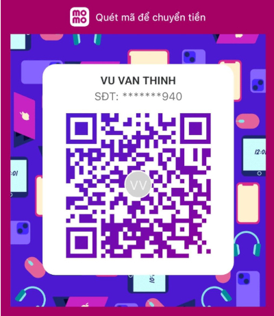

!!! abstract "Lời nhắn"
	LEarn Anything mong muốn truyền cảm hứng và đam mê khám phá kho tàng tri thức vô tận tới các bạn và chúng tôi cũng luôn mở rộng cửa đón nhận mọi đóng góp từ cộng đồng.

## Đóng góp nội dung

Để đăng bài của bạn lên nền tảng website của LEarn Anything, bạn có thể chọn một trong các hình thức sau:

### Gửi file zip nội dung bài viết

Nếu bạn ưa thích sự đơn giản thay vì phải biết cách sử dụng quá nhiều công cụ mới thì viết bài với định dạng markdown là lựa chọn không tồi. Bạn có thể tải file zip chứa cấu trúc thư mục mẫu [tại đây](https://github.com/thinh-vu/learn-anything-knowledge/raw/main/docs/assets/post-folder-template.zip) về giải nén, viết bài và nén file định dạng zip để chia sẻ.

Trong thư mục mẫu này chứa cấu trúc thư mục rỗng `/assets/images` giống như cấu trúc thư mục file đính kèm của website để bạn lưu file đính kèm vào. Như vậy khi bạn gửi bài chia sẻ thì nội dung markdown có thể được sử dụng ngay vì có chung cấu trúc liên kết tới file đính kèm khi chia sẻ lên web.

Tôi sẽ thực hiện công đoạn hoàn thiện cuối cùng giúp bạn. Nội dung đóng góp và bản quyền luôn thuộc về bạn và được ghi chú trong phần YAML frontmatter (chính là cài đặt các thuộc tính của ghi chú trong Obsidian). 

### Folk Github repo và commit trực tiếp vào mã nguồn

Nếu bạn đã làm quen với Github hẳn sẽ không xa lạ với khái niệm "folk repo" tức sao chép toàn bộ kho chứa/thư mục mã nguồn về tài khoản của mình sau đó chỉnh sửa và commit (upload) để đóng góp vào mã nguồn gốc. 

Người sở hữu mã nguồn sẽ xem xét các thay đổi của bạn gửi lên để xét duyệt và gộp nội dung bạn đóng góp vào mã nguồn chính thức.

Để bắt đầu, bạn thực hiện các bước sau:

1. Folk repo của dự án [tại đây](https://github.com/thinh-vu/learn-anything-knowledge)

??? "Click để xem hình minh họa"
	

2. Clone dự án về máy tính qua [Github Desktop](https://desktop.github.com/) hoặc [Git](https://git-scm.com/downloads) CLI (giao diện dòng lệnh)
=== "Cách 1: Clone repo bằng Github Desktop"
	Bước 1: chọn Clone repository để thực hiện
	
	 
	
	  Bước 2: Paste link dự án vào mục URL như trong hình để sao chép
  
	
=== "Cách 2: Clone repo bằng Git CLI"
	Lưu ý: Bạn cần phải cài đặt sẵn công cụ [Git](https://git-scm.com/downloads) trên máy trước khi chạy lệnh `git clone https://github.com/thinh-vu/learn-anything-knowledge`. Thư mục `C:\Users\mrthi` như trong hình là thư mục minh họa nơi bạn sẽ lưu bản sao của mã nguồn dự án.
	
	
## Ủng hộ kinh phí duy trì dự án
!!! abstract "Lời nhắn"
	Các nội dung được cung cấp tới cộng đồng nhằm phổ biến những kiến thức có giá trị và lan tỏa tới nhiều người xứng đáng được biết. Bạn có thể nhận những giá trị này hoàn toàn miễn phí. Nếu bạn muốn đóng góp nhằm ủng hộ dự án phát triển, chúng tôi sẵn sàng đón nhận. Dù là gửi tặng một ly cafe hay donate nhằm khuyến khích tác giả phát triển nội dung đều đáng trân trọng.

<figure markdown>
  
  <figcaption>Momo QR</figcaption>
</figure>

??? "Click để xem Vietcombank QR"
	<figure markdown>
	  
	  <figcaption>VCB QR</figcaption>
	</figure>

