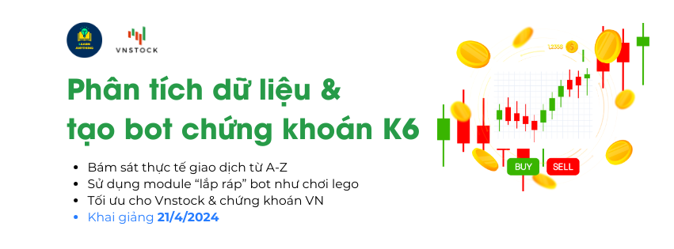

# Danh mục khóa học

!!! tip "Đăng ký tham gia"
	Bạn có thể tham gia các khóa học trả phí trên nền tảng học tập của LEarn Anything bằng cách **[nhắn tin](https://www.messenger.com/t/mr.thinh.ueh)** và trao đổi riêng với Thịnh để được tư vấn. Tất cả khóa học được chia sẻ qua trang khóa học **[course.learn-anything.vn](http://course.learn-anything.vn/)**

{ align=left width=600 }

Khóa học Phân tích dữ liệu & tạo bot chứng khoán với Python K6 sẽ được triển khai từ 21/4/2024 đến tháng 6/2024. Khóa học thứ 6 của chương trình đào tạo Python này sẽ được xây dựng theo kiểu "guided tour" giúp bình dân hóa Python cho anh chị em quan tâm tới ứng dụng ngôn ngữ lập trình Python trong việc hỗ trợ tự động hóa việc phân tích và đầu tư "nhàn" mà hiệu quả hơn.

[Mô tả khóa học :material-account-school:](https://docs.vnstock.site/course/#khoa-hoc-ang-trien-khai){ .md-button }

<!--  

{ align=left width=600 loading=lazy}

Khóa học Web Scraping với Python theo hình thức học trực tuyến qua video ghi hình sẵn. Nội dung khóa học cung cấp cho bạn kiến thức toàn diện để triển khai một dự án thu thập dữ liệu trên Web với cấu trúc chặt chẽ kèm minh họa thực tế. Web Scraping được ứng dụng rộng rãi trong công việc và đạt hiệu quả tối ưu khi làm việc với dữ liệu web. Hiện tại hiếm có khóa đào tạo bài bản về lĩnh vực này tại Việt Nam.

[Truy cập khóa học :material-account-school:](https://course.learn-anything.vn/course/python-web-scraping-thu-thap-du-lieu-web/){ .md-button }

 -->

