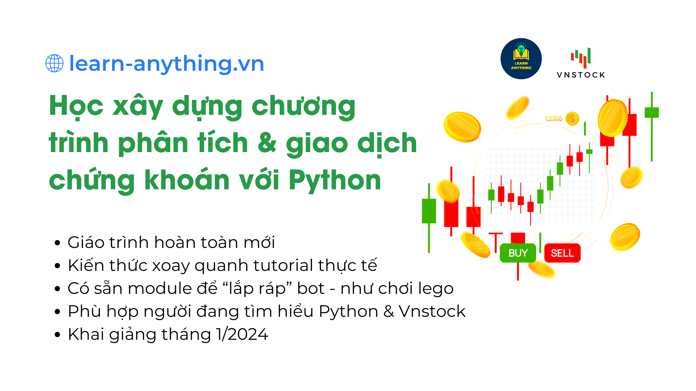

# Danh mục khóa học

!!! tip "Đăng ký tham gia"
	Bạn có thể tham gia các khóa học trả phí trên nền tảng học tập của LEarn Anything bằng cách **[nhắn tin](https://www.messenger.com/t/mr.thinh.ueh)** và trao đổi riêng với Thịnh để được tư vấn. Tất cả khóa học được chia sẻ qua trang khóa học **[course.learn-anything.vn](http://course.learn-anything.vn/)**

{ align=left width=600 }

Khóa học Phân tích dữ liệu với Python K5 sẽ được triển khai từ 1/2024 đến 3/2024. Khóa học thứ 5 của chương trình đào tạo Python này sẽ được xây dựng theo kiểu "guided tour" giúp bình dân hóa Python cho những kẻ tay mơ hoặc đang học tập nửa vời để đầu tư chứng khoán.

[Mô tả khóa học :material-account-school:](https://docs.vnstock.site/course/#khoa-hoc-ang-trien-khai){ .md-button }

<!-- Adding a break for separation -->
 

{ align=left width=600 }

Khóa học Phân tích dữ liệu với Python K4 đang triển khai từ 10/2023 đến 1/2024. Khóa học cung cấp lộ trình làm chủ Python trong việc xử lý dữ liệu và ứng dụng rộng rãi trong hầu hết các ngành nghề kinh doanh. Sau khi kết thúc khóa học bạn sẽ có kỹ năng sử dụng Python từ cơ bản đến trung cấp giúp bạn tự tin khám phá bất kỳ ứng dụng nào trên nền tảng Python.

[Truy cập khóa học :material-account-school:](https://course.learn-anything.vn/course/phan-tich-du-lieu-voi-python-khoa-4/){ .md-button }

<!-- Adding a break for separation -->
 

{ align=left width=600 loading=lazy}

Khóa học Web Scraping với Python theo hình thức học trực tuyến qua video ghi hình sẵn. Nội dung khóa học cung cấp cho bạn kiến thức toàn diện để triển khai một dự án thu thập dữ liệu trên Web với cấu trúc chặt chẽ kèm minh họa thực tế. Web Scraping được ứng dụng rộng rãi trong công việc và đạt hiệu quả tối ưu khi làm việc với dữ liệu web. Hiện tại hiếm có khóa đào tạo bài bản về lĩnh vực này tại Việt Nam.

[Truy cập khóa học :material-account-school:](https://course.learn-anything.vn/course/python-web-scraping-thu-thap-du-lieu-web/){ .md-button }

