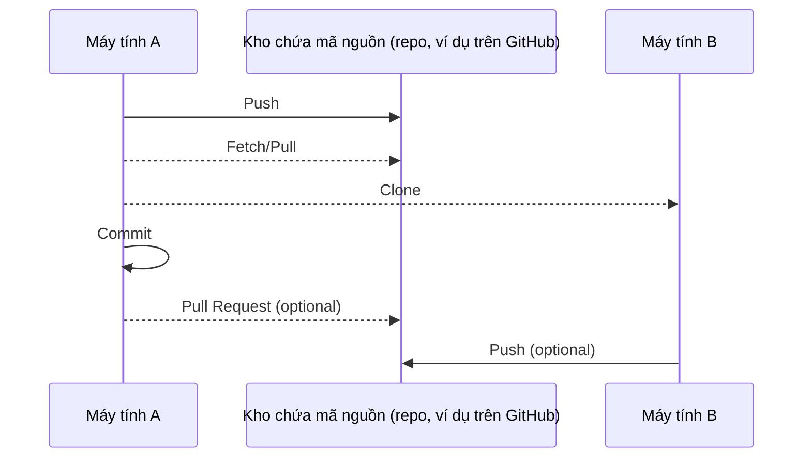
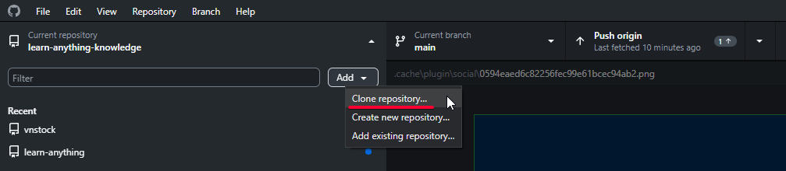
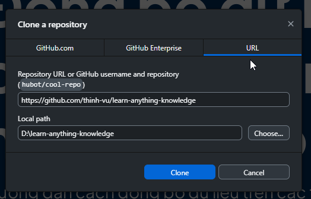
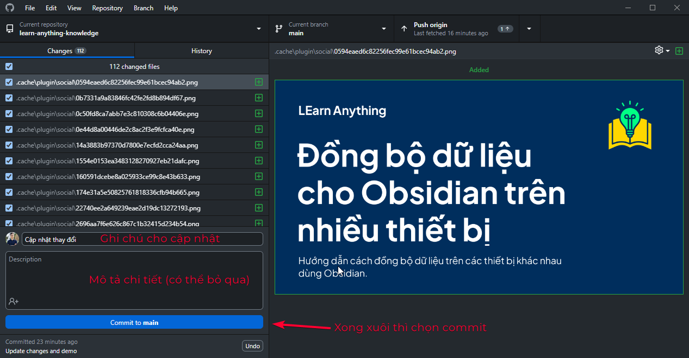
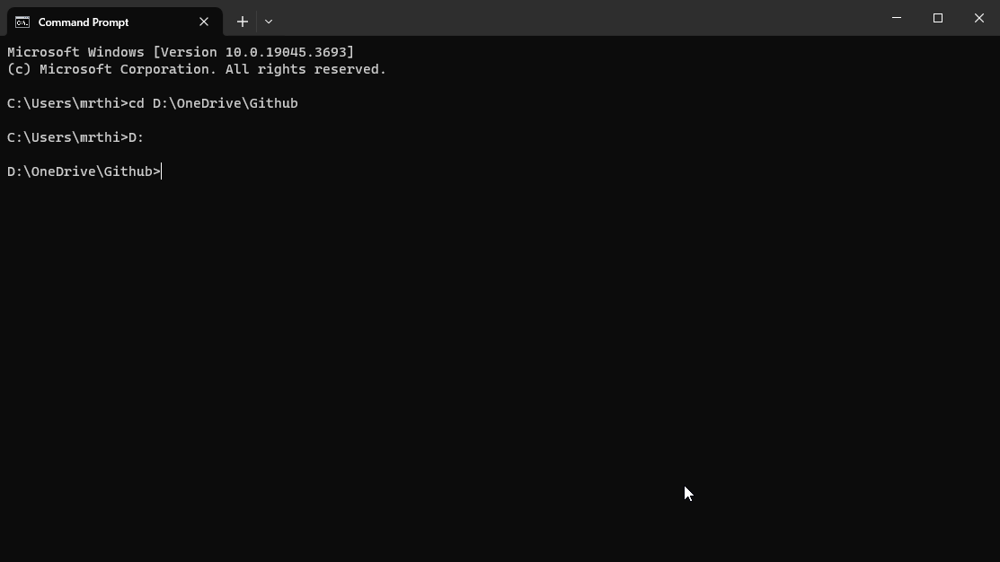
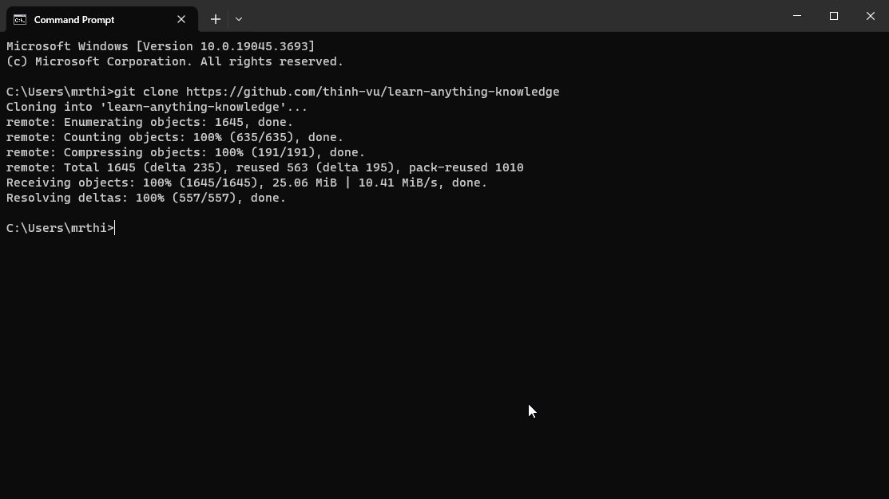

## Giới thiệu

### Git là gì?
> **[Git](https://git-scm.com/downloads)** là một công cụ giúp bạn theo dõi và lưu trữ phiên bản của dự án. Nó cho phép bạn làm việc song song, bảo quản dữ liệu an toàn, quay lại phiên bản trước, và theo dõi lịch sử thay đổi dự án. Điều này càng trở nền cần thiết khi bạn làm việc nhóm và quản lý các dự án phức tạp.

**[Git](https://git-scm.com/downloads)** được phát triển bởi Linus Torvalds - cha đẻ của hệ điều hành [Linux](https://vi.wikipedia.org/wiki/Linux) nổi tiếng vào năm 2005, ban đầu dành cho việc phát triển nhân Linux. Hiện nay, Git trở thành một trong các phần mềm quản lý mã nguồn phổ biến nhất. Git hoạt động trên tất cả các hệ điều hành phổ biến hiện nay.

Bạn có thể hình dung cách hoạt động của Git một cách đơn giản tương tự như tính năng quản lý lịch sử phiên bản trên bộ ứng dụng văn phòng trực tuyến Google Docs.

Lưu đồ dưới đây mô tả đơn giản cách thức Git hoạt động với các máy tính và kho chứa mã nguồn (repo).

Trong đó:

- Máy tính A và B là các thiết bị tham gia vào hệ thống, có thể là các người dùng khác nhau. Mỗi người dùng có thể lập trình và tạo ra một phiên bản sửa đổi của mã nguồn gốc trên máy tính của mình. Sau đó sẽ cập nhật mã nguồn lên repo khi hoàn thành.
- Kho chứa mã nguồn (repo, phổ biến nhất là Github) là nơi lưu trữ tập trung mã nguồn sau khi người dùng sửa đổi và cập nhật. Repo cho phép gộp các đoạn mã nguồn sửa đổi bởi nhiều người dùng lại với nhau một cách dễ dàng, không xung đột.
- Clone (sao chép) / Fetch (lấy dữ liệu) / Commit (cập nhật thay đổi lên repo) / Push (đẩy các thay đổi lên repo trên Github) / Pull (thao tác gộp thay đổi từ các nhánh mã nguồn khác nhau), vv là các thao tác thực hiện với Github (sử dụng công cụ Git).

### Github

> GitHub là một dịch vụ cung cấp kho lưu trữ mã nguồn Git (repo) dựa trên nền web cho các dự án phát triển phần mềm. Bạn có thể sử dụng Github để lưu trữ mã nguồn (hoặc các file/thư mục) hoàn toàn miễn phí ở chế độ công khai dưới dạng các dự án mã nguồn mở.

Các bạn có thể sẽ bị nhầm lẫn giữa Git và Github khi mới tiếp xúc. Nói một cách đơn giản thì Github là một dịch vụ còn Git là công cụ/hệ thống mà Github sử dụng. Ngoài Github còn có nhiều dịch vụ khác như Gitlab, Bitbucket, vv cũng sử dụng Git làm công cụ quản lý phiên bản.

## Hướng dẫn sử dụng cơ bản
> Trong khuôn khổ bài viết này, tôi giới thiệu tới các bạn một cách ngắn gọn, dễ hiểu dành cho đối tượng không chuyên về công nghệ giúp các bạn có thể tiếp cận với Git một cách gần gũi thông qua những thao tác đơn giản, không đao to búa lớn.

### Github
#### Đăng ký tài khoản

#### Tạo một repo

#### Sao chép (fork) một repo

#### Tạo một nhánh (branch) cho repo
Trong một repo, bạn có thể tạo nhiều nhánh khác nhau, ví dụ `main` hoặc master chứa mã nguồn ổn định còn `beta` chứa mã nguồn tạm thời trong quá trình phát triển.

#### Xem lịch sử phiên bản

#### Lần đầu thực hiện Pull Request

### Github Desktop
#### Cài đặt Github Desktop
Cách dễ nhất để các bạn sử dụng công cụ Git là dùng Github Desktop thông qua giao diện đồ họa trực quan và dễ hiểu. Để bắt đầu, bạn cần tải bản Github Desktop về cài đặt.

[Tải Github Desktop :material-download:](https://desktop.github.com/){ .md-button }

#### Clone một repo

Mở ứng dụng Github Desktop, chọn `Clone repository` sau đó nhập URL của repo Github bạn cần sao chép của người khác, ví dụ [learn-anything-knowledge](https://github.com/thinh-vu/learn-anything-knowledge) tại mục `URL` hoặc tìm tên 1 repo có trong tài khoản Github của bạn tại mục `Github.com`.

=== "B1. Chọn Clone Repository"
	
=== "B2. Nhập URL của repo cần clone"
	

#### Theo dõi thay đổi một thư mục

Để theo dõi một thư mục bất kỳ, bạn thực hiện như B1 như phần Clone repo ở trên, chọn `Add > Add existing repository` và duyệt file browser đến thư mục bạn chọn.

#### Commit để ghi nhận thay đổi

Từ giao diện Github Desktop, giả sử bạn đang mở repo cần cập nhật thay đổi. Ở đây, bạn chỉ cần nhập ghi chú ngắn gọn cho lần cập nhật và chọn nút Commit như hình. Các thay đổi của bạn sẽ được lưu trong giây lát.

#### Push thay đổi lên Github

Sau khi thực hiện bước commit, bạn còn một bước cuối cùng nữa để đẩy (tức push hay cũng chính là upload) mã nguồn lên Github. 

### Git CLI
> Để tìm hiểu đầy đủ nhất về Git, bạn có thể tham khảo tài liệu chính thức [tại đây](https://git-scm.com/docs). Dưới đây là một số hướng dẫn đơn giản mà bạn thường xuyên sử dụng nhất.

CLI là viết tắt của `Command Line Interface` tức giao diện dòng lệnh.

#### Tải Git

[Tải Git cho máy tính :material-download:](https://git-scm.com/downloads){ .md-button }

#### Chạy Git

Để chạy Git, bạn mở ứng dụng Terminal trên máy tính, áp dụng với cả macOS, Windows, và Linux. 
Windows sử dụng ứng dụng mặc định Command Prompt, bạn có thể tải Terminal qua Windows Store để sử dụng nhiều tính năng thú vị.

Bạn có thể tìm Terminal bằng tổ hợp phím Cmd + Space sau đó gõ từ khóa termial trên macOS hoặc sử dụng phím Windows để kích hoạt tìm kiếm với máy tính Windows, Linux.

Từ giao diện Terminal như dưới đây, gõ hoặc copy/paste dòng lệnh bạn cần thực hiện và Enter để chạy.

<figure markdown>
  
  <figcaption>Ứng dụng Terminal trên Windows 10</figcaption>
</figure>

#### Mở ứng dụng tại thư mục bạn chọn
Mặc định khi chạy Terminal, máy tính mở cửa sổ làm việc ở thư mục mặc định của hệ thống, thường là ổ đĩa `C` trên Windows hoặc thư mục hệ thống trên macOS. Để chuyển đến thư mục bạn cần làm việc, sử dụng câu lệnh `cd` tức change directory. Nhập dòng lệnh như dưới đây vào Terminal, trong đó bạn cần đổi tên thư mục tương ứng vào mẫu.

`cd ĐỊA_CHỈ_THƯ_MỤC_BẠN_CHỌN`

Riêng với Windows, nếu thư mục làm việc ở ổ đĩa khác `C`, bạn cần gõ thêm 1 dòng sau khi nhập lệnh trên, là `D:` hoặc `E:`, vv tương ứng với tên ổ đĩa chứa thư mục bạn chọn.

<figure markdown>

  <figcaption>Đổi thư mục làm việc trên ứng dụng Terminal - Windows 10</figcaption>
</figure>

!!! tip "Tip mở Command Prompt/Termial"
	Một cách đơn giản trên Windows để mở Terminal tại thư mục làm việc bạn chọn là sử dụng Windows Explorer mở thư mục đó, sau đó gõ `cmd.exe` vào thanh địa chỉ để mở Command Prompt/Termial.

#### Clone một repo
Để sao chép một repo bất kỳ về máy tính của bạn để làm việc, bạn sử dụng câu lệnh `git clone URL_REPO_BẠN_CHỌN`. Ví dụ, để sao chép repo `learn-anything-knowledge` chứa mã nguồn website này, bạn có thể sử dụng câu lệnh:

`git clone https://github.com/thinh-vu/learn-anything-knowledge`

Giờ đây, tôi có thể tìm thấy thư mục `learn-anything-knowledge` được lưu trữ bên trong thư mục `C:\Users\mrthi` sau khi chạy lệnh thành công.
<figure markdown>

  <figcaption>Sao chép một Github repo bất kỳ trong Terminal với Git CLI</figcaption>
</figure>

#### Theo dõi thay đổi

Để theo dõi một thư mục bất kỳ với Git, bạn mở Temrinal tại địa chỉ thư mục đó và chạy lệnh `git init`.

Bạn có thể học thêm các tùy chọn nâng cao khi cần thiết thông qua tài liệu hướng dẫn.

#### Mở nhánh (branch) bất kỳ của repo

Để chuyển từ nhánh `main` hoặc `master` mặc định của một repo sang nhánh khác, ví dụ `beta`, bạn sử dụng câu lệnh:

`git checkout beta`

Như vậy, khi chạy câu lệnh này, Git sẽ giúp bạn kiểm tra các thay đổi của file trong nhánh beta của repo bạn chọn.

Nếu bạn đang làm việc với dự án chia sẻ website của mình lên github pages, nhánh bạn cần làm việc thường sẽ là `gh-pages` để cập nhật các file của trang web đã được tạo ra lên Github giúp hiển thị website đầy đủ.

#### Thêm các thay đổi để sẵn sàng commit

Sử dung lệnh `git add .` để thêm các thay đổi vào danh sách chờ commit (hay staging area). Dấu `.` trong câu lệnh thể hiện việc chấp nhận thêm toàn bộ các thay đổi đã được tạo ra.

#### Commit để upload thư mục

Sử dụng `git commit -m "Update beta branch with new features"` để đính kèm ghi chú vào lệnh commit. Trong đó phần thông tin trong dấu `""` được nhập tùy ý.

Cuối cùng, sử dụng lệnh `git push origin beta` để đẩy các thay đổi của bạn lên Github, ví dụ nhánh beta của repo.

