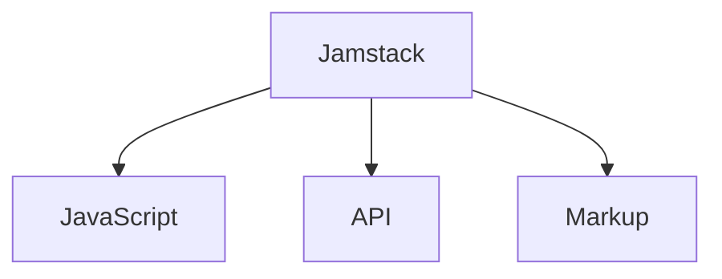

!!! abstract "jamstack là gì"
	Jamstack đầu tiên được biết đến là JAMstack trong đó JAM chứa các từ viết tắt cho JavaScript, API và Markup (ngôn ngữ đánh dấu).

**JavaScript**: là một phần quan trọng trong việc làm cho các chức năng trên trang web của bạn hoạt động một cách linh hoạt mà không bị hạn chế về việc bạn phải sử dụng công cụ hoặc thư viện cụ thể nào.

**APIs**: giúp xử lý các tác vụ phía máy chủ một cách dễ dàng và có thể sử dụng đi sử dụng lại. API được truy cập thông qua giao thức HTTPS bằng JavaScript. API có thể sử dụng dịch vụ từ bên thứ ba hoặc do bạn tự thiết kế.

**Markup**: Trang web của bạn được hiển thị dưới dạng các file HTML tĩnh, có thể được tạo ra từ các file nguồn như Markdown bằng cách sử dụng một Công cụ Tạo Trang Tĩnh như [Jekyll](https://jekyllrb.com/), [Gatsby](https://www.gatsbyjs.com/), [MkDocs Material](https://squidfunk.github.io/mkdocs-material/), vv.

