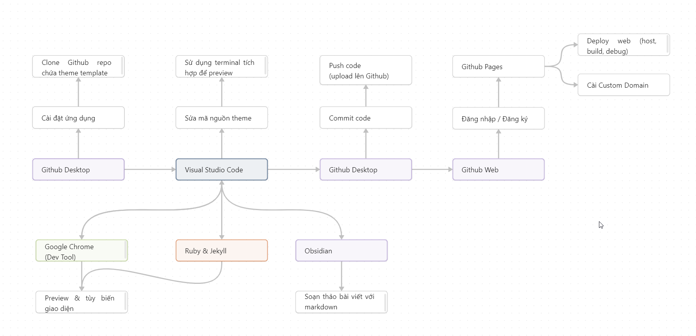
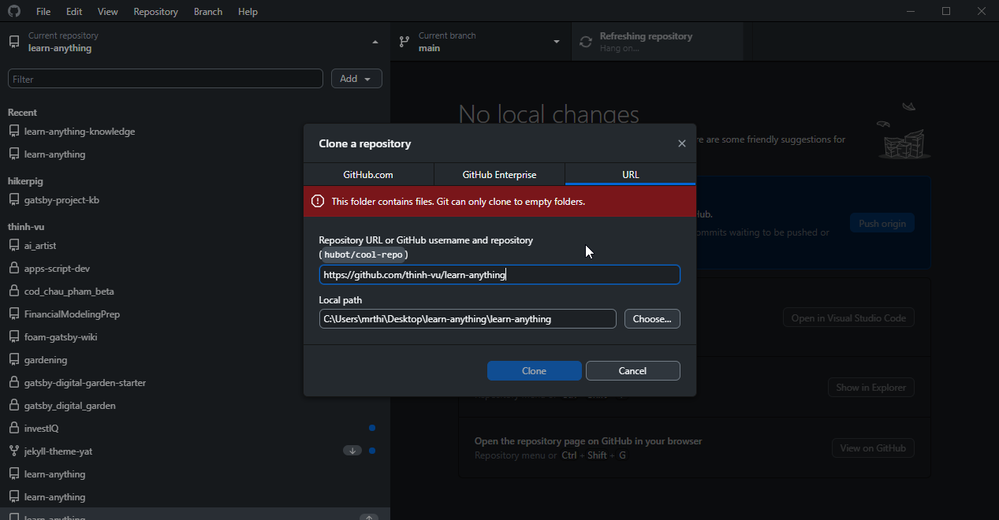
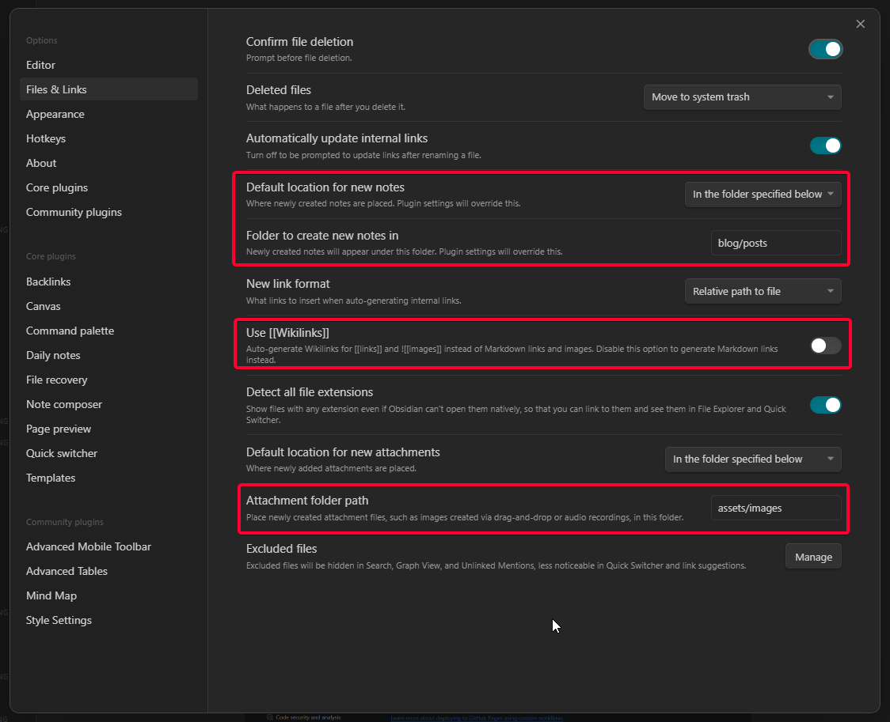
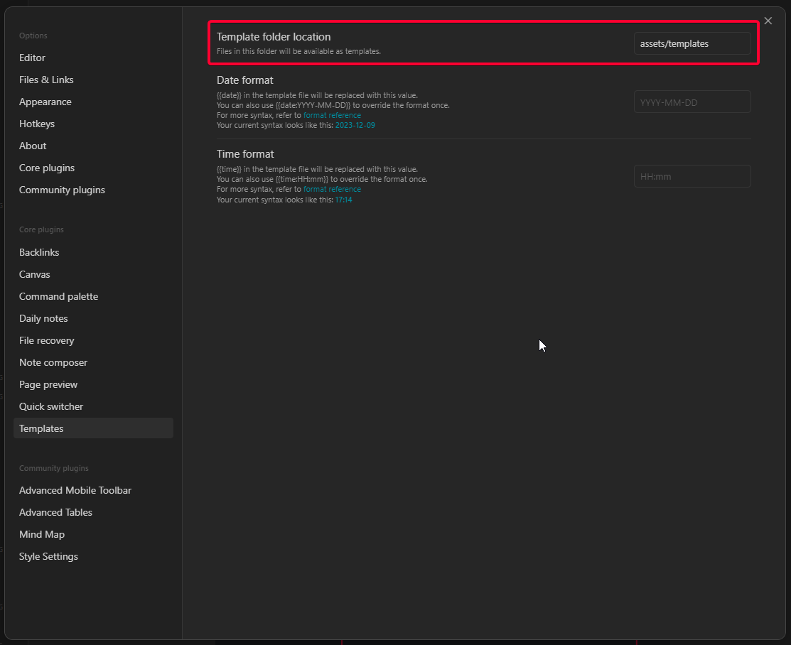
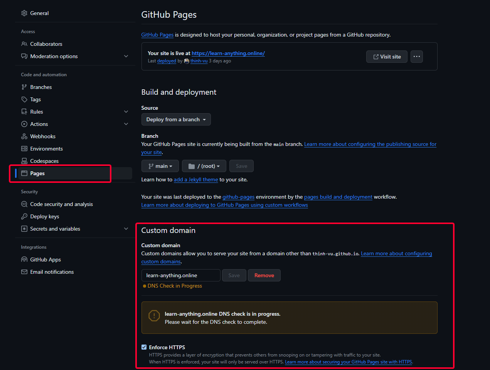
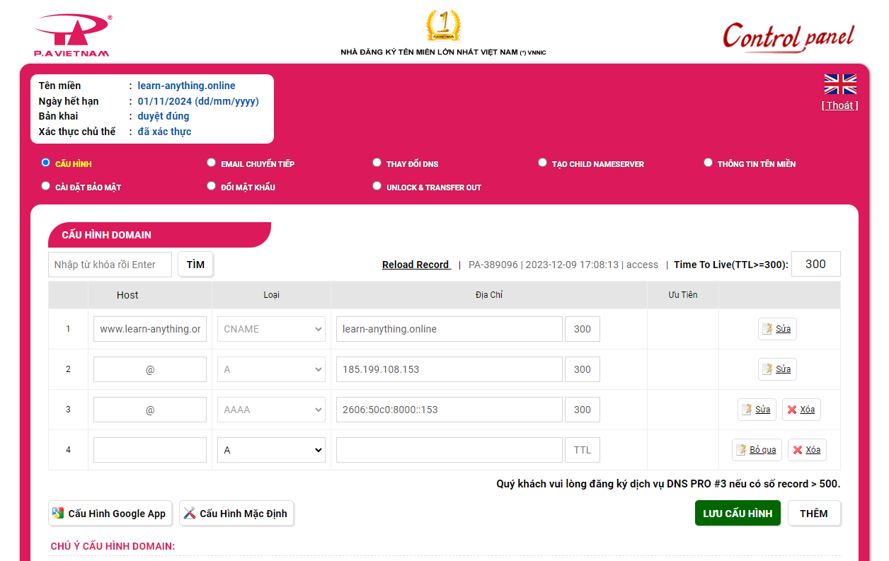

## Tổng quan các bước thực hiện
> Sơ đồ này tóm tắt thành phần và chức năng các công cụ cần sử dụng trong hướng dẫn. Click để xem hình lớn hơn.

### Công cụ cần thiết
> Đây là những công cụ bạn cần có để có thể làm theo hướng dẫn.

- Tài khoản [Github](https://github.com/): Truy cập vào [link](https://github.com/signup) để tạo tài khoản nếu chưa có.
- Đồng bộ & quản lý phiên bản: Tải và cài đặt[Github Desktop](https://desktop.github.com/). Bạn có thể sử dụng [Git](https://git-scm.com/downloads) và giao diện dòng lệnh nếu đã quen.
- Soạn thảo Code: [Visual Studio Code](https://code.visualstudio.com/download)
- Soạn thảo Markdown: [Obsidian](https://obsidian.md/)

### Công cụ bổ sung
> Những công cụ này nếu bạn cài đặt thêm hoặc sử dụng thì tốt để xem trước trang blog ở môi trường cục bộ (local) trước khi đưa lên web.

- Ngôn ngữ lập trình: **[Ruby](https://www.ruby-lang.org/vi/)** cung cấp môi trường để chạy được công cụ Jekyll. Tưởng tượng như nó là hệ điều hành Windows còn Jekyll là một ứng dụng trong Windows vậy.
- Trình tạo trang tĩnh: **[Jekyll](https://jekyllrb.com/)** là công cụ tạo trang web tĩnh kiểu JAMstack (HTML, CSS, JavaScript) cho phép tạo ra các trang web nhanh chóng với các thiết lập theo cú pháp.
- Trình duyệt web: Chrome
- Trang quản lý tên miền riêng (nếu có) để trỏ tên miền về địa chỉ IP của Github. Hướng dẫn của Github [tại đây](https://docs.github.com/en/pages/configuring-a-custom-domain-for-your-github-pages-site/managing-a-custom-domain-for-your-github-pages-site)

### YAT theme

> Để sao chép giao diện blog của tôi giới thiệu, bạn có thể clone mã nguồn trên github [tại đây](https://github.com/thinh-vu/learn-anything)

Bạn cũng có thể truy cập trang dự án của giao diện nguyên bản trên Github: [yekyll theme yat](https://jeffreytse.github.io/jekyll-theme-yat/about.html)
## Sao chép mã nguồn với Github
> Đây là bước đầu tiên bạn cần thực hiện, sao chép toàn bộ Github repo về máy để có thể chỉnh sửa cấu hình và viết bài. 

Trong hướng dẫn này bạn sử dụng Github Desktop để sao chép mã nguồn và sau khi hoàn thành chỉnh sửa thì đồng bộ mã nguồn (commit và push) lên trang Github. Bạn có thể xem chi tiết trong video.

## Cấu hình theme Jekyll YAT
Xem chi tiết tại [Cài đặt công cụ tạo trang tĩnh Jekyll](https://learn-anything.vn/kien-thuc/cong-nghe/jamstack/cai-dat-cong-cu-tao-trang-web-tinh-jekyll-ssg/)
### Chức năng của các file thiết lập
- File `Gemfile` chứa thông tin thiết lập về theme được sử dụng, các gói phụ thuộc cần được chỉ rõ. Trong hướng dẫn ban đầu tác giả nêu không đầy đủ do đó khi sử dụng sẽ gặp lỗi khi thiết lập và người dùng không có kinh nghiệm sẽ loay hoay.
- File `_config.yml` chứa tất cả các cài đặt cho site. Bỏ comment cho các dòng lệnh bằng cách xóa dấu # phía trước hoặc bôi đen và chọn phím tắt `Ctrl` + `/`. Thay đổi các giá trị mặc định để cập nhật.
- Thư mục `_saas`: chứa các file cấu hình định dạng cho website (css)
- Thư mục `_posts`  chứa các file markdown bài viết cho trang blog.
- Thư mục `_includes` có thể chỉnh sửa phần mã tùy chỉnh để theo dõi lượt truy cập website với công cụ Google Tag Manager thông qua file `custom_head.html`. Ngoài ra các bạn không cần tùy chỉnh thêm trong thư mục này. 
- Thư mục `assets` chứa các hình ảnh và file sẽ được đính kèm trong bài viết hoặc blog.
- Tùy biến các file `home.html`, `about.html`, `archives.html`, `categories.html`, `tags.html` theo cách đặt tên bạn muốn.
### Giao diện
- Đặt properties `sidebar: []` để ẩn TOC bên phải
- Cấu hình sidebar tại file `article_menu` tại đường dẫn `jekyll-theme-yat\_includes\sidebar`
- Thay đổi tên `Dark/Light` thành `Tối/Sáng` tại file `jekyll-theme-yat/_includes/extensions/theme-toggle.html`
- Thay đổi màu sắc chủ đạo cho theme trong `_config.yml`
### Theo dõi & phân tích website
- Tạo tài khoản Google Analytics (nếu chưa có) [tại đây](https://analytics.google.com/)
- Sửa đổi đoạn mã theo dõi GA thành GTM (nếu cần) tại file `jekyll-theme-yat/_includes/extensions/google-analytics.html`
## Soạn thảo bài viết bằng Markdown
### Tính năng chính
> YAT theme hỗ trợ nhiều tính năng markdown thú vị, bạn có thể tham khảo thêm chi tiết tại mục Features [ở đây](https://github.com/thinh-vu/learn-anything).

- Diagram: Có thể sử dụng [PlantUML](https://plantuml.com/guide) hoặc Mermaid
- Table: Hỗ trợ nhiều cài đặt như gộp ô, headless
- Hỗ trợ đa dạng các cú pháp markdown cơ bản lẫn nâng cao.
### Thiết lập Obsidian để soạn thảo bài viết
> Có hai thiết lập chính cần lưu ý với Obsidian là `Files & Links` và `Templates`

- Thiết lập hành vi của Obsidian khi tương tác với File và Link  
- Thiết lập mẫu ghi chú sử dụng YAML frontmatter để cung cấp thông tin mô tả bài viết (metadata)
  
## Live Preview và tạo trang web
### Cập nhật cài đặt và xem trước
> Chỉ áp dụng khi bạn cài Ruby & Jekyll trên máy tính.

- Chạy lệnh `bundle install` để cài đặt các gói phụ thuộc.
- Cuối cùng, chạy lệnh `bundle exec jekyll serve` để chạy local server và xem trước nội dung để có thể tùy biến trang web.
- Để build (generate site) tại môi trường local, chạy lệnh `bundle exec jekyll build` từ thư mục dự án. Khi chạy lệnh build, các thay đổi tự động được gán cho nhánh `gh-pages`. 
### Build local hay github action và github page?
- Nên sử dụng local mặc dù mất công thiết lập môi trường (1 lần), về sau chạy lệnh build nhanh chóng và cho phép preview trang để dễ dàng debug. Sau khi live preview thành công thì tạo trang web với câu lệnh build và lưu vào 1 nhánh riêng để đẩy lên github thông qua một nhánh riêng, ví dụ `gh_pages`.
- Github page chạy mất thời gian, không thể live preview, lỗi thì khó debug hơn hoặc khôi phục lại phiên bản cũ.
## Thiết lập tên miền riêng
Để thiết lập tên miền riêng, bạn thêm tên miền riêng vào mục cài đặt Gihub Pages [tại đây](https://github.com/thinh-vu/learn-anything/settings/pages) 

Sau đó thêm một bản ghi CNAME cho trang cấu hình DNS của tên miền. Ở đây tôi sử dụng dịch vụ của PA Việt Nam.
