!!! tip "Giới thiệu"
    Thông qua hướng dẫn tạo tài khoản Oracle Cloud bạn đã sẵn sàng để đi bước tiếp theo trong hành trình, hướng dẫn này giúp tạo và cấu hình một máy chủ ảo sử dụng hệ điều hành Ubuntu, một bước quan trọng để triển khai các tác vụ tự động hóa và phát triển bot cơ bản ứng dụng cho thị trường chứng khoán Việt Nam. 
    
Ubuntu là một hệ điều hành máy tính mã nguồn mở, miễn phí được sử dụng phổ biến trong việc chạy các máy chủ trên internet. Nói một cách đơn giản, khi bạn xem một video, đọc email, hoặc thậm chí chơi game trực tuyến, bạn có thể đang tương tác với một máy chủ sử dụng Ubuntu.

Ubuntu giống như một hệ điều hành Windows hoặc macOS mà bạn có thể quen thuộc cho Desktop, trong trường hợp này chúng ta làm quen với việc sử dụng Ubuntu trên các máy chủ thay vì máy tính cá nhân và tương tác thông qua giao diện dòng lệnh (CLI) tương tự như Terminal mà bạn có thể đã biết trên macOS hoặc Command Prompt trên Windows. 

## Tạo Ubuntu Instance từ Oracle Cloud

Sau khi nhận được email Oracle Cloud xác nhận bạn tạo tài khoản thành công, bạn mở đường link trong email để đi tới Oracle Cloud dashboard, bạn sẽ được đưa tới giao diện làm việc như dưới đây. Chọn Create a VM instance để bắt đầu quá trình tạo máy ảo.

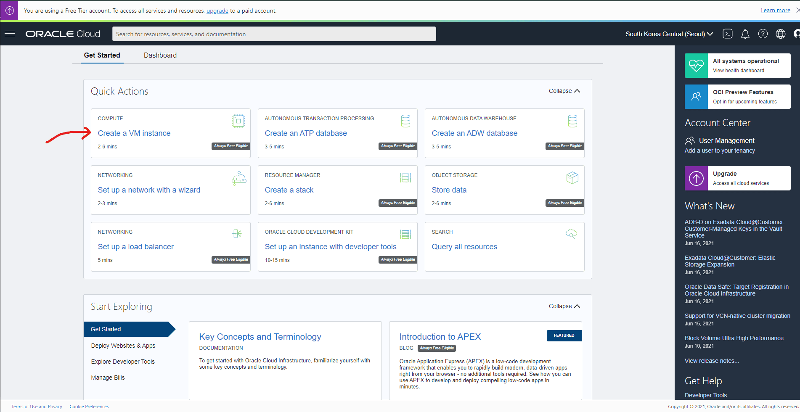

## Chọn cấu hình máy ảo

Ở bước này, bạn được yêu cầu đặt tên cho máy ảo của mình, ở đây mình đặt tên là ubuntu_demo như hình dưới. Có 2 điều cực kỳ quan trọng bạn cần làm ở bước này đó là:

1. Chọn **Change Image** để lựa chọn cấu hình máy ảo sử dụng hệ điều hành Ubuntu (phiên bản hiện tại được hỗ trợ là Ubuntu 20.04 Minimal). Mặc định, hệ điều hành được chọn sẵn sẽ là Oracle Autonomous Linux sử dụng CentOS. Ubuntu là bản phân phối Linux phổ biến nhất và cũng khá dễ sử dụng vì vậy tôi cũng khuyên các bạn sử dụng lựa chọn này, cũng để thuận tiện trong các bước hướng dẫn tiếp theo.

2. Chọn **Save Private Key** để lưu trữ khóa bảo mật cho phép bạn truy cập đến máy ảo được tạo thông qua kết nối bảo mật SSH.

**SSH** tức (Secure Shell) là một giao thức kết nối bảo mật, hỗ trợ các nhà quản trị mạng truy cập vào máy chủ từ xa thông qua mạng internet để thực hiện các tương tác cần thiết.

Sau khi hoàn tất các thông tin và cài đặt như hình bên dưới, chọn nút Create để tạo máy ảo.

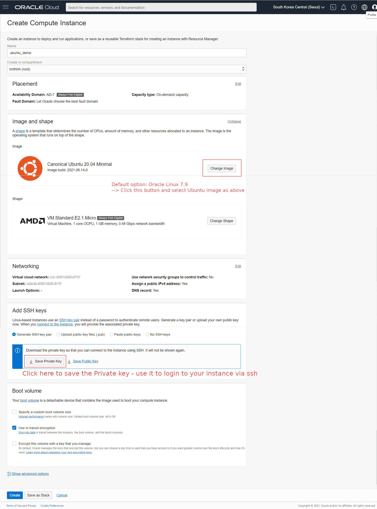

Hệ thống sẽ thực hiện tạo máy ảo theo thông tin bạn thiết lập và sẵn sàng sử dụng trong khoảng 5 phút. Tới đây 1 việc quan trọng bạn cần làm là copy địa chỉ Public IP Address như trong hình vào Notepad hoặc Google Keep để dùng cho việc thiết lập câu lệnh kết nối tới máy ảo thông qua Command Prompt trên Windows hoặc Terminal trên MacOS.

## Kết nối tới máy ảo

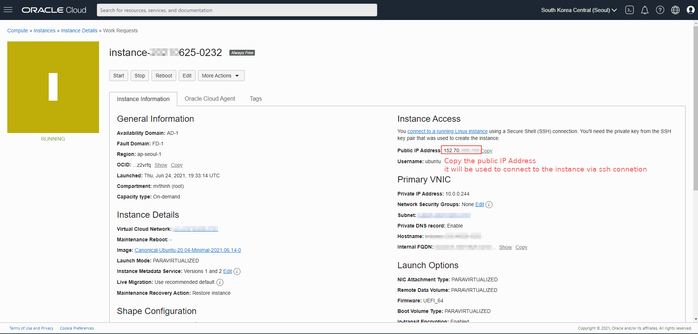

Câu lệnh này có dạng `ssh –i <private_key_file> <username>@<public-ip-address>` 

Trong đó:

- `<private_key_file>` là đường dẫn đến file Private Key bạn đã download và lưu ở bước thiết lập máy ảo ở trên. Ví dụ trong trường hợp của tôi sử dụng máy tính Windows và lưu trữ file tại địa chỉ C:\Users\mr-thinh\.ssh\ssh-demo-ubuntu.key

- `<username>` mặc định là ubuntu

- `<public-ip-address>` đã copy trong bước thiết lập instance

Câu lệnh tôi có được trong trường hợp này là:

```
ssh -i C:\Users\mr-thinh\.ssh\ssh-demo-ubuntu.key ubuntu@152.97.512.273
```

Lưu ý: `C:\Users\mr-thinh\.ssh\ssh-demo-ubuntu.key` là địa chỉ nơi bạn lưu file thực tế trên máy tính của mình.

### Kết nối từ máy tính Windows

Bây giờ hãy mở ứng dụng Command Prompt trên Windows (sử dụng phím Windows và nhập cụm từ tìm kiếm cmd) hoặc Terminal trên macOS (sử dụng tổ hợp phím Command + Space và nhập Terminal). Copy câu lệnh chúng ta vừa tạo ra ở trên sau đó paste vào Command Prompt/Terminal. 

Ở lần đầu tiên chạy câu lệnh này, bạn có thể sẽ được hỏi `Are you sure you want to continue connecting (yes/no/[fingerprint])?` --> Hãy nhập yes và nhấn Enter để tiếp tục.

!!! tip "Bí quyết"
    Trong một số trường hợp, bạn có thể gặp lỗi "Permission denied" hay "Public key" khá rắc rối trên Windows, sử dụng Terminal trên macOS hay Linux sẽ ít khi gặp lỗi này. Do đó, cách giải quyết tạm thời là sử dụng Terminal thông qua [Xterm chạy trên Google Colab](https://learn-anything.vn/kien-thuc/python/su-dung-terminal-trong-google-colab/) (cũng là máy ảo Ubuntu Linux) để kết nối dễ dàng.

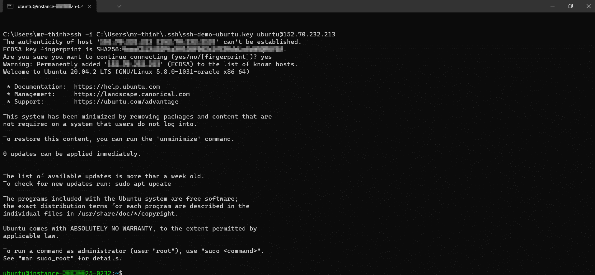
Kết nối Ubuntu Instance từ Windows Command Prompt

### Kết nối từ Visual Studio Code

#### Cài đặt Open SSH trên Windows

!!! tip "Giới thiệu"
    SSH là tính năng có sẵn trên máy tính Linux và MacOS. Tuy nhiên với Windows, để sử dụng SSH bạn cần cài đặt thêm phần mềm Putty hoặc cài đặt phần mở rộng của Windows để bật tính năng Open SSH. Khi kết nối SSH tới máy chủ Ubuntu thông qua Visual Studio Code, bạn có một trải nghiệm tương tác tự nhiên và quen thuộc như tạo và quản lý file trên máy tính thông thường thay vì sử dụng dòng lệnh hoàn toàn. Tuy nhiên cách làm này đôi khi hay bị mất kết nối tới máy chủ so với chỉ kết nối qua giao diện dòng lệnh.


Để bật tính năng Open SSH bạn bấm phím Windows sau đó tìm kiếm Apps & Feature để mở mục cài đặt như dưới đây.

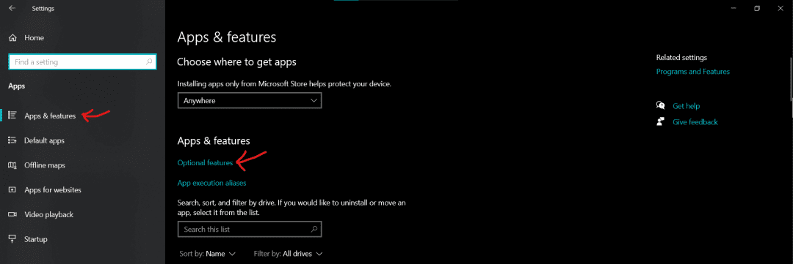

Mở mục Optional features và tìm kiếm Open SSH, tick chọn tính năng và chọn mục Install như hình.

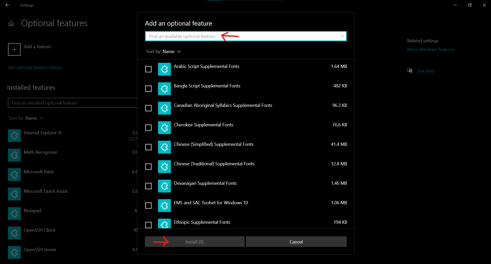

Vậy là bạn đã bật thành công Open SSH trên Windows rồi đó.

#### Cài đặt bổ sung trong Visual Studio Code

!!! tip "Cài đặt Visual Studio Code"
    Nếu đây là lần đầu bạn nghe tới Visual Studio Code, có thể đọc thêm hướng dẫn cài đặt môi trường sử dụng Python với Visual Studio Code [tại đây](https://learn-anything.vn/kien-thuc/python/thiet-lap-moi-truong-python/#trinh-soan-thao-lenh)

Visual Studio Code (VSC) là 1 IDE mạnh mẽ sử dụng trong việc lập trình nhiều loại ngôn ngữ rất tiện dụng. Mình dùng VSC là công cụ chính để làm việc với Python. Trong bước này, mình hướng dẫn các bạn cài VSC, 1 số plugin để làm việc với máy ảo trên Oracle Cloud để tiện trong việc lập trình, upload và download file với máy ảo và máy local của bạn.

1. Để cài đặt VSC, truy cập Tại đây và chọn phiên bản phù hợp với máy tính của bạn.
2. Sau khi cài đặt xong VSC hoặc bạn đang sử dụng VSC, hãy chuyển đến mục Plugin và chắc các plugin sau phải được cài đặt: 
    - Remote - SSH
    - Oracle Developer Tools for VS Code

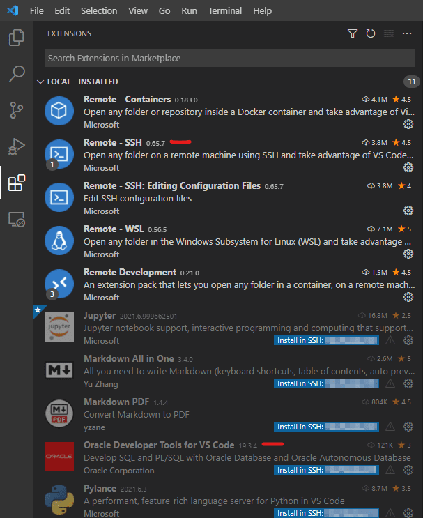


#### Kết nối máy ảo

Trong khi mở VSC, sử dụng tổ hợp phím Ctrl + Shift + P (với Windows) hoặc Command + Shift + P và nhập add new để tìm kiếm lệnh Remote-SSH: Add new Host --> Sử dụng phím mũi tên để di chuyển và Nhấn Enter để chọn.

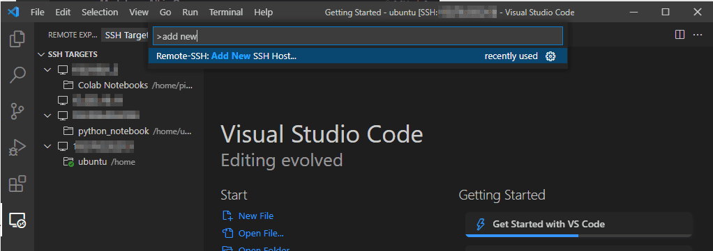

Tiếp theo, nhập câu lệnh ssh như bạn đã sử dụng để kết nối với máy ảo thông qua Command Prompt và bấm Enter: 

```
ssh -i C:\Users\mr-thinh\.ssh\ssh-demo-ubuntu.key ubuntu@152.97.512.273
```

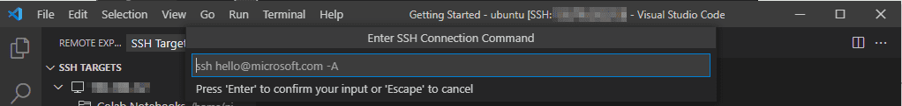

Tiếp theo bạn sẽ được hỏi chọn nơi lưu cấu hình ssh, hãy chọn lựa chọn đầu tiên như mục được highlight màu xanh ở hình dưới đây:

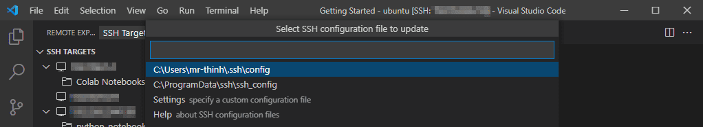

Các mục cài đặt cơ bản cho VSC để lập trình trên máy ảo Ubuntu đến đây gần như đã xong. Tiếp theo bạn sẽ kết nối đến máy ảo và mở thư mục cần sử dụng để lập trình (như đã tạo ở phần trước).

Trong khi mở VSC, sử dụng tổ hợp phím Ctrl + Shift + P (với Windows) hoặc Command + Shift + P và nhập connect để tìm kiếm lệnh Remote-SSH: Connect to Host --> Sử dụng phím mũi tên để di chuyển, chọn địa chỉ IP của máy ảo bạn mới thêm để kết nối, Nhấn Enter để tiếp tục.

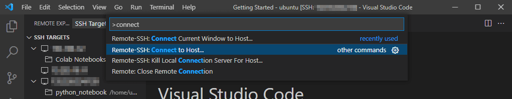


Sau khi kết nối được thiết lập, VSC sẽ hiện cho bạn tùy chọn Open Folder ở máy ảo như hình bên dưới. Chọn Open Folder để tiếp tục. Sau đó chọn thư mục /home/ubuntu/ để xem trọn thư mục của máy ảo Ubuntu.

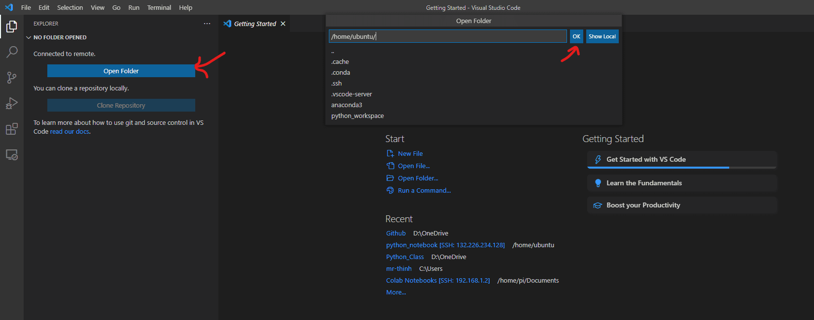

Giờ đây không gian làm việc của bạn với VSC để lập trình cho máy ảo Ubuntu trên Oracle Cloud sẽ như dưới đây. Bạn chỉ cần tạo 1 file .py bất kỳ trong thư mục python_workspace để bắt đầu lập trình. Các thao tác upload, download file trao đổi giữa máy ảo và máy local được thực hiện đơn giản bằng cách kéo thả hoặc lệnh chuột phải. Bạn hãy thử khám phá nhé.

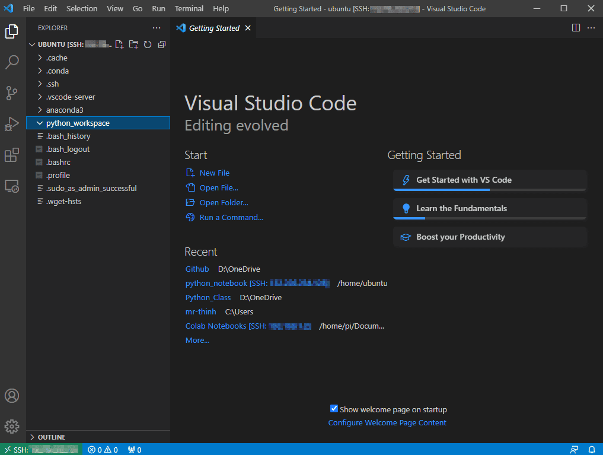

Nếu có vướng mắc gì thêm, bạn cũng có thể tham khảo bài hướng dẫn chính thức của Visual Studio Code để kết nối đến Remote Machine [tại đây](https://code.visualstudio.com/docs/remote/ssh).

## Cài đặt Python và thư viện cần thiết

!!! tip "Giới thiệu"
    Trong mục này, bạn thực hiện việc cài đặt môi trường sử dụng Python để thực hiện các tác vụ tự động và thử nghiệm bot đầu tiên của mình trong series hướng dẫn tạo bot cơ bản trên nền tảng Oracle Cloud (Always Free).

### Cài đặt Python

Ở các bước dưới đây, bạn copy các câu lệnh và paste vào giao diện dòng lệnh tương tác với máy ảo Ubuntu và Enter để chạy lệnh giúp thực hiện quá trình cài đặt.

```shell
sudo apt update
sudo apt install software-properties-common
sudo add-apt-repository ppa:deadsnakes/ppa
```

Cập nhật các gói phần mềm có trong máy ảo, để có thể cài đặt Python trong bước tiếp theo.

```shell
sudo apt update
```

Để cài đặt một bản Python cụ thể, ví dụ 3.11 thì sử dụng câu lệnh dưới đây.

```
sudo apt install python3.11
```

Để xác nhận quá trình cài đặt thành công, chạy lệnh sau để hiển thị phiên bản Python bạn vừa cài:

```shell
python3.11 --version
```

### Cài đặt thư viện Python

Bạn có thể đăng nhập máy ảo thông qua Command Prompt/Terminal và sử dụng câu lệnh pip quen thuộc pip install your-package ví dụ như khi muốn cài đặt thư viện gspread, tôi sử dụng câu lệnh pip install gspread . Ngoài ra bạn có thể kéo cửa sổ Terminal tích hợp sẵn trong VSC từ cạnh dưới của phần mềm.


## Cài đặt công cụ soạn thảo lệnh đơn giản

!!! tip "Giới thiệu"
    Sau khi thiết lập máy ảo Ubuntu, bạn có được 1 nền tảng máy tính gần như trống rỗng, chỉ có các tính năng mặc định của hệ điều hành và cần cài đặt thêm ứng dụng mình cần. Trong trường hợp này, một công cụ soạn thảo văn bản/lệnh đơn giản là cân thiết trong hầu hết các thao tác làm việc với máy ảo. Dưới đây bạn được hướng dẫn cài Vim hoặc Nano làm công cụ soạn thảo lệnh trên máy ảo.

### Cài đặt Nano

!!! info "Giới thiệu Nano"
    Nano là một trình soạn thảo văn bản ngay trên dòng lệnh, được thiết kế với mục đích là dễ sử dụng và thân thiện với người mới bắt đầu. Khác với Vim hay Emacs, Nano cung cấp một giao diện đơn giản, không yêu cầu học nhiều phím tắt phức tạp để bắt đầu sử dụng. Mọi thao tác cơ bản như tìm kiếm, cắt, sao chép, dán văn bản đều có thể thực hiện qua các phím tắt được hiển thị ngay trên màn hình.

Nano thích hợp cho việc chỉnh sửa các tệp cấu hình, viết ghi chú, hoặc thậm chí là lập trình khi bạn cần một công cụ đơn giản, không làm phân tâm bởi các tính năng phức tạp. Vì sự đơn giản và dễ tiếp cận, Nano thường được khuyên dùng cho những người mới làm quen với Linux và các hệ thống tương tự.

Để cài đặt nano, bạn sử dụng câu lệnh dưới đây, paste vào giao diện lệnh và Enter để thực thi. Bạn có thể phải thêm `sudo ` trước câu lệnh nếu được yêu cầu:

```
apt install nano
```


### Cài đặt Vim

!!! info "Giới thiệu Vim"
    Vim là một trình soạn thảo văn bản mạnh mẽ được sử dụng phổ biến trong giới lập trình và quản trị hệ thống. Nổi tiếng với khả năng tùy chỉnh cao và hỗ trợ nhiều plugin, Vim cho phép người dùng chỉnh sửa văn bản một cách nhanh chóng và hiệu quả. Ban đầu có thể hơi khó học do giao diện dựa trên bàn phím và không có menu đồ họa, nhưng một khi đã quen, Vim sẽ giúp bạn soạn thảo văn bản mà không cần rời khỏi bàn phím, tăng tốc độ làm việc đáng kể. Vim phù hợp cho việc lập trình, viết script, hoặc chỉnh sửa bất kỳ loại tệp văn bản nào, và là lựa chọn hàng đầu cho nhiều chuyên gia công nghệ thông tin.

Để cài đặt Vim, bạn sử dụng câu lệnh dưới đây:

```
apt-get install vim
```

### Sử dụng Nano/Vim trong máy ảo

Để sử dụng trình soạn thảo văn bản kể trên, bạn làm quen với một số câu lệnh và thao tác cơ bản sau:

- Mở/tạo file script `.py` hoặc ngôn ngữ lập trình bất kỳ, file văn bản `.txt` hoặc kể cả file bất kỳ chứa văn bản mà không có đuôi định dạng.

```shell
nano script_cua_toi.py
```

Câu lệnh này được chạy từ thư mục home (mặc định) hoặc một thư mục bạn chỉ định sẳn với câu lệnh `cd` trước đó. Nếu file đã tồn tại, bạn đọc được nội dung của file, nếu file chưa tồn tại, trình soạn thảo sẽ tạo file mới cho bạn.

- Soạn thảo: Sau khi mở/tạo file thì bạn chỉ đơn giản là gõ nội dung hoặc paste lệnh đã chuẩn bị sẵn vào file. Mình khuyên nên chọn cách paste vào để tiện lợi nhất vì soạn thảo với giao diện dòng lệnh sẽ không quen thuộc và tiện lợi với hầu hết những người không phải lập trình viên chuyên nghiệp.

- Lưu file: Sử dụng tổ hợp phím tắt `Ctrl + O` hoặc `Cmd + O` trên macOS sau đó Enter để sử dụng tên file có sẵn hoặc thay đổi tên file nếu bạn thích.

- Thoát: Sử dụng tổ hợp phím tắt `Ctrl + X` hoặc `Cmd + X` để thoát chế độ soạn thảo.

## Cài đặt thành công

!!! success "Cài đặt thành công!"
    Chúc mừng bạn sở hữu một máy chủ ảo đầu tay hoàn toàn miễn phí sau khi kết thúc hành trình này. Đến đây, bạn có thể sử dụng máy chủ ảo để giao cho nó các nhiệm vụ tự động không kể ngày đêm hay phải bật một chiếc máy cá nhân không nghỉ. Bằng cách sử dụng tài nguyên miễn phí của Oracle Cloud, bạn có thể đáp ứng hầu hết các nhu cầu cơ bản trong việc tự động hóa và xây dựng bot khi mới bắt đầu.
