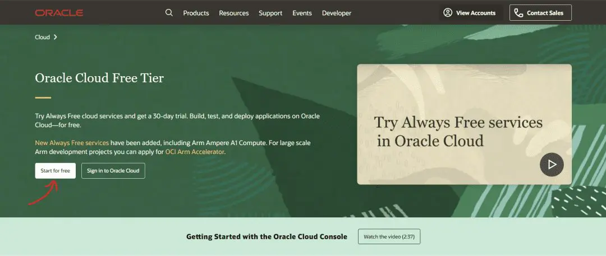
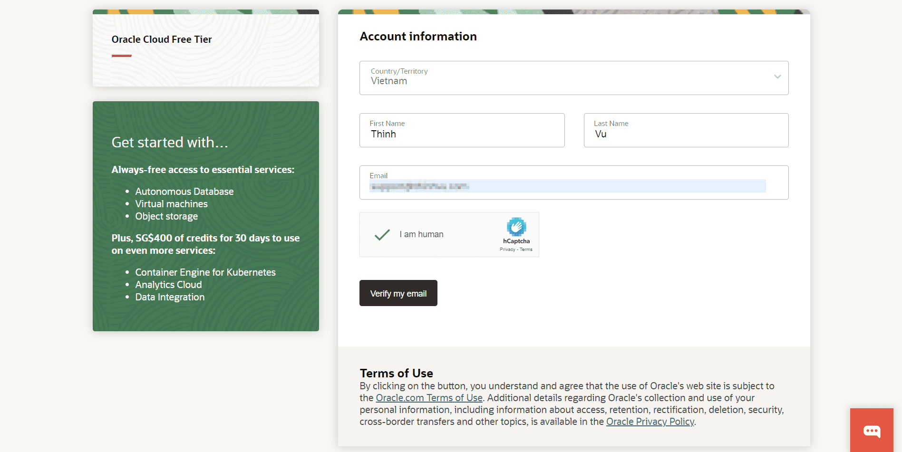
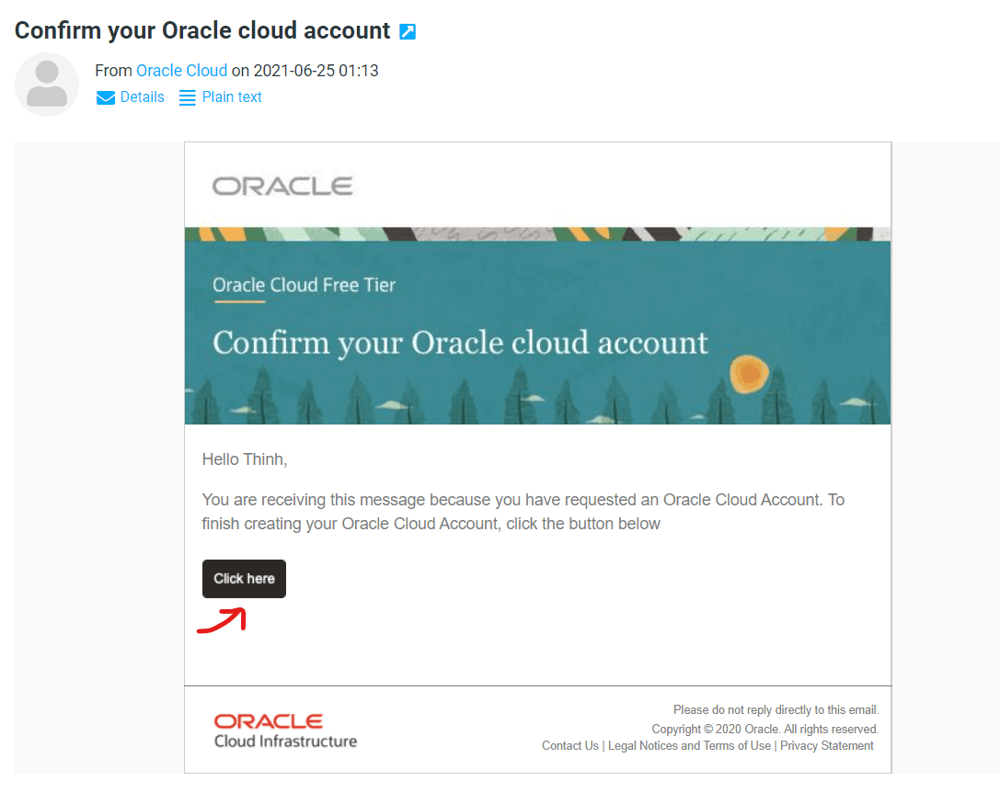
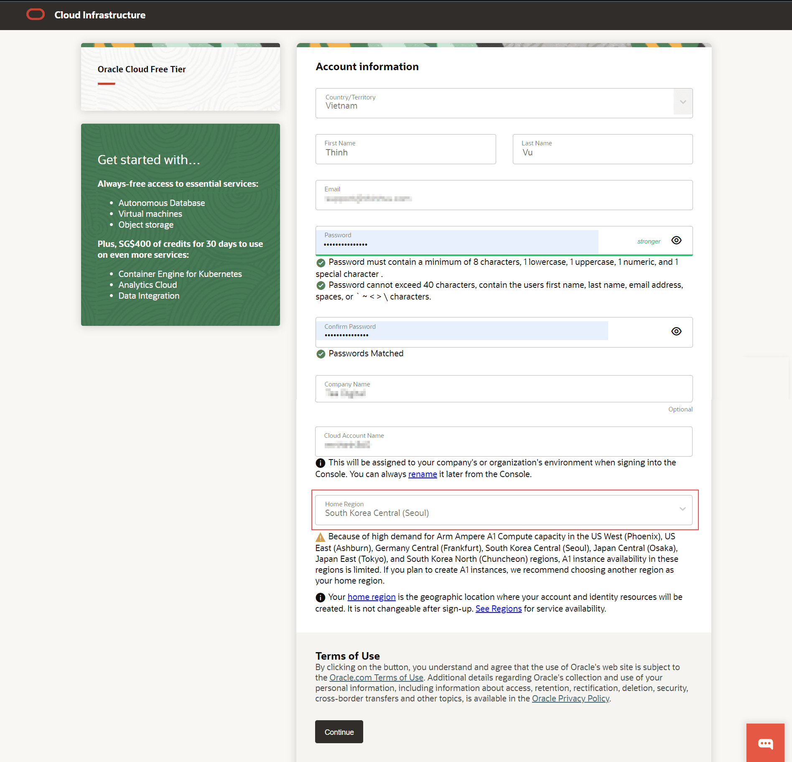
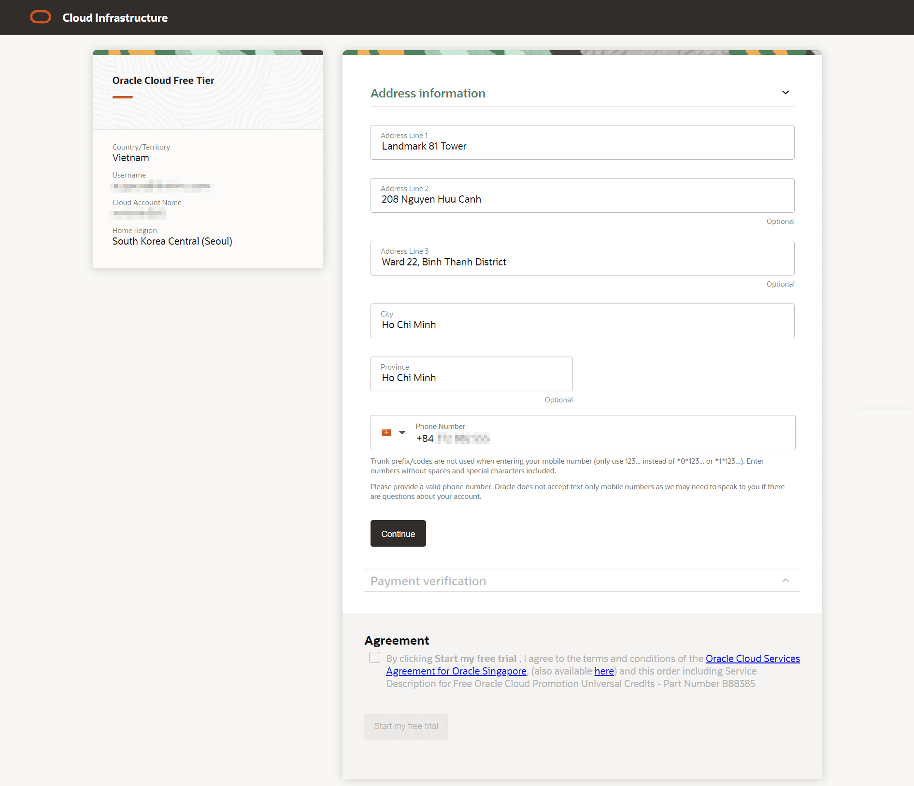
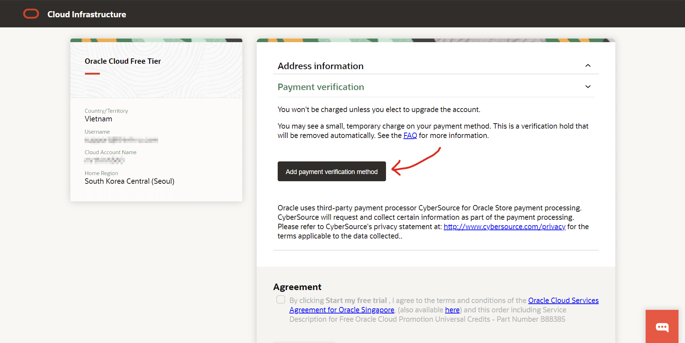
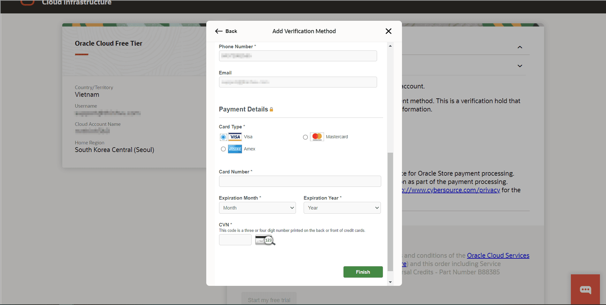
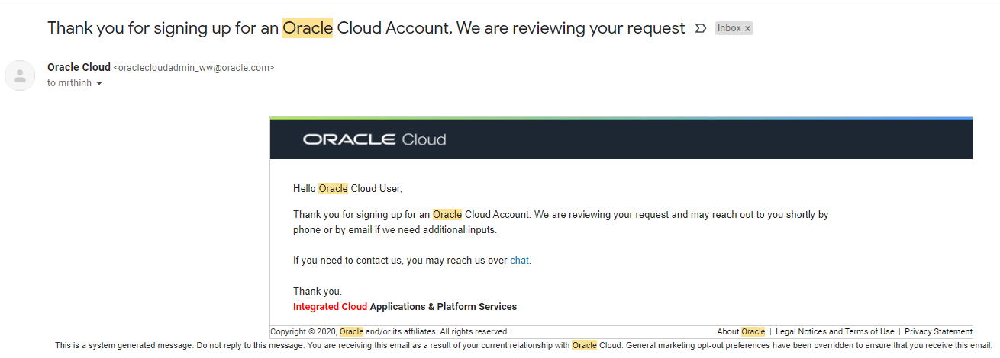
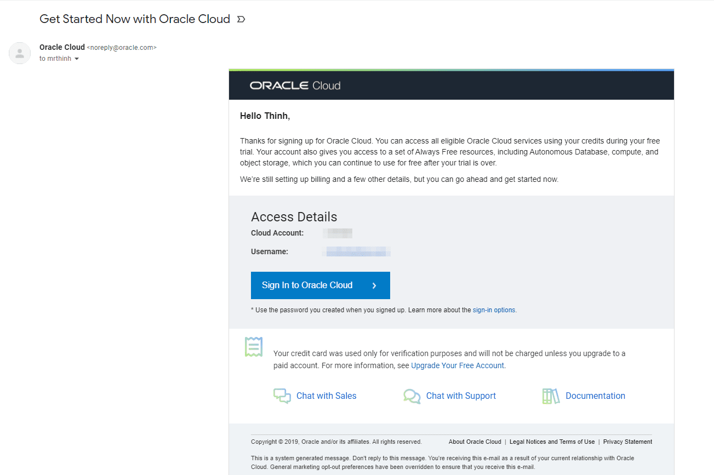

!!! tip "Giới thiệu Oracle Cloud Server"
    Oracle Cloud Server cung cấp một giải pháp máy chủ ảo linh hoạt và mạnh mẽ, cho phép người dùng triển khai và quản lý các ứng dụng của mình trên dịch vụ đám mây. Trong hướng dẫn này, bạn sẽ làm quen với cách thiết lập một máy chủ Linux sử dụng hệ điều hành Ubuntu trên nền tảng Oracle (Always Free Resources). Đây là bước chân đầu tiên dành cho những người trên hành trình tập tành xây dựng bot và tự động hóa công việc, đặc biệt ứng dụng cho lĩnh vực chứng khoán. Bạn có thể nâng cấp hoặc sử dụng dịch vụ trả phí chất lượng khi đã thành thạo, đây là bước lý tưởng để bạn thử nghiệm dự án của mình an toàn, miễn phí.
    
[Oracle Cloud Free Tier](https://www.oracle.com/cloud/free/) gồm 2 gói ưu đãi là Always Free cloud services và 30-day Free Trial (với credit là $300 sử dụng trong 30 ngày). Trong đó gói Always Free cloud services cho phép bạn sử dụng một số tài nguyên hệ thống nhất định nhưng không giới hạn về thời gian. Hiện tại, bạn cần có một chiếc thẻ Debit Card (trả trước) để có thể đăng ký sử dụng. Oracle không tự động nâng cấp gói hay trừ tiền của bạn trừ khi bạn đăng ký dịch vụ trả phí.

## Thông tin cơ bản

Ở màn hình tiếp theo, bạn cần điền 1 số thông tin cơ bản bao gồm Quốc gia, Tên bạn và địa chỉ email để Oracle Cloud gửi thông tin xác thực tài khoản. Sau khi điền thông tin, bạn chọn Verify my email như hình dưới đây.

## Xác thực tài khoản qua email

Sau khi gửi thông tin cho hệ thống, bạn sẽ nhận được 1 email từ Oracle Cloud vào địa chỉ email bạn đã đăng ký kèm đường link cho phép bạn xác thực việc tạo tài khoản của mình.

## Chọn khu vực đặt máy chủ

Sau khi mở đường link với nút Click here trong email như trên, bạn sẽ được yêu cầu tạo Password cho tài khoản, cung cấp thông tin Công ty, đặt tên cho tài khoản Cloud và chọn khu vực đặt máy chủ.

Lưu ý: mục Home Region ở bước tiếp theo bạn có thể chọn quốc gia là Singapore vì chi phí cũng hợp lý và ít bị quá tải hơn South Korea (Hàn Quốc). Sau khi chọn khu vực đặt máy chủ, bạn sẽ không thể thay đổi sau đó.

## Hoàn tất cung cấp thông tin tài khoản

Sau khi điền đầy đủ thông tin cần thiết, chọn Continue để chuyển đến bước điền thông tin địa chỉ của bạn.

Sau khi điền đầy đủ thông tin, bạn chọn Continue để tiếp tục chuyển đến bước thêm thông tin thẻ dùng làm phương thức thanh toán.

## Thêm phương thức thanh toán

Tại bước thêm thông tin thẻ, các loại thẻ hợp lệ là Visa, Mastercard và Amex. Sau khi điền đầy đủ thông tin thẻ, bạn chọn Finish. Đến đây, hệ thống sẽ xác thực thẻ của bạn còn hiệu lực hay không bằng cách trừ số tiền khoảng 25 ngàn đồng tương ứng với 1USD (1.38SGD vào thời điểm tháng 4/2024) sau đó hoàn lại tiền cho bạn ngay lập tức.

## Xét duyệt tài khoản

Sau khi hoàn tất bước này, bạn sẽ nhận được 1 email thông báo rằng yêu cầu tạo tài khoản của bạn đang được xem xét.

Thời gian để bạn nhận được phản hồi về việc yêu cầu được phê duyệt thông thường sẽ trong vòng 24h. Email thông báo tạo tài khoản Oracle Cloud thành công như dưới đây kèm thông tin tài khoản và đường link đăng nhập hệ thống.

Bạn click vào Sign in to Oracle Cloud sẽ mở ra trang Dashboard như phần nội dung dưới đây. Như vậy ở phần I, bạn đã biết cách tạo cho mình 1 tài khoản Oracle Cloud để tận dụng các tài nguyên miễn phí Always Free cloud services rồi đấy.

## Tiếp tục hành trình

!!! success "Chúc mừng bạn!"
    Chúc mừng bạn đã tạo thành công tài khoản Oracle Cloud để tiếp tục hướng các bài viết hướng dẫn tiếp theo trong hành trình làm quen với việc tạo bot và tự động hóa một số công việc quan trọng. Cùng xem tiếp bài viết trong cùng Series này về Tạo máy chủ ảo Ubuntu trên Oracle Cloud nhé.
