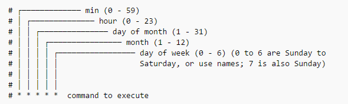
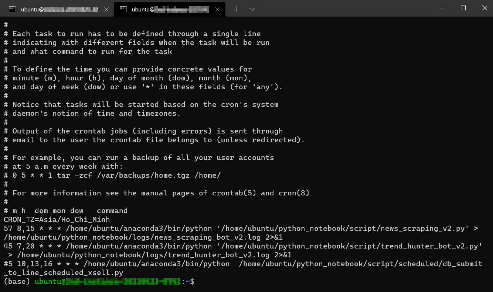

## Giới thiệu

!!! tip "Giới thiệu"
    Cron là một dịch vụ trên các hệ thống Unix và Linux, cho phép người dùng lập lịch thực hiện tự động các lệnh hoặc script tại một thời điểm cụ thể. Thông qua việc sử dụng crontab, một tập tin cấu hình cho cron, người dùng có thể định rõ lịch trình chạy cho từng công việc riêng lẻ.

Crontab, viết tắt của "cron table", chứa một danh sách các công việc và thời gian chạy của chúng. Mỗi công việc trong crontab được ghi trên một dòng, bao gồm một chuỗi thời gian định kỳ và lệnh được thực hiện. Chuỗi thời gian này bao gồm 5 trường giá trị định nghĩa thời điểm chạy: phút, giờ, ngày trong tháng, tháng, và ngày trong tuần.


## Soạn thảo lệnh cron
Ví dụ, để lập lịch chạy một script mỗi ngày vào lúc 2 giờ sáng, bạn có thể thêm một dòng vào crontab như sau:

```shell
0 2 * * * /home/vnstock/data_crawler.py
```

Cron và crontab rất hữu ích cho việc tự động hóa các tác vụ hệ thống và quản lý, như sao lưu dữ liệu, cập nhật hệ thống, hoặc chạy các tác vụ bảo trì định kỳ. 

* Để mở Cron và thêm/chỉnh các cron job, sử dụng câu lệnh `crontab -e`, để xem các cron job đã được cài đặt sử dụng câu lệnh `crontab -l`

* Khi sử dụng `crontab -e`, tiếp theo bấm phím `i` để chọn Insert mode với Vim editor (cho phép chỉnh sửa nội dung văn bản) --> Khi chỉnh sửa xong, sử dụng phím `Esc` để thoát chế độ chỉnh sửa, gõ tổ hợp phím `:x` sau đó `Enter` để đóng Vim editor và thoát ứng dụng Cron. Nếu bạn sử dụng Nano là trình soạn thảo văn bản thì thao tác sẽ đơn giản hơn với việc sử dụng `Ctrl + O` và `Enter` để lưu và `Ctrl + X` để thoát khi hoàn thành.

## Cấu trúc lệnh Cron

Cấu trúc của 1 câu lệnh trong Cron khá đơn giản, mỗi 1 dấu * thể hiện cho 1 giá trị tương ứng với phút, giờ, ngày, tháng, ngày trong tuần như hình minh họa dưới đây.



Dưới đây là 1 số Cron job mình đã cài đặt và lên lịch chạy. Giải thích 1 chút với 1 ví dụ để các bạn dễ hiểu nhé:

```shell
57 8,15 * * * /home/ubuntu/anaconda3/bin/python '/home/ubuntu/python_notebook/script/news_scraping_v2.py' > /home/ubuntu/python_notebook/logs/news_scraping_bot_v2.log 2>&1
```

Câu lệnh này nói rằng:

- Tác vụ được lên lịch chạy vào lúc 8:57 và 15:57 hàng ngày
- Đường dẫn thư mục của python trên máy là `/home/ubuntu/anaconda3/bin/python`
- Đường dẫn đến file Python Script là `/home/ubuntu/python_notebook/script/news_scraping_v2.py`
- Khi Python Sript được thực thi, file log sẽ được ghi vào đường dẫn thư mục là `/home/ubuntu/python_notebook/logs/news_scraping_bot_v2.log` và phiên bản log mới hơn sẽ ghi đè phiên bản cũ. 

Để tìm hiểu thêm về Cron job, các bạn có thể tham khảo bài viết [tại đây](https://www.codementor.io/@akul08/the-ultimate-crontab-cheatsheet-5op0f7o4r).

Hiện tại, một cách đơn giản để soạn thảo các lệnh cron chính là nhờ AI như ChatGPT hay Google Gemini. Bạn hoàn toàn không cần phải bỏ quá nhiều công sức để tạo ra câu lệnh đầu tiên của mình.



