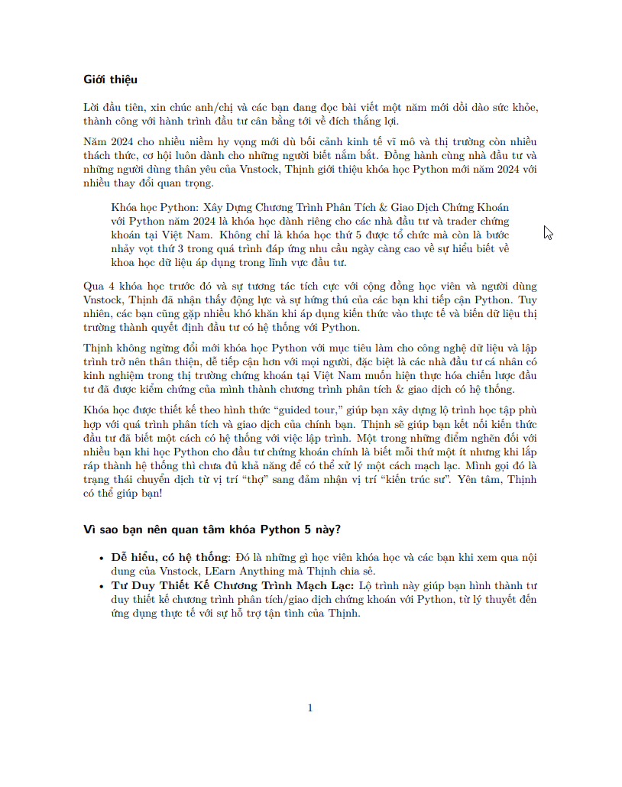
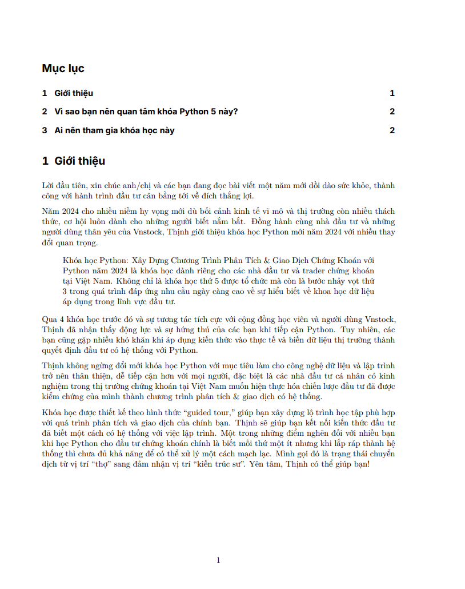
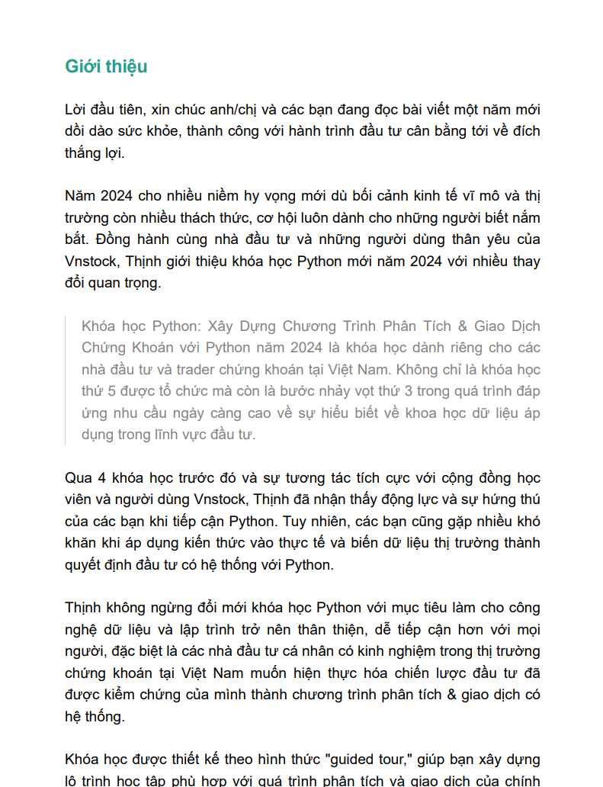

https://learn-anything.vn/kien-thuc/cong-nghe/xuat-ban-noi-dung-markdown-voi-quarto/https://learn-anything.vn/kien-thuc/cong-nghe/xuat-ban-noi-dung-markdown-voi-quarto/
!!! abstract "Giới thiệu Quarto"
	  [Quarto](https://quarto.org/) là một hệ thống phần mềm mã nguồn mở cho xuất bản nội dung khoa học và kỹ thuật dựa trên [Pandoc](https://pandoc.org/). Bạn có thể tạo ra nội dung từ định dạng Jupyter Notebook (dùng cho Python, R, Julia, vv) hoặc viết với định dạng văn bản markdown trực tiếp trong trình soạn thảo yêu thích của bạn, cụ thể là Obsidian. Quarto cho phép xuất bản nội dung sang pdf định dạng tài liệu, sách, báo cáo khoa học đẹp mắt và dễ dàng giúp bổ sung điểm yếu cho Pandoc sử dụng dạng Plugin trong Obsidian. 

Quarto cho phép xuất bản nội dung file markdown sang nhiều định dạng tài liệu khác nhau từ nội dung văn phòng (pdf, docx, pptx, vv) cho đến website/blog, ebook, vv một cách đơn giản và đẹp mắt. 

Bố cục trình bày nội dung từ một mã nguồn markdown duy nhất tạo ra bởi Quarto có chất lượng cao và sẵn sàng sử dụng. Đây là một nền tảng bạn không thể bỏ qua, tuy nhiên lại ít người để ý đến bởi bắt nguồn từ gói phần mềm R cho tính toán khoa học và thống kê thay vì người dùng đại chúng.

👉 Bạn có thể xem thêm bài viết liên quan đến chủ đề xuất bản nội dung từ markdown với Obsidian [tại đây](https://learn-anything.vn/kien-thuc/obsidian/su-dung-obsidian-trong-xuat-ban-chia-se-noi-dung).

## Cài đặt

!!! abstract "Cài đặt Quarto CLI"
	Quarto sẽ được sử dụng như một tiện ích trong môi trường dòng lệnh (CLI - Command Line Interface) trong ứng dụng Command Prompt/Terminal.


Truy cập Quarto và tải phiên bản phù hợp cho máy tính của bạn tại link sau:

[Tải Quarto CLI :material-download:](https://quarto.org/docs/dashboards/){ .md-button }

Bạn có thể sử dụng Quarto kèm với Visual Studio Code, cần cài thêm [Quarto extension](https://marketplace.visualstudio.com/items?itemName=quarto.quarto). Điều này làm hành trình sử dụng Quarto của phần đông người dùng trở nên khó khăn bởi nó mở rộng phạm vi khiến bạn sử dụng bộ công cụ của lập trình viên hơn là một người dùng ưa viết thông thường.


## Các định dạng nội dung xuất bản với Quarto

!!! abstract "Xuất bản ra nhiều định dạng từ markdown"
	Bạn có thể tham khảo danh sách đầy đủ các định dạng xuất bản mà Quarto hỗ trợ [tại đây](https://quarto.org/docs/reference/)


## Xuất nội dung markdown sang định dạng tùy chỉnh

### Xuất file PDF

Đây là một mẫu YAML front-matter được chèn ở đầu trang markdown cho phép tạo ra mẫu file pdf định dạng sách để bạn có thể hình dung. Thực tế, bạn có thể sử dụng cài đặt mặc định của Quarto nếu không có nhu cầu tùy biến cụ thể thành sách, tài liệu, bài báo, vv.

Mình đang sử dụng cấu hình này cho các tài liệu được chuyển đổi sang dạng PDF khi chia sẻ trong công việc.

```
---
title: ""
format: 
  pdf: 
    documenclass: book
    toc: true
    toc-depth: 2
    toc-title: Mục lục
    number-sections: true
    number-depth: 4
    highlight-style: github
    geometry:
      - top=30mm
      - left=20mm
      - heightrounded
    fontfamily: inter
    colorlinks: true
    fc-list: lang=vi
---
```

Để xuất file PDF, mở Command Prompt/Terminal từ thư mục chứa ghi chú và chạy dòng lệnh sau:

```shell
quarto render "Python course 5 thinhvu blog.md" --to pdf
```

Trong đó: `"Python course 5 thinhvu blog.md"` là tên của ghi chú cần xuất ra định dạng pdf, tên file được bao quanh bởi cặp dấu nháy nếu chứa khoảng trắng.

!!! warning "Lưu ý"
	Bạn cần có ít nhất một phiên bản TeX để có thể xuất file, Quarto khuyên dùng TinyTeX. Có thể được cài đặt với câu lệnh dưới đây từ Command Prompt/Terminal.

```
quarto install tinytex
```

=== "1. Quarto - Xuất PDF mặc định"
	<figure markdown>
	  
	  <figcaption>File PDF xuất từ Obsidian (chế độ mặc định)</figcaption>
	</figure>
=== "2. Quarto - định dạng YAML mẫu"
	<figure markdown>
	  
	  <figcaption>File PDF xuất với cấu hình YAML mẫu ở trên - sử dụng Quarto từ giao diện dòng lệnh</figcaption>
	</figure>
=== "3. Obsidian - PDF mặc định"
	<figure markdown>
	  
	  <figcaption>File PDF xuất từ Obsidian (chế độ mặc định)</figcaption>
	</figure>