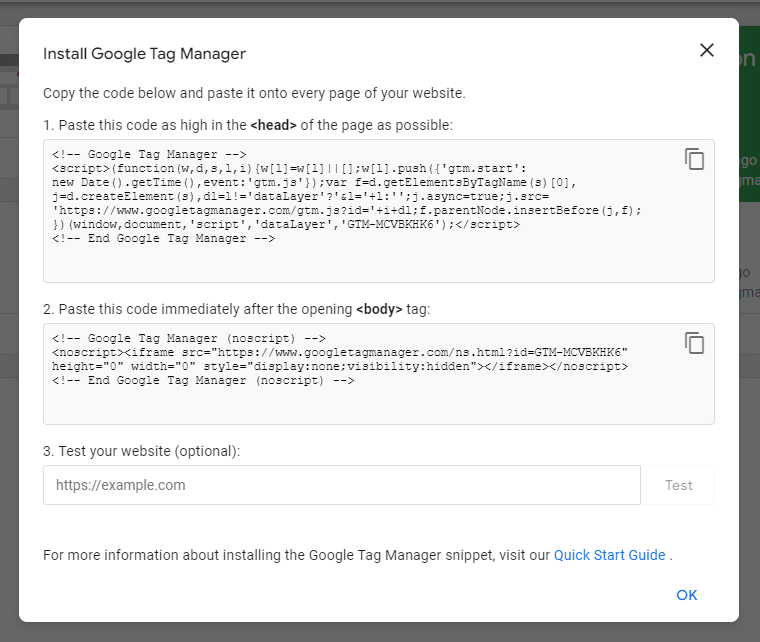

## Cài đặt Plugins
> Tham khảo danh sách tài nguyên cho MKdocs: [tại đây](https://github.com/mkdocs/catalog)
### Plotly chart
- Tham khảo: https://github.com/haoda-li/mkdocs-plotly-plugin
- Cài đặt: `pip install mkdocs-plotly-plugin`
- Thêm vào mkdocs.yml: 
```
plugins:
  - plotly
```

### Jupyter notebook
- Tham khảo: https://github.com/danielfrg/mkdocs-jupyter
### Markmap
> Tạo mindmap từ markmap
- Tham khảo: https://github.com/markmap/mkdocs-markmap
## Tùy biến home landing page
- Sử dụng trang override mẫu: [tại đây](https://github.com/binbashar/le-ref-architecture-doc/blob/master/material/overrides/home.html)
- Chi tiết phần trao đổi trong issue: [tại đây](https://github.com/squidfunk/mkdocs-material/issues/1996)
- Tham khảo các ví dụ khác
	- https://timvink.nl/#start-blog-entries-overview

## Cài đặt theo dõi
### Google Tag Manager:

- Copy 2 đoạn mã cài đặt từ trang Google Tag Manager và chèn vào các vị trí sau
	- Đoạn mã cho thẻ `<head>` dán vào `docs\material\overrides\partials\integrations\analytics\custom.html`
	- Đoạn mã cho `<body>` dán vào `docs\material\overrides\main.html`
~~- Trong `_config.yml`
	- Trong `docs/material/overrides/main.html` thay đổi chính xác mã theo dõi đã điền trong file `_config.yaml`~~
## 