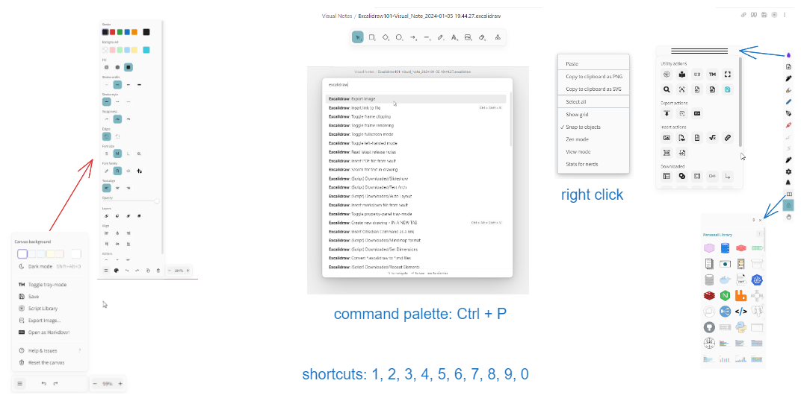
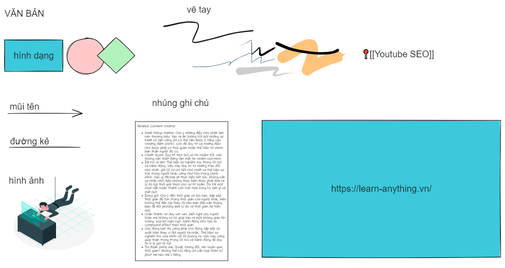

## Excalidraw

!!! abstract "Giới thiệu"
	[Excalidraw](https://excalidraw.com/) là một công cụ miễn phí cho phép tạo ra các ghi chú trực quan, vẽ, tạo lưu đồ, vv và được tích hợp hoàn hảo trong Obsidian. Bạn sở hữu sức mạnh quản lý và liên kết thông tin của Obsidian lẫn khả năng minh họa ý tưởng của mình với Excalidraw để thúc đẩy khả năng sáng tạo.

Trong video 30 phút này, mình sẽ hướng dẫn bạn làm quen và sử dụng Excalidraw một cách nhanh chóng và toàn diện nhất. 

<iframe width="914" height="514"src="https://www.youtube.com/embed/ZoyZ8IBkKdA?si=afXUC-c7GNgQNhsU" title="YouTube video player" framebhoặcder="0" allow="accelerometer; autoplay; clipboard-write; encrypted-media; gyroscope; picture-in-picture; web-share" allowfullscreen></iframe>

### Làm quen không gian làm việc
Trong hình minh họa dưới đây, bạn sẽ làm quen cách kích hoạt hầu hết các menu chức năng trong Excalidraw để làm việc hiệu quả.

### Các đối tượng chính trong ghi chú

Dưới đây là các đối tượng chính được Excalidraw hỗ trợ.

### Các nhóm thao tác chính
Trong một màn hình duy nhất, bạn sẽ hình dung được hầu hết các thao tác chính làm việc trong Excalidraw.

### Các cài đặt cơ bản

Excalidraw cho phép tùy biến các chức năng khá đa dạng. Dưới đây là một số thiết lập quan trọng và cơ bản nhất bạn sẽ muốn thực hiện liên quan đến việc lưu và tổ chức các chi chú.

### Phím tắt mặc định
!!! abstract "Lưu ý"
	Phím tắt là "vũ khí bí mật" giúp bạn thao tác nhanh chóng, trở thành pro user cho bất kỳ công cụ nào. Dưới đây là danh sách các phím tắt được hỗ trợ bởi Excalidraw. Một số thao tác có phím tắt trùng với phím tắt trong Obsidian sẽ không thể thực hiện được chức năng chính sách.
#### Phím tắt công cụ
| Công cụ | Mô tả | Phím tắt |
| ---- | ---- | ---- |
| Hand (panning tool) | Di chuyển canvas | H |
| Selection | Chọn | V hoặc 1 |
| Rectangle | Hình vuông/chữ nhật | R hoặc 2 |
| Diamond | Hình thoi/bình hành | D hoặc 3 |
| Ellipse | Hình elip/tròn | O hoặc 4 |
| Arrow | Mũi tên | A hoặc 5 |
| Line | Đường kẻ | L hoặc 6 |
| Draw | Vẽ tay | P hoặc 7 |
| Text | Văn bản | T hoặc 8 |
| Insert image | Chèn ảnh | 9 |
| Eraser | Tẩy / gôm | E hoặc 0 |
| Frame tool | Tạo khung | F |
| Laser pointer | Bút laze (công cụ chỉ trỏ trên màn hình) | K |
| Pick a colhoặc from the canvas | Chọn màu (colhoặc picker) | I hoặc Shift + S hoặc Shift + G |
| Edit line/arrow points | Chỉnh điểm trên sửa đường kẻ, mũi tên | Ctrl + Enter |
| Edit text / add label | Chỉnh sửa văn bản, thêm nhãn | Enter |
| Pick a colhoặc from canvas | Chọn màu từ canvas | Enter hoặc Shift + Enter |
| Finish editing (text edithoặc) | Hoàn tất sửa văn bản | Esc hoặc Ctrl + Enter |
| Curved arrow | Mũi tên gấp khúc | A + click + click + click |
| Curved line | Đường kẻ gấp khúc | L + click + click + click |
| Add a new line (text edithoặc) | Thêm dòng mới (văn bản) | Enter hoặc Shift Enter |
| Prevent arrow binding | Chặn gán mũi tên vào đối tượng | Ctrl |
| Add/ Update link fhoặc a selected shape | Thêm hoặc sửa liên kết (url) cho hình được chọn | Ctrl + K |

#### Phím tắt trong chế độ xem

| Chế độ xem | Mô tả | Phím tắt |
| ---- | ---- | ---- |
| Zoom in | Phóng to | Ctrl + + |
| Zoom out | Thu nhỏ | Ctrl + - |
| Reset zoom | Đặt lại thu/phóng | Ctrl + 0 |
| Zoom to fit all elements | Phóng to vừa các đối tượng | Shift + 1 |
| Zoom to selection | Phóng to đến đối tượng được chọn | Shift + 2 |
| Move page up/down | Di chuyển trang xem phía trên / dưới | PgUp hoặc PgDn |
| Move page left/right | Di chuyển trang, xem phía trái / phải | Shift + PgUp hoặc Shift + PgDn |
| Zen mode | Chế độ tối giản | Alt + Z |
| Snap to objects | Bám dính đối tượng | Alt + S |
| Show grid | Hiện đường kẻ | Ctrl + ' |
| View mode | Chế độ xem | Alt + R |
| Toggle theme | Bật giao diện tối/sáng | Alt + Shift + D |
| Stats fhoặc nerds | Hiện thống kê | Alt + / |

#### Phím tắt khi soạn thảo

| Thao tác                                     | Mô tả                                        | Phím tắt                       |
| -------------------------------------------- | -------------------------------------------- | ------------------------------ |
| Move canvas                                  | Di chuyển canvas                             | Space + drag hoặc Wheel + drag |
| Reset the canvas                             | Đặt lại canvas                               | Ctrl + Delete                  |
| Delete                                       | Xóa                                          | Delete                         |
| Cut                                          | Cắt                                          | Ctrl + X                       |
| Copy                                         | Sao chép                                     | Ctrl + C                       |
| Paste                                        | Dán                                          | Ctrl + V                       |
| Paste as plaintext                           | Dán dạng văn bản thuần                       | Ctrl + Shift + V               |
| Select all                                   | Chọn tất cả                                  | Ctrl + A                       |
| Deep select                                  | Chọn đối tượng con thuộc một nhóm            | Ctrl + click                   |
| Deep select within box, and prevent dragging | Chọn đối tượng con, chặn di chuyển đối tượng | Ctrl + drag                    |
| Copy to clipboard as PNG                     | Chép vào bộ nhớ tạm dạng hình PNG            | Shift + Alt + C                |
| Copy styles                                  | Sao chép kiểu                                | Ctrl + Alt + C                 |
| Paste styles                                 | Dán kiểu                                     | Ctrl + Alt + V                 |
| Send to back                                 | Dời lớp được chọn xuống dưới                 | Ctrl + Shift + [               |
| Bring to front                               | Dời lớp được chọn lên trên                   | Ctrl + Shift + ]               |
| Send backward                                | Dời lớp được chọn 1 cấp xuống dưới           | Ctrl + [                       |
| Bring or forward                             | Dời lớp được chọn 1 cấp lên trên             | Ctrl + ]                       |
| Align top                                    | Căn phía đầu                                 | Ctrl + Shift + Up              |
| Align bottom                                 | Căn phía cuối                               | Ctrl + Shift + Down            |
| Align left                                   | Căn trái                                    | Ctrl + Shift + Left            |
| Align right                                  | Căn phải                                             | Ctrl + Shift + Right           |
| Duplicate                                    | Tạo bản sao                                             | Ctrl + D hoặc Alt + drag       |
| Lock/unlock selection                        | Khóa/bỏ khóa công cụ chọn                                             | Ctrl + Shift + L               |
| Undo                                         | Khôi phục lùi                                             | Ctrl + Z                       |
| Redo                                         | Khôi phục tiến                                             | Ctrl + Y hoặc Ctrl + Shift + Z |
| Group selection                              | Nhóm các đối tượng được chọn                                             | Ctrl + G                       |
| Ungroup selection                            | Tách nhóm các đối tượng được chọn                                             | Ctrl + Shift + G               |
| Flip horizontal                            | Lật ngang                                             | Shift + H                      |
| Flip vertical                                | Lật dọc                                             | Shift + V                      |
| Show stroke color picker                   | Hiện công  cụ chọn màu viền                                             | S                              |
| Show background color picker               | Hiện công cụ chọn màu nền                                             | G                              |
| Decrease font size                           | Giảm cỡ chữ                                             | Ctrl + Shift + <               |
| Increase font size                           | Tăng cỡ chữ                                             | Ctrl + Shift + >               |

## Draw.io
[Draw.io](https://app.diagrams.net/) hay Diagram.net là một công cụ vẽ lưu đồ mã nguồn mở, miễn phí trên nền web. Draw.io được hỗ trợ trong Obsidian dưới dạng một community plugin cho phép bạn tạo ra các lưu đồ minh họa cho ý tưởng, quy trình làm việc dễ dàng.

## Mermaid

!!! abstract "Giới thiệu"
	[mermaid](https://mermaid.js.org/) là công cụ biểu diễn dữ liệu (charting) trên nền tảng JavaScript, cho phép tạo ra các dạng đồ họa dựa trên cú pháp kiểu Markdown dạng "code". Bạn có thể sử dụng mermaid để tạo ra các diagram, flowchart đẹp mắt với cú pháp tương đối thú vị. Mermaid được hỗ trợ trong Obsidian và hầu hết các ứng dụng sử dụng markdown phổ biến.