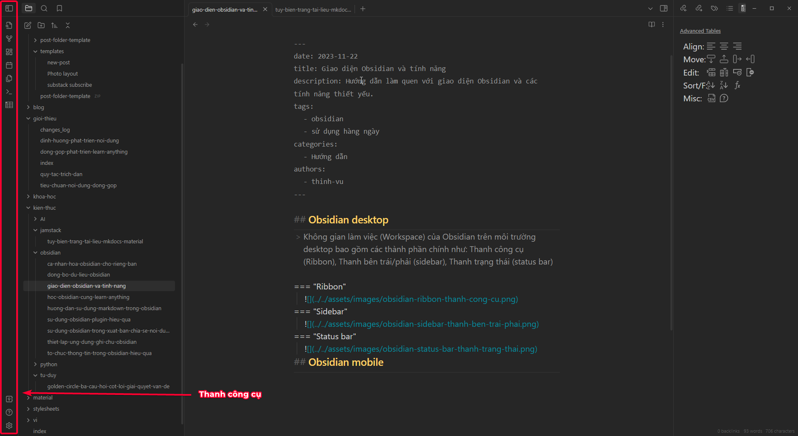
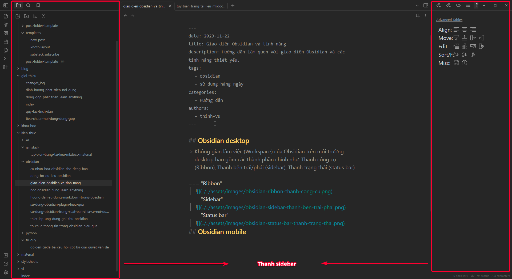
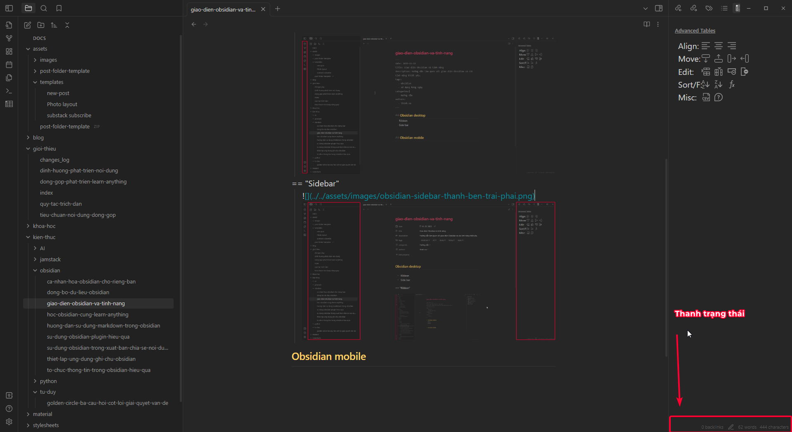
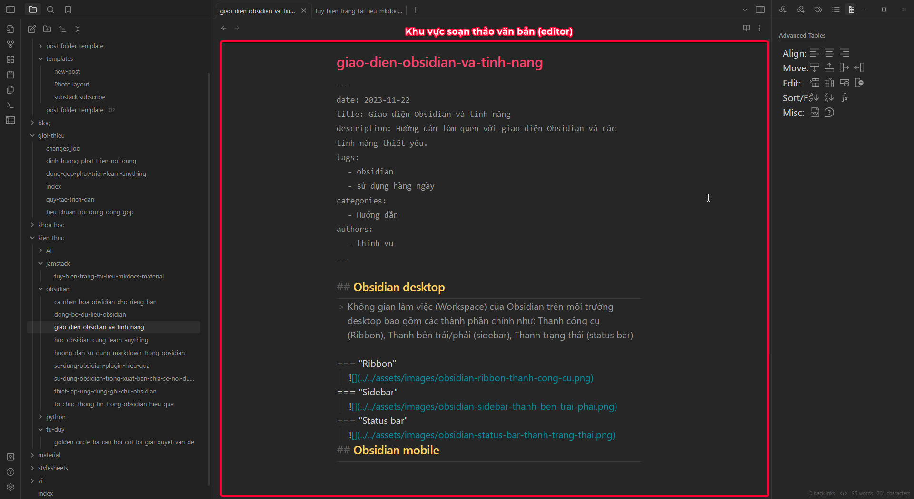
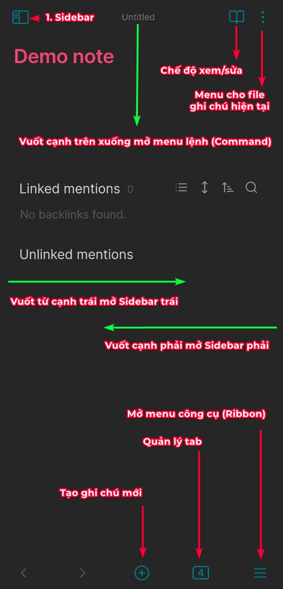
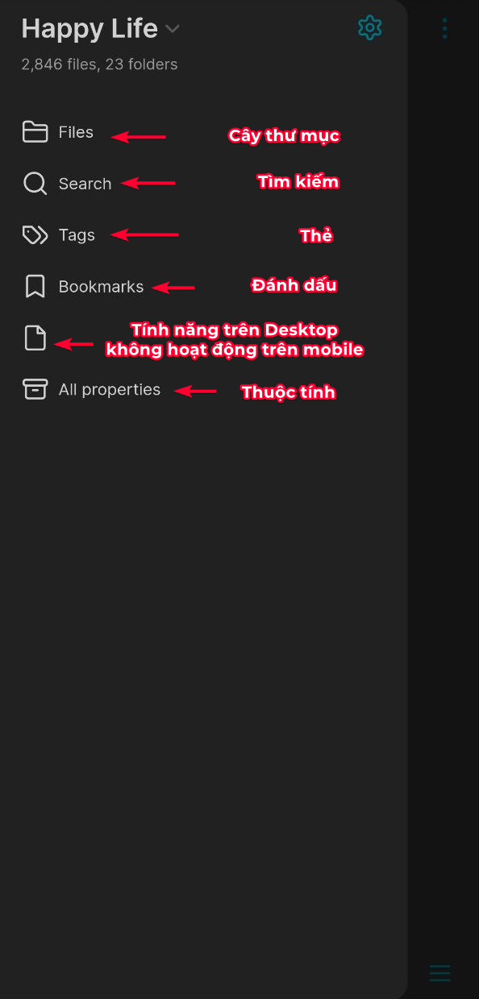
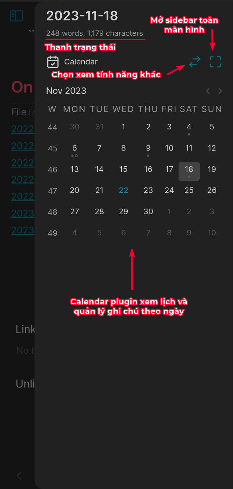
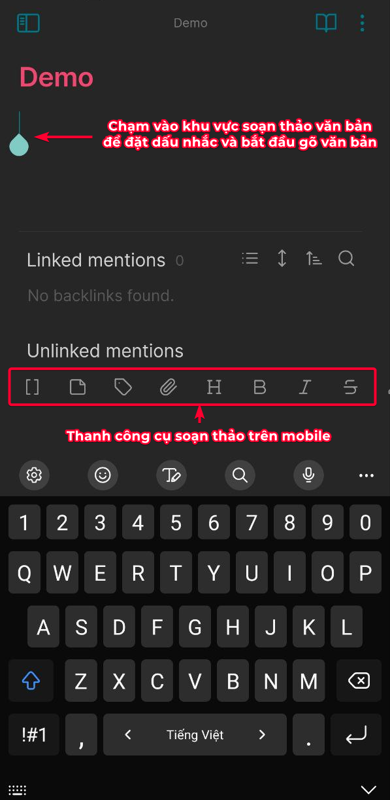

!!! abstract "Giới thiệu"
	Sau khi hoàn thành các bước thiết lập, khởi động Obsidian lần đầu tiên bạn sẽ làm quen với bố cục và các chức năng trong không gian làm việc của phần mềm. Dưới đây là các bố cục chính giúp bạn làm quen và bắt đầu sử dụng Obsidian bớt bị choáng ngợp. 

Chắc hẳn bạn sẽ khá bối rối khi mở Obsidian lần đầu tiên bởi phần mềm gốc khi cài đặt xong hoàn toàn trống trơn nhưng cũng đồng thời có quá nhiều nút bấm và thông tin trong cùng một màn hình. Đừng lo, bạn có thể ẩn các thanh công cụ trái và phải (sidebar) để mọi thứ trông thật tối giản và tập trung khi đã sử dụng quen thuộc.

## Obsidian desktop
> Không gian làm việc (Workspace) của Obsidian trên môi trường desktop bao gồm các thành phần chính như: Thanh công cụ (Ribbon), Thanh bên trái/phải (sidebar), Thanh trạng thái (status bar)

=== "1. Ribbon - thanh công cụ"
	
=== "2. Sidebar - thanh bên trái/phải"
	
=== "3. Status bar - trạng thái"	
	
=== "4. Editor - Soạn thảo văn bản"
	
## Obsidian mobile

=== "1. Bố cục Obsidian trên Mobile"
	
=== "2. Sidebar - Thanh bên trái"
	
=== "3. Sidebar - Thanh bên phải"
	
=== "4. Editor - Soạn thảo văn bản"
	