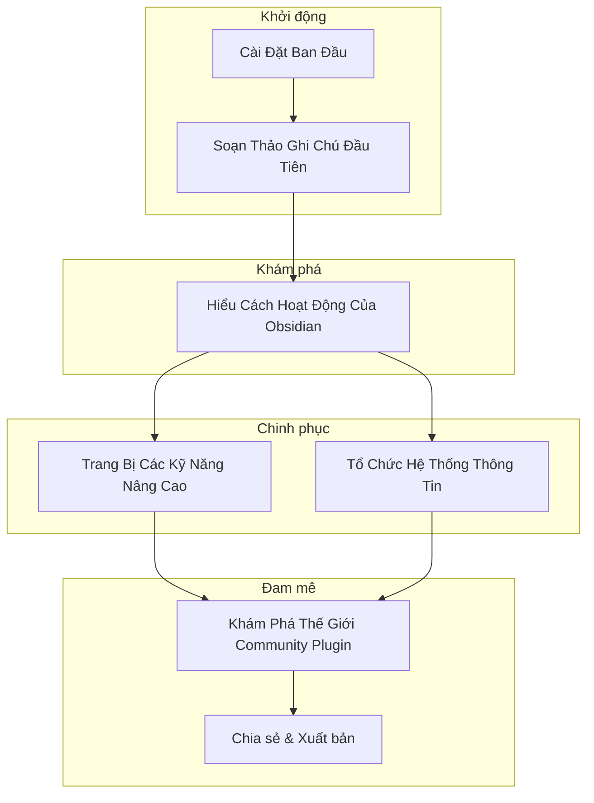

# Kiến thức về Obsidian

> Obsidian là một ứng dụng ghi chú & quản lý kiến thức đa năng, cung cấp trải nghiệm sử dụng thú vị với tốc độ đáng kinh ngạc và hoàn toàn miễn phí. Nếu bạn đang tìm kiếm một giải pháp tổng thể nhằm gia tăng hiệu suất công việc thì Obsidian là một lựa chọn tuyệt vời cho bộ công cụ làm việc mà bạn không thể bỏ qua.


## Lộ trình làm chủ Obsidian
Để có một cái nhìn tổng quan về lộ trình học và làm chủ ứng dụng Obsidian một cách có hệ thống, bạn có thể tham khảo lộ trình gợi ý sau.


Hoặc chi tiết hơn theo đề mục nội dung như sau:

```md
Từ 0 đến 1: Soạn thảo ghi chú đầu tiên với Obsidian
├── Cài đặt ban đầu
│   ├── Thiết lập giao diện (theme)
│   ├── Thiết lập một số thư mục đặc biệt
│   ├── Thiết lập trải nghiệm ghi chú
│   ├── Thiết lập files & links
│   ├── Thiết lập core plugin
│   ├── Cài đặt một số community plugin quan trọng
│   └── Thiết lập đồng bộ giữa máy tính và điện thoại
├── Trải nghiệm soạn thảo ghi chú ban đầu
│   └── Hiểu cú pháp ghi chú markdown cơ bản
│       ├── Heading
│       ├── Đính kèm: hình ảnh, link, video, ghi âm
│       ├── In đậm, in nghiêng, gạch chân, gạch ngang
│       ├── Code
│       ├── Wiki Link, Tag
│       ├── Bảng
│       ├── Quote
│       ├── Danh sách: đánh số, đánh dấu
│       └── Highlight
├── Hiểu cách hoạt động của Obsidian
│   └── Các tính năng cơ bản của Obsidian
│       ├── Graph view
│       ├── Tổ chức không gian làm việc
│       ├── Thao tác trên thiết bị di động
│       └── Calendar
├── Hứng thú - Nâng cấp kỹ năng
│   ├── Soạn thảo nâng cao
│   └── Quản lý file & thông tin mô tả
├── Tổ chức hệ thống thông tin
│   ├── Obsidian cho từng mục đích công việc
│   └── Hiểu các phương pháp tổ chức thông tin
└── Thế giới community plugin mở rộng
    └── Chia sẻ thông tin và xuất bản
```

Bạn cũng có thể dành chút thời gian để xem/nghe video tôi chia sẻ về các nội dung trên với nhiều thông tin hữu ích giúp bạn tiến nhanh hơn trên con đường chinh phục Obsidian.

<div style="display: flex; justify-content: center;">
<iframe width="940" height="529" src="https://www.youtube.com/embed/CUZCP8K-Qkw?si=MaLfHCyhAqu2YSBA" title="YouTube video player" frameborder="0" allow="accelerometer; autoplay; clipboard-write; encrypted-media; gyroscope; picture-in-picture; web-share" allowfullscreen></iframe>
</div>