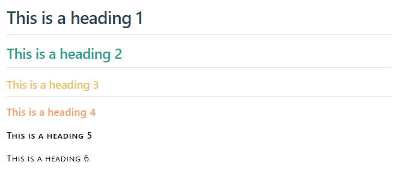
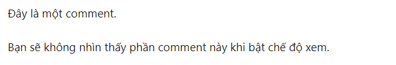

# Hướng dẫn sử dụng Markdown trong Obsidian

!!! abstract "Obsidian markdown"
	Obsidian sử dụng Markdown là cú pháp định dạng các ghi chú trong ứng dụng. Tuy nhiên tính năng thú vị nhất của Obsidian không phải là soạn thảo văn bản mà là quản lý cơ sở tri thức của bạn được liên kết chặt chẽ thông qua các ghi chú.

## Markdown phổ thông

### Văn bản

Để tạo ra văn bản thông thường (body text), bạn chỉ cần viết như với bất kỳ trình soạn thảo văn bản nào. Để ngăn cách các đoạn văn với nhau, bạn sử dụng khoảng trống với phím Enter.

```
Đây là đoạn văn 1

Đây là đoạn văn 2
```

Kết quả:

Đây là đoạn văn 1

Đây là đoạn văn 2
### Heading - Tiêu đề

Heading hay tiêu đề phân cấp (1 đến 6) được sử dụng để tạo ra một dàn ý của bài, việc này cũng giúp ứng dụng soạn thảo văn bản của bạn tạo ra phần mục lục, trong trường hợp này chúng ta dùng heading với Obsidian. Có 6 cấp heading được hỗ trợ trong hầu hết các ngôn ngữ markdown và HTML trên web. Bạn tạo ra mục heading bằng cách chèn số lượng dấu `#` tương ứng phía trước dòng chữ tiêu đề. 

```md
# This is a heading 1
## This is a heading 2
### This is a heading 3 
#### This is a heading 4
##### This is a heading 5
###### This is a heading 6
```



Lưu ý rằng sau các dấu `#` là khoảng trắng rồi mới đến văn bản, nếu không bạn đang tạo ra `tag` chứ không phải heading.

### Emphasize - Nhấn mạnh
Dưới đây là cách định dạng các kiểu văn bản phổ biến với cú pháp markdown trong Obsidian, cú pháp này cũng hoạt động với tất cả các trình soạn thảo hỗ trợ markdown.

| Kiểu định dạng                 | Cú pháp              | Cách viết                              | Hiển thị                         |
| ------------------------------ | -------------------- | -------------------------------------- | -------------------------------- |
| In đậm                         | ** ** hoặc __ __     | **Bold text**                          | Bold text                        |
| In nghiêng                     | * * hoặc _ _         | *Italic text*                          | Italic text                      |
| Gạch ngang                     | ~~ ~~                | ~~Striked out text~~                   | Striked out text                 |
| Tô màu đánh dấu                | == ==                | ==Highlighted text==                   | Highlighted text                 |
| Kết hợp in đậm và in nghiêng   | ** ** và _ _         | **Bold text and _nested italic_ text** | Bold text and nested italic text |
| In đậm và in nghiêng đồng thời | *** *** hoặc ___ ___ | ***Bold and italic text***             | Bold and italic text             |

### List - Danh sách

Để tạo ra danh sách các mục theo kiểu gạch đầu dòng (bullet points) bạn sử dụng gạch đầu dòng như cách viết quen thuộc. Để đánh số cho mục thì đánh số cho chúng, ví dụ `1.` . Cú pháp này quá quen thuộc nhưng có thể bạn không biết nó là markdown.

```md
- Mục 1
- Mục 2
  - Mục 2a
  - Mục 2b

1. Mục 1
2. Mục 2
3. Mục 3
   - Mục 3a
   - Mục 3b
```

Kết quả thu được như sau:

- Mục 1
- Mục 2
  - Mục 2a
  - Mục 2b

1. Mục 1
2. Mục 2
3. Mục 3
   - Mục 3a
   - Mục 3b

### Quotes - Câu trích dẫn

Để tạo ra đoạn văn trích dẫn bắt mắt, bạn sử dụng dấu mũi tên `>` trước văn bản mình muốn định dạng.

```md
> Hướng dẫn sử dụng Obsidian markdown bằng tiếng Việt này được tạo ra giúp bạn làm quen với cú pháp Markdown một cách dễ hiểu, nhanh chóng và đầy đủ nhất.
```

Đây là kết quả:

> Hướng dẫn sử dụng Obsidian markdown bằng tiếng Việt này được tạo ra giúp bạn làm quen với cú pháp Markdown một cách dễ hiểu, nhanh chóng và đầy đủ nhất.

Để tạo ra nhiều kiểu định dạng ấn tượng cho các đoạn chú thích khác như minh họa dưới đây, bạn tham khảo phần định dạng Callout.


### Code - đoạn mã lập trình

Để chèn một đoạn mã lập trình với cú pháp markdown, bạn sử dụng cặp dấu backtick (ngay phía dưới phím Esc trên bàn phím) để bao quanh đoạn mã. Nếu chèn khối mã bao gồm nhiều dòng thì dùng cặp 3 dấu backtick để biểu thị. Theo sau dấu backtick là tên ngôn ngữ lập trình tương ứng để hiển thị màu theo cú pháp của ngôn ngữ lập trình đó.

```python
`import pandas as pd`
```

Kết quả: `import pandas as pd`

hoặc chèn nhiều dòng mã Python như dưới đây:

```
	```python
	import pandas as pd
	from pandas import json_normalize
	```
```

Kết quả:

```python
import pandas as pd
from pandas import json_normalize
```

### Task list - Danh sách công việc

Để tạo ra danh sách công việc (to-do list) trong markdown, bạn sử dụng cú pháp
- `- [ ]` để tạo công việc chưa hoàn thành
- `- [x]` để đánh dấu hoàn thành công việc

```
- [x] Công việc đã hoàn thành
- [ ] Công việc trong kế hoạch.
```

và đây là thành quả

- [x] Công việc đã hoàn thành
- [ ] Công việc trong kế hoạch.

### Comment - Bình luận

Để tạo ra phần bình luận cho văn bản (chỉ hiển thị khi soạn thảo mà không xuất ra màn hình khi xem), bạn sử dụng cặp dấu `%%` bao quanh đoạn văn bản mục tiêu.
Nếu phần cần highlight thuộc nhiều dòng thì đặt cặp dấu `%%` riêng từng dòng như minh họa dưới đây.

```
Đây là một %%inline%% comment.

Bạn sẽ không nhìn thấy phần comment này khi bật chế độ xem.
%%
Đây là một khối văn bản được comment.

Nội dung comment có thể trong nhiều dòng.
%%
```



### Chèn ảnh

Để chèn ảnh trong Markdown, bạn sử dụng cú pháp ``. Trong các trình soạn thảo văn bản hỗ trợ Markdown như Obsidian, Visual Studio Code bạn chỉ cần copy và paste ảnh vào nội dung văn bản đang soạn thảo sẽ được tự động định dạng để hiển thị hoàn hảo. Nếu sử dụng link ảnh trên web thì cần chèn link vào phần url ảnh như trên.

```md

```

Kết quả hiển thị như sau:


Khi sử dụng ảnh trong thư mục của máy tính, bạn có thể sử dụng địa chỉ chính xác hoặc địa chỉ tương đối đến file ảnh:

- Địa chỉ chính xác (absolute path): `D:\Github\learn-anything-knowledge\docs\assets\images\python_course_4_thinhvu_square.png`
- Địa chỉ tương đối (relative path): `/assets/images/python_course_4_thinhvu_square.png`

Bạn cũng có thể không cần đặt tên cho ảnh trong cặp ngoặc `[]`, như vậy cú pháp rút gọn sẽ là `[](url ảnh hoặc đường dẫn file ảnh trên máy tính)`.

Để thay đổi kích thước ảnh, bạn chèn thông tin khổ ảnh vào trong cặp dấu `[]` như sau:

``

Kết quả thu được như sau, trong đó `400` thể hiện cho chiều rộng hiển thị là 400px của ảnh.

{width=400}


### Link - Chèn Liên kết từ web

Bạn có thể sử dụng markdown để chèn liên kết bất kỳ đến bài viết, hình ảnh hoặc tài nguyên trên web. Cú pháp để thực hiện việc này chỉ khác so với khi chèn ảnh là không có dấu `!` ở đầu.

`[Truy cập khóa học](https://learn-anything.vn/course/phan-tich-du-lieu-voi-python-khoa-4/)`

Trả về kết quả là: [Truy cập khóa học](https://learn-anything.vn/course/phan-tich-du-lieu-voi-python-khoa-4/)

## Markdown Obsidian

### Backlink - Liên kết nội bộ

Để liên kết một ghi chú khác có trong vault Obsidian, bạn sử dụng cặp dấu ngoặc nhọn `[[]]` bao quanh tên ghi chú của bạn. Ví dụ ghi chú được liên kết dưới đây có tên là `Internal link`.

```md
Liên kết đến một trang: [[Internal link]].
```

### Liên kết Obsidian

[Obsidian URI](https://publish.obsidian.md/help-vi/Ch%E1%BB%A7+%C4%91%E1%BB%81+N%C3%A2ng+cao/S%E1%BB%AD+d%E1%BB%A5ng+obsidian+URI) cho phép bạn mở các ghi chú từ một vault Obsidian bất kỳ hoặc từ một chương trình khác. Liên kết được chèn phải thuộc Vault bất kỳ bạn đã thiết lập với Obsidian.

Nếu trong liên kết có chứa khoảng trắng thì cách dễ nhất để thoát các khoảng trắng này (escape - giúp chương trình hiểu thành phần của liên kết vẫn tiếp tục) là sử dụng cặp dấu `<>` bao quanh liên kết.

Cách khác, bạn phải mã hóa liên kết (ví dụ dấu cách trong tên file phải được thay thế bằng `%2F`) theo kiểu mã hóa URI (encoding).

```md
[Liên kết đến ghi chú](<obsidian://open?path=D:\OneDrive\Github\gardening\_notes\Cộng đồng vnstock python.md>)
```

[Liên kết đến ghi chú](<obsidian://open?path=D:\OneDrive\Github\gardening\_notes\Cộng đồng vnstock python.md>)

### Embed - Nhúng

Nhúng cho phép bạn hiển thị nội dung của một ghi chú khác vào trong ghi chú bạn đang soạn thảo. Việc này tương tự bạn chèn một cửa sổ `iframe` vào trang web để hiển thị, ví dụ như chèn 1 video Youtube.

```md
![[Obsidian là gì]]
```

Trong ví dụ này, chúng ta chèn và hiển thị nội dung có trong ghi chú có tên `Obsidian là gì` vào ghi chú hiện tại. Việc này giúp bạn tận dụng các đoạn nội dung đã viết khi cần lặp lại trong nhiều ngữ cảnh khác nhau.