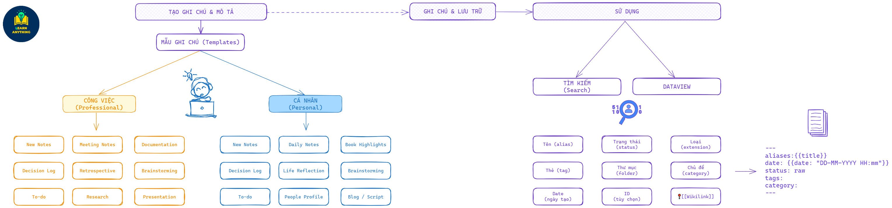
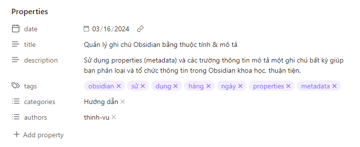
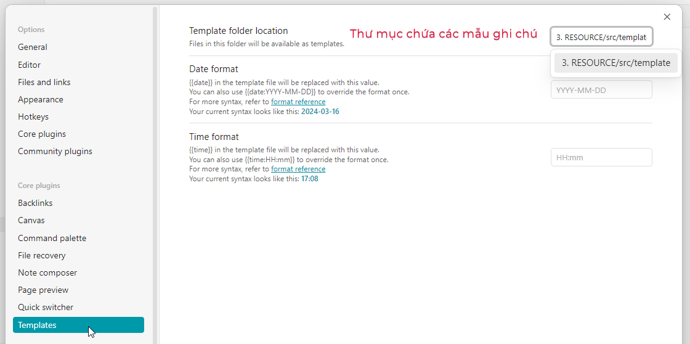
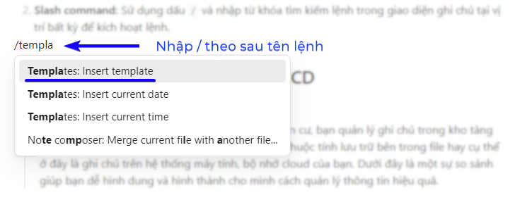
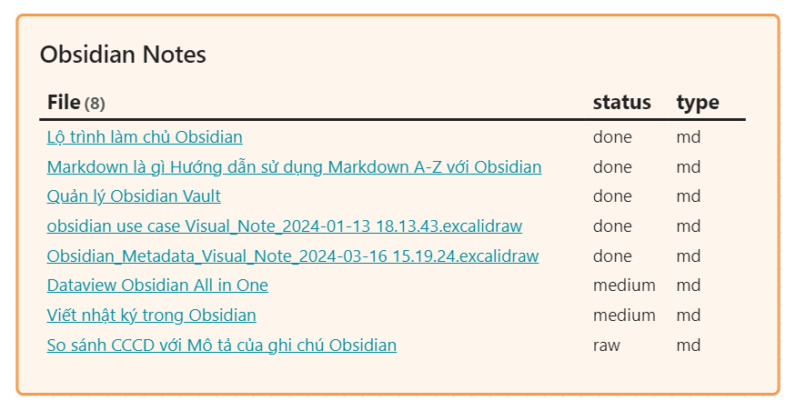
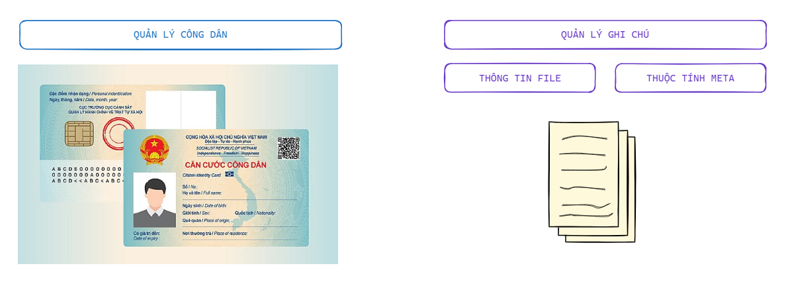

!!! tip "Giới thiệu"
	Metadata hay properties trong Obsidian (hay YAML frontmatter trong markdown) là những thông tin bạn miêu tả các thuộc tính, đặc điểm nhận dạng một ghi chú bất kỳ của bạn. Việc này giúp bạn phân loại, lưu trữ, tra cứu và sử dụng được dễ dàng, thuận tiện nhất. Ngoài ra trong Obsidian, bạn có thể sử dụng plugin Dataview để thống kê, biểu diễn thông tin có trong hệ cơ sở dữ liệu ghi chú của mình một cách linh hoạt và thú vị.
	
## Quá trình quản lý, ghi chú và sử dụng

!!! tip "Quá trình quản lý ghi chú với thuộc tính metadata"
	Toàn bộ quá trình quản lý ghi chú bằng thông tin mô tả thuộc tính/metadata được tóm tắt như dưới đây. Trong đó bạn sẽ có thêm ý tưởng rõ ràng để hình dung về các loại mẫu ghi chú mình thường xuyên sử dụng cũng như các thuộc tính quan trọng nhất mình sử dụng cho từng loại ghi chú. 




Quá trình quản lý, ghi chú và sử dụng gồm 3 bước chính như sau:

1. Tạo mẫu ghi chú (template)
2. Phân loại thông tin mô tả khi ghi chú
3. Tra cứu (sử dụng thông tin đã mô tả)

### Tạo mẫu ghi chú

!!! tip "Giới thiệu templates"
	Mẫu ghi chú hay templates được cài đặt trong Obsidian tại mục Templates (một core plugin có sẵn) cho phép bạn sử dụng một mẫu ghi chú đã có cấu trúc sẵn để chèn vào một ghi chú khi bạn làm việc. Tính năng này thích hợp cho lối tư duy mạch lạc, có cấu trúc và hỗ trợ bạn việc phân loại ghi chú của mình tốt hơn thông qua các trường thông tin đã cấu trúc sẵn.

#### Hệ thống hóa tất cả ghi chú của bạn với mẫu tương ứng

Có một sự thật là bạn có thể tạo ra các mẫu ghi chú bao quát toàn bộ hoạt động trong cuộc sống thường ngày của bạn từ công việc đến mục đích cá nhân, từ sáng tạo nội dung cho đến học tập hay viết luận. Hãy thử áp dụng [Nguyên tắc MECE](https://learn-anything.vn/kien-thuc/phat-trien-ban-than/nguyen-tac-mece/) và [Nguyên lý kim tự tháp Minto](https://learn-anything.vn/kien-thuc/phat-trien-ban-than/nguyen-ly-kim-tu-thap-minto/) mà mình giới thiệu qua blog này để giúp bạn tư duy mạch lạc và tổ chức các chi chú của mình chặt chẽ nhất.

Mình chia hệ thống mẫu ghi chú cho cá nhân thành 2 nhóm chính như dưới đây. bạn có thể tìm thấy một số mẫu trong hệ thống [Obsidian Go](https://learn-anything.vn/kien-thuc/obsidian/thiet-lap-ung-dung-ghi-chu-obsidian/#cai-at-mau-obsidian-go) mình chia sẻ.

1. **1CÔNG VIỆC (Professional):** Các ghi chú công việc thể hiện đặc trưng cho hoạt động tại công ty, dự án yêu cầu tính chuyên nghiệp. Một vài ví dụ giúp bạn dễ hình dung hơn.
	- New Notes: Các ghi chú chung chưa phân loại hoặc có mẫu cụ thể.
	- Meeting Notes: ghi chú cuộc họp
	- Documentation: các ghi chú công việc chung hoặc thuật lại các phương pháp, cách thức thực hiện một số công việc phức tạp cần lưu lại.
	- Decision Log: Ghi chú lại bối cảnh và cách tiếp cận khi ra các quyết định quan trọng.
	- Retrospective: Đánh giá lại hoạt động, dự án hoặc kết quả của bộ phận theo tháng/quý.
	- Brainstorming: Mẫu tư duy và tìm kiếm ý tưởng.
	- To-do: Công việc thường ngày, hoặc theo kế hoạch cần làm. Sử dụng kèm các plugin như Project, Kanban, Obsidian GTD
	- Research: Các ghi chú mang tính chất nghiên cứu, tìm kiếm và tổng hợp thông tin cho chủ đề hoặc một lĩnh vực công việc.
	- Presentation: Tổng hợp nội dung cho bài trình bày, câu chuyện cụ thể.

3. **CÁ NHÂN (Personal):** Tất cả các ghi chú còn lại không thuộc lĩnh vực công việc.
	- Daily Notes: nhật ký nhìn nhận lại một số sự kiện quan trọng diễn ra trong ngày.
	- Book Highlights: Các đoạn trích dẫn từ việc đọc sách (chủ yếu xuất ra từ Kindle).
	- Life Reflection: Mẫu ghi chú này giúp mình nhìn nhận lại hành trình, kết quả thực hiện các mục tiêu trong khung thời gian dài hoặc những bài học sau những sự kiện đáng nhớ trong cuộc sống.
	- People profile: Ghi chú lại những thông tin quan trọng về một người cụ thể xuất hiện trong cuộc sống của mình, có thể là bạn bè, đối tác hoặc những cá nhân mình cảm thấy có một sự hiểu biết, ghi nhớ cá nhân về họ để phát triển mối quan hệ.
	- Blog / Script: là nội dung các bài viết hoặc bản thảo cho nội dung video dự định xuất bản.
#### Thành phần & nội dung của mẫu ghi chú

Một mẫu ghi chú có thể chia thành 2 phần chính:

1. **Metadata** (hay phần thông tin mô tả, trong Obsidian được gọi là Properties). Phần thông tin mô tả này khi xem trong chế độ `Source mode` được bao quanh bởi cặp dấu `---`. Khi soạn thảo với Obsidian chế độ `Live Preview` sẽ được trình bày như dưới đây.
   
2. **Nội dung ghi chú mẫu** là cấu trúc các thành phần, hướng dẫn hoặc điều bạn muốn nhắc nhở bản thân mình làm theo trình tự, khung nội dung thống nhất với bất kỳ ghi chú nào trong cùng một loại bạn đã định hình. Ví dụ dưới đây là mẫu ghi chú hàng ngày của mình với 4 nhóm thông tin chính gồm:

	- Win the day: Việc mình muốn hoàn thành trong ngày" được nêu ra khi bắt đầu một ngày
	- Reflection: Ghi lại một vài sự kiện chính và hồi tưởng lại một ngày đã qua, đánh giá lại mục tiêu có hoàn thành hay chưa.
	- On this day: Thông tin trả về từ plugin Dataview lọc các ghi chú được tạo ra cùng ngày tương tự theo thời gian (năm trước, tháng trước, vv)

```
---
aliases: 
date: { date: "YYYY-MM-DD HH:mm" }
tags:
  - "#reflection"
mood: 
---

# Win the Day ✨


# Reflection 💬


# On this day 🧠
```

Bạn có thể tự dành chút thời gian động não (brainstorming) ra các mẫu ghi chú mình cần sử dụng, việc này chỉ có bạn mới có thể biết mình muốn gì. Bạn cũng có thể hỏi ChatGPT để tạo ra các mẫu ghi chú markdown theo kiểu/chủ đề nhất định sau khi đã nghĩ ra các loại thông tin mình cần ghi chú.

Cuối cùng, bạn tạo các file ghi chú, đặt chung trong một thư mục tại Vault của mình. Ví dụ, trong Vault của mình có thư mục `template` là thư mục con trong `3. RESOURCE/src/template`. Sau đó, bạn vào phần cài đặt  `Settings > Templates` thuộc core plugins để chọn địa chỉ thư mục mẫu nói trên tại mục `Template folder location`.



### Phân loại thông tin mô tả

!!! tip "Giới thiệu"
	Khi bắt đầu bất kỳ một ghi chú mới, việc bạn cần làm là chèn mẫu ghi chú đã thiết lập theo đúng nội dung mình đang cần tạo ra. Việc này ví như bạn điền "giấy khai sinh" cho ghi chú của mình.

Mình thường bắt đầu ghi chú mới bằng cách nhấn tổ hợp phím `Ctrl + Shift + Alt + T` đã gán từ trước cho tính năng Templates để chọn mẫu ghi chú cần sử dụng. Bạn cũng có thể chèn mẫu qua 2 cách khác phổ biến bao gồm:

1. **Command palette:** Sử dụng tổ hợp phím tắt `Ctrl + P` và tìm kiếm với từ khóa `template` để tìm hành động là `Templates: Insert template`. Tính năng tìm lệnh này được bật mặc định khi cài Obsidian, nếu bạn sử dụng tổ hợp phím tắt mà không kích hoạt được tính năng thì vào phần `Settings > Core plugins` tìm và kích hoạt tính năng.
   
2. **Slash command:** Sử dụng dấu `/` và nhập từ khóa tìm kiếm lệnh trong giao diện ghi chú tại vị trí bất kỳ, Enter hoặc click chuột vào lệnh để chọn kích hoạt lệnh tương tự như với `Command Palette`.
   
Với các mẫu ghi chú được chèn, bạn lần lượt điền các thông tin mô tả ở phần thuộc tính ghi chú (properties) để tiến hành phân loại/tổ chức thông tin của mình. 

!!! tip "Tips quan trọng"
	Bạn nên chèn sẵn các thông tin mô tả cơ bản cho từng loại ghi chú ngay trong mẫu. Ví dụ với `status` mặc định sẽ có giá trị là `raw`, `tags` với bài viết blog của mình sẽ có giá trị `#obsidian, #metadata`, phần `category` sẽ là `Blog, Youtube` chẳng hạn. Việc này giúp cho nhiệm vụ phân loại của bạn chỉ đơn giản là chèn mẫu ghi chú và chỉnh sửa, thêm 1 vài thông tin cụ thể cho ghi chú của mình thay vì làm "nô lệ" cho việc mô tả lặp đi lặp lại tốn thời gian.

### Tra cứu và sử dụng thuộc tính

#### Tìm kiếm trong Obsidian

Với tính năng tìm kiếm trong Obsidian thì cú pháp ở đây khá đơn giản thôi, bạn sử dụng tên file hoặc một thuộc tính bất kỳ của loại ghi chú mục tiêu và thực hiện tìm kiếm.

Trong ví dụ minh họa, mình lọc tất cả ghi chú có trạng thái là `raw` tức mới chỉ ở giai đoạn ý tưởng và có chứa từ `CCCD` thì nhận được 13 kết quả bao gồm 2 kết quả dưới đây.


#### DataView

Đoạn mã Dataview dưới đây có thể được chèn vào một ghi chú bất kỳ trong Obsidian để hiển thị dữ liệu/ghi chú/kết quả lọc được trả về từ câu truy vấn. Bạn cũng có thể sử Dataview kết hợp một thẻ/ghi chú bất kỳ trong chế độ Obsidian Canvas để tạo ra trang tổng quan như ý muốn.

```dataview
	TABLE status, file.ext AS type WHERE contains(lower(file.name), "obsidian")
	SORT status ASC
```

Trong đó, thành phần của câu truy vấn gồm:

- TABLE: hiển thị dữ liệu trả về dưới dạng bảng, dạng khác có thể là LIST, TASK, CALENDAR
- `status, file.ext` là tên các cột hiển thị bổ sung cho cột `File` mặc định. `status` là thuộc tính được tạo tự do, trong khi `file.ext` là thuộc tính tên định dạng file (mặc định của file ghi chú khi được tạo ra).
- `AS` cho phép đổi tên `file.ext` thành `type` cho thuận tiện mục đích sử dụng
- `WHERE` là thao tác lọc các kết quả theo điều kiện đặt ra, ví dụ tên file tức thuộc tính `file.name` phải chứa chữ `obsidian` dù viết hoa hay thường (sử dụng hàm `lower()` để định dạng tên file về kiểu chữ thường để so sánh).
- `SORT` cho phép sắp xếp cột `status` theo chiều thuận `ASC` tức ascending.

Chi tiết về cách sử dụng Dataview, bạn có thể tham khảo tại trang web chính thức [tại đây](https://blacksmithgu.github.io/obsidian-dataview/)

Tada, dưới đây là kết quả trả về từ câu truy vấn trên, được hiển thị trong một thẻ (card) của Obsidian Canvas.

## Thuộc tính ghi chú vs lý lịch công dân qua CCCD

!!! tip "Hình dung dễ hiểu"
	Nhà nước quản lý công dân bằng cơ sở dữ liệu dân cư, bạn quản lý ghi chú trong kho tàng của mình thông qua cấu trúc thư mục, tên và các thuộc tính lưu trữ bên trong file hay cụ thể ở đây là ghi chú trên hệ thống máy tính, bộ nhớ cloud của bạn. Dưới đây là một sự so sánh giúp bạn dễ hình dung và hình thành cho mình cách quản lý thông tin hiệu quả.



### Các thông tin trong CCCD

Từ bảng so sánh dưới đây, mình tin bạn đã có một sự hình dung rõ ràng về cách tạo và quản lý các ghi chú trong Obsidian của mình một cách có tổ chức.

| Thông tin CCCD     | Properties ghi chú                            | Giải thích                                                                                                                                                                                                                                               |
| ------------------ | --------------------------------------------- | -------------------------------------------------------------------------------------------------------------------------------------------------------------------------------------------------------------------------------------------------------- |
| Số CCCD            | ID ngẫu nhiên (nếu sử dung dạng Zettelkasten) | Thường bỏ qua                                                                                                                                                                                                                                            |
| Tên                | Title / Alias                                 | Tên ghi chú gán với "alias" (biệt danh) là một thuộc tính có sẵn trong Obsidian, cho phép bạn gán một cái tên khác so với tên file của ghi chú. Mình thường đặt alias để tiện chèn ghi chú với tính năng Wikilink                                        |
| Ngày sinh          | Date Created                                  | Thời gian ghi chú được tạo ra. Thông tin này được tự động lưu trữ trong file. Có thể bổ sung trường thông tin tự động để tiện xem trong ghi chú. Thông tin này theo suốt vòng đời của ghi chú.                                                           |
| Giới tính          | File Extension                                | Markdown, Excalidraw, vv. Thông tin này chính là extension hay định dạng loại file ghi chú                                                                                                                                                               |
| Quốc tịch          | Ổ đĩa                                         | Ghi chú này thuộc Vault nào trong Obsidian (hay Drive nào với bộ nhớ lưu trữ, trên Cloud)                                                                                                                                                                |
| Quê quán           | Folder                                        | Ghi chú này được đặt ở thư mục nào trong Vault. Thư mục mang tích chất vật lý, hữu hình. Khi tổ chức ghi chú theo cấu trúc thư mục, bạn có thể tìm được trên hệ thống quản lý file của máy tính.                                                         |
| Nơi thường trú     | Starred                                       | Có thể hình dung tính năng yêu thích để giúp truy cập nhanh và thường xuyên sử dụng                                                                                                                                                                      |
| Hình ảnh           | Cover image                                   | Cover của ghi chú hoặc icon để giúp nhận diện nhanh khi bắt gặp                                                                                                                                                                                          |
| Đặc điểm nhận dạng | Search queries                                | Đối với ghi chú, đặc điểm nhận dạng có thể được tạo ra bằng cách ghép nhiều trường thông tin mang tính chất mô tả lại với nhau, tạo ra một bộ nhận diện đặc trưng không trùng lặp. Việc này thấy rõ khi thực hiện thao tác tìm kiếm với nhiều điều kiện. |
| Ngày cấp           | Last Modified                                 | Thời gian sửa ghi chú lần cuối. Thời gian này được cập nhật theo sửa đổi.                                                                                                                                                                                |

### Các thông tin sơ yếu lý lịch thường gặp

Dưới đây là một số thông tin các bạn thường gặp trong mẫu lý lịch công việc, và tương tự bạn cũng có thể mô phỏng thuộc tính ghi chú của mình kiểu vậy để tiện sử dụng.

| Thông tin lý lịch                                   | Properties ghi chú | Giải thích                                                                                                                                                                                                                                         |
| --------------------------------------------------- | ------------------ | -------------------------------------------------------------------------------------------------------------------------------------------------------------------------------------------------------------------------------------------------- |
| Tỉnh / Thành phố / Quận / Huyện nơi người đó cư trú | Tag (Keywords)     | Chỉ một đơn vị hành chính cho phép tách và gom nhóm dân cư thuộc cấp đó quản lý. Với ghi chú cũng tương tự, một tag cho phép gộp các ghi chú có đặc điểm chung nhưng không quá khăng khít, mức độ tương đồng ở mức chung chung.                    |
| Biệt danh (Nickname)                                | Alias              | Tên biệt danh của ghi chú                                                                                                                                                                                                                          |
| Người thân                                          | Wikilink / Related | Chèn Wikilink của ghi chú có nhắc đến ghi chú này. Ví như quan hệ gia đình than thiết: cha, mẹ, anh chị em ruột.                                                                                                                                   |
| Trình độ học vấn                                    | Status             | Trạng thái trong vòng đời của ghi chú: Raw, Medium, Done, Archieved, Deleted (chỉ hành động, không thể hiện bằng tên). Ví dụ liên quan bởi vòng đời của ghi chú là tích lũy thêm kiến thức hoặc làm rõ chủ đề được ghi chú và trở nên hữu ích hơn. |
