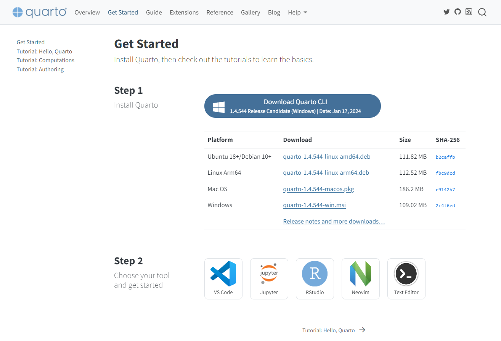
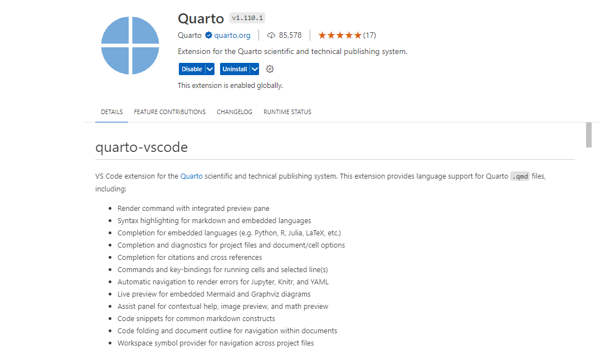
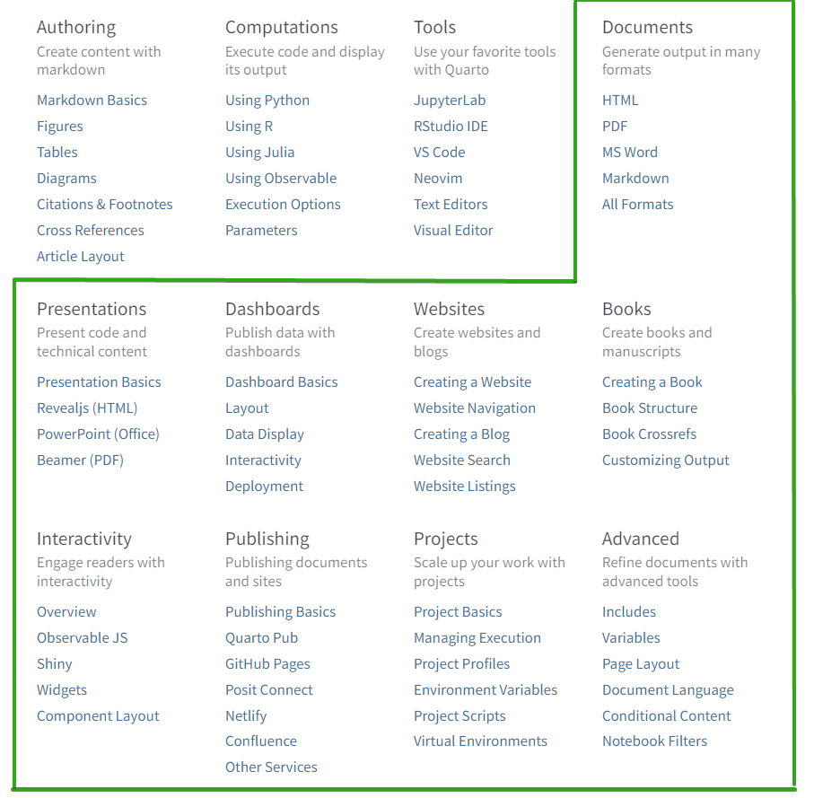

!!! tip "Chia sẻ"
	Trong các hướng dẫn dưới đây, bạn sẽ được làm quen cách sử dụng Obsidian như một công cụ soạn thảo văn bản với Markdown để dễ dàng chia sẻ và xuất bản nội dung lên Web hoặc file.

## Chia sẻ lên web
!!! abstract "Thông tin"
	Dưới đây, bạn sẽ làm quen với các nền tảng tạo trang web tĩnh (Static Site Generator - SSG) giúp tạo ra nội dung website từ các file markdown. Ngoài Obsidian, bạn cũng sẽ làm quen với [Github](https://github.com/) và các dịch vụ giúp deploy (triển khai) và xuất bản trang web của bạn tới công chúng. Các công cụ SSG như MKDocs, Jekyll, Gatsby đều thuộc nhóm JAMstack, bạn có [rất nhiều lựa chọn khác](https://jamstackthemes.dev/theme/) ngoài 3 công cụ được gợi ý này.

### Obsidian với MKDocs
- Bạn có thể tham khảo bài viết hướng dẫn sơ lược về cách thiết lập MKDocs từ trang Vnstock mà mình sử dụng [tại đây](https://docs.vnstock.site/blog/2023/12/17/huong-dan-thiet-lap-mkdocs-matterial/)
- Giới thiệu về [Material for MKDocs ](https://squidfunk.github.io/mkdocs-material/)

### Obsidian với Jekyll
Tham khảo hướng dẫn chi tiết về Jekyll và các bước cấu hình trang blog đẹp, hiện đại với Jekyll YAT theme từ đây: 

- [Cài đặt Jekyll](https://learn-anything.vn/kien-thuc/cong-nghe/jamstack/cai-dat-cong-cu-tao-trang-web-tinh-jekyll-ssg/)
- [Thiết lập Jekyll YAT theme](https://learn-anything.vn/kien-thuc/cong-nghe/jamstack/tao-blog-dep-voi-jekyll-yat-theme-tu-ghi-chu-obsidian/)

Ngoài ra, bạn  có thể lựa chọn theme tùy ý cho Jekyll tại [Jamstack theme](https://jamstackthemes.dev/theme/#ssg=jekyll) và thực hiện tùy biến theo sở thích khi đã có kinh nghiệm cơ bản thiết lập một trang web với Jekyll sử dụng Github Pages là nơi lưu trữ (host) trang web miễn phí.

### Obsidian với Gatsby
- Tham khảo [Gatsby](https://www.gatsbyjs.com/)
- Lựa chọn theme cho Jekyll tại [Jamstack theme](https://jamstackthemes.dev/theme/#ssg=gatsby)

## Chia sẻ file

### Obsidian với Pandoc
- Tham khảo thông tin về [Pandoc](https://pandoc.org/)

### Obsidian với Quarto

!!! abstract "Giới thiệu Quarto"
	  [Quarto](https://quarto.org/) là một hệ thống phần mềm mã nguồn mở cho xuất bản nội dung khoa học và kỹ thuật. Bạn có thể tạo ra nội dung từ định dạng Jupyter Notebook (dùng cho Python, R, Julia, vv) hoặc viết với định dạng văn bản markdown trực tiếp trong trình soạn thảo yêu thích của bạn, cụ thể là Obsidian. Quarto cho phép xuất bản nội dung sang pdf định dạng tài liệu, sách, báo cáo khoa học đẹp mắt và dễ dàng giúp bổ sung điểm yếu cho Pandoc sử dụng dạng Plugin trong Obsidian.

Quarto cho phép xuất bản nội dung file markdown sang nhiều định dạng tài liệu khác nhau từ nội dung văn phòng (pdf, docx, pptx, vv) cho đến website/blog, ebook, vv một cách đơn giản và đẹp mắt. 

Bố cục trình bày nội dung từ một mã nguồn markdown duy nhất tạo ra bởi Quarto có chất lượng cao và sẵn sàng sử dụng. Đây là một nền tảng bạn không thể bỏ qua, tuy nhiên lại ít người để ý đến bởi bắt nguồn từ gói phần mềm R cho tính toán khoa học và thống kê thay vì người dùng đại chúng.

#### Cài đặt

!!! abstract "Cài đặt Quarto CLI"
	Quarto sẽ được sử dụng như một tiện ích trong môi trường dòng lệnh (CLI - Command Line Interface) trong ứng dụng Command Prompt/Terminal.



Truy cập Quarto và tải phiên bản phù hợp cho máy tính của bạn tại link sau:

[Tải Quarto CLI :material-download:](https://quarto.org/docs/dashboards/){ .md-button }

Bạn có thể sử dụng Quarto kèm với Visual Studio Code, cần cài thêm [Quarto extension](https://marketplace.visualstudio.com/items?itemName=quarto.quarto). Điều này làm hành trình sử dụng Quarto của phần đông người dùng trở nên khó khăn bởi nó mở rộng phạm vi khiến bạn sử dụng bộ công cụ của lập trình viên hơn là một người dùng ưa viết thông thường.



#### Các định dạng nội dung xuất bản với Quarto

!!! abstract "Xuất bản ra nhiều định dạng từ markdown"
	Bạn có thể tham khảo danh sách đầy đủ các định dạng xuất bản mà Quarto hỗ trợ [tại đây](https://quarto.org/docs/reference/)



#### Xuất nội dung markdown sang định dạng tùy chỉnh

##### PDF
Đây là một mẫu YAML front-matter được chèn ở đầu trang markdown cho phép tạo ra mẫu file pdf định dạng sách để bạn có thể hình dung. Thực tế, bạn có thể sử dụng cài đặt mặc định của Quarto nếu không có nhu cầu tùy biến cụ thể thành sách, tài liệu, bài báo, vv.

Mình đang sử dụng cấu hình này cho các tài liệu được chuyển đổi sang dạng PDF khi chia sẻ trong công việc.

```
---
title: ""
format: 
  pdf: 
    documenclass: book
    toc: true
    toc-depth: 2
    toc-title: Mục lục
    number-sections: true
    number-depth: 4
    highlight-style: github
    geometry:
      - top=30mm
      - left=20mm
      - heightrounded
    fontfamily: inter
    colorlinks: true
    fc-list: lang=vi
---
```

