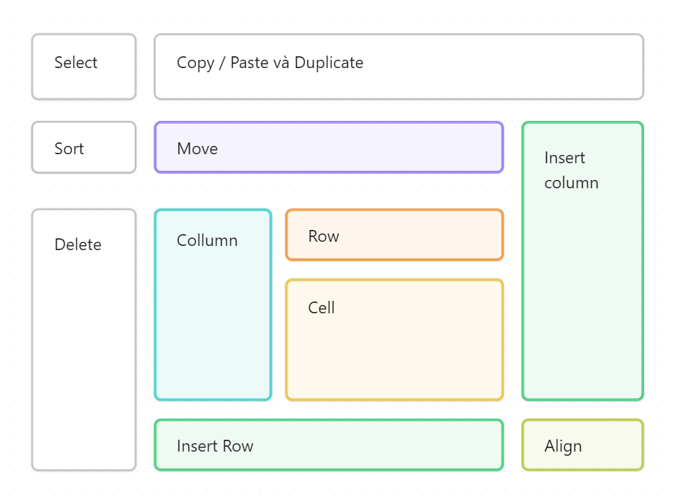

!!! abstract "Tính năng Table từ Obsidian v1.5.3"
	Obsidian mới ra mắt tính năng làm việc với bảng hoàn toàn mới trong phiên bản 1.5 vừa ra mắt ngày 26/12. Trong video này mình chia sẻ với các bạn cách chỉnh sửa bảng với giao diện chỉnh sửa mới rất trực quan của Obsidian. Bạn sẽ không cần phải cài Advanced Table community plugin để tạo và sửa bảng nữa. 

Đây là một trong những tính năng mình cho rằng cực kỳ căn bản khi soạn thảo tài liệu bên cạnh heading, body text, hình ảnh, link. Mình bắt đầu sử dụng Obsidian từ 2021 tới nay mới thấy Obsidian cải thiện tính năng chí tử này vì người dùng mới đến với Obsidian chắc chắn cực kỳ bối rối khi muốn tạo bảng, nhất là những người quen dùng Excel hay các ứng dụng ghi chú trực quan như Notion.

<iframe width="914" height="514"src="https://www.youtube.com/embed/hiZTW85T8jw?si=XWb23zbiI8-r57Qe" title="YouTube video player" frameborder="0" allow="accelerometer; autoplay; clipboard-write; encrypted-media; gyroscope; picture-in-picture; web-share" allowfullscreen></iframe>

Đây là tóm tắt các thao tác chính được hỗ trợ bởi Obsidian khi làm việc với bảng được nhắc đến trong video.
<figure markdown>
  
  <figcaption>Thao tác với bảng trong Obsidian</figcaption>
</figure>
