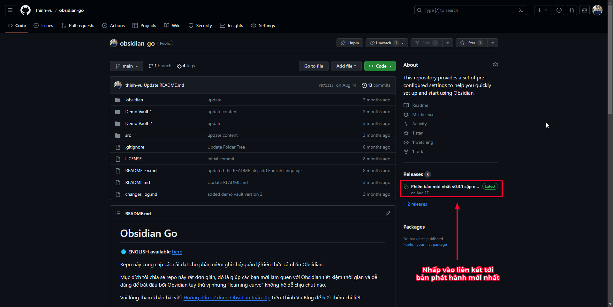
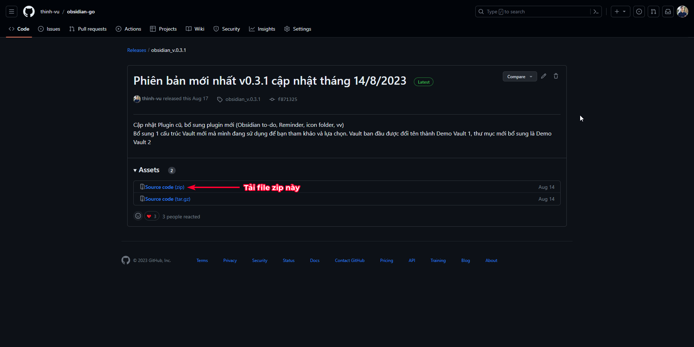

# Thiết lập ứng dụng ghi chú Obsidian
## Cài đặt Obsidian

[Tải Obsidian :material-download:](https://obsidian.md/download){ .md-button }

**Obsidian trên máy tính**

Bạn có thể tải Obsidian tại trang web chính thức: [Obsidian.md](https://obsidian.md). Obsidian hoạt động trên tất cả các hệ điều hành máy tính hiện nay bao gồm macOS, Windows, và Linux.

**Obsidian cho điện thoại, máy tính bảng**

Bạn có thể sử dụng Obsidian trên thiết bị di động iOS như iPhone, iPad hoặc nền tảng Android tùy ý. Trên các máy tính bảng Windows, bạn có thể tải phiên bản ARM trong link download ở trên.

## Cài đặt mẫu Obsidian Go
!!! abstract "Giới thiệu"
	Obsidian Go V3 là mẫu thiết lập Obsidian được giới thiệu bởi Thịnh Vũ - tác giả của LEarn Anything và Thinh Vu Blog giúp các bạn mới có thể tận dụng toàn bộ cấu hình mẫu được giới thiệu bao gồm các thiết lập và plugin khuyên dùng để sử dụng ngay lập tức. 

Obsidian là công cụ soạn thảo văn bản và quản lý kiến thức cho cá nhân có tính tùy biến cao. Khi bước vào thế giới của Obsidian, bạn sẽ cần dành nhiều thời gian để làm quen với bộ công cụ và phương thức làm việc mới so với các công cụ truyền thống. Obsidian V3 giúp rút ngắn việc tự "đốt đuốc tìm đường" của các bạn nhiều lần bởi khi cài đặt xong gói phần mềm, mọi thứ đều thô sơ và bạn sẽ choáng ngợp với trải nghiệm mới mà không biết bắt đầu từ đâu.

### Triết lý Cấu hình vault
Hầu hết các phần cài đặt trong Obsidian vault [^1] đã được tùy biến tối ưu nhất theo quan điểm sử dụng của Thịnh, các tùy biến này ưu tiên việc ít tác động tới cài đặt gốc nhất nhưng giúp việc sử dụng thuận tiện.

[^1]: vault chỉ thư mục chứa toàn bộ không gian làm việc và file trong Obsidian.
### Các thành phần chính
Thành phần | Mô tả
--- | ---
Plugins | các tiện ích mở rộng gợi ý đã cài đặt từ Community Plugins, khi nạp bộ cài đặt này bạn sẽ có thể sử dụng ngay các tính năng nâng cao. Update (cập nhật) các plugin lên bản mới nhất trong phần Cài đặt.
Template | Các mẫu ghi chú gợi ý, cho phép bạn chèn mẫu khi tạo ghi chú mới dễ dàng
Cấu trúc thư mục | Gợi ý cách tổ chức thư mục tối ưu để sử dụng và quản lý mọi thứ có trật tự nhưng thúc đẩy sáng tạo và linh hoạt.
Shortcuts | Bố cục các tổ hợp phím tắt để sử dụng một cách thuận tiện, dễ nhớ và khoa học
Theme | Thiết lập giao diện tối giản
File & Links | Thiết lập các đường dẫn thư mục khi tạo ghi chú mới, mẫu ghi chú và hành vi của Obsidian trong các ngữ cảnh cụ thể.

### Cách sử dụng Obsidian Go V3

Để sử dụng thư mục cấu hình sẵn Obsidian Go, bạn thực hiện theo các bước như sau:

1. Tải file zip về máy tính từ link Github repo tại đây

	[Download :material-download:](https://github.com/thinh-vu/obsidian-go){ .md-button }

??? "Click để mở xem hình minh họa"
	<figure markdown>
	  
	  <figcaption>Chọn bản phát hành mới nhất</figcaption>
	</figure>
	
	<figure markdown>
	  
	  <figcaption>Chọn file zip để tải về</figcaption>
	</figure>
2. Giải nén file zip để có thư mục bên trong
3. Chép thư mục này vào máy tính của bạn:
	> Hướng dẫn này mặc định hiểu bạn có nhu cầu đồng bộ các ghi chú giữa nhiều thiết bị (tất yếu), do đó bạn cần chọn 1 dịch vụ đám mây để làm phương tiện đồng bọ. Nếu không có nhu cầu đồng bộ dữ liệu với các thiết bị khác. Bạn chỉ cần chép thư mục vừa giải nén vào vị trí bất kỳ trên thiết bị.
	- macOS: chép vào thư mục của dịch vụ iCloud, OneDrive (tôi đang sử dụng), hoặc Google Drive. Nếu sử dụng Obsidian trên iPhone thì chỉ dùng iCloud để đồng bộ, nếu dùng thiết bị Android thì chọn OneDrive, Google Drive, vv.
	- Windows: chép vào thư mục OneDrive, Google Drive, hoặc bất kỳ ứng dụng Cloud nào bạn chọn.
	- Android: Đặt ở thư mục gốc là được. Bạn sẽ cần dùng thêm ứng dụng FolderSync để đồng bộ với Cloud nếu muốn.
	- iPhone/iPad: Bật đồng bộ thư mục trên từ iCloud sau khi lưu từ macbook.
4. Chọn `Open folder as Vault` từ Obsidian để mở thư mục cấu hình sẵn để sử dụng trên thiết bị di động của bạn.

!!! warning "Lưu ý"
	Bạn cần cài đặt ứng dụng OneDrive, Google Drive, Dropbox, vv trên máy tính (client) để đồng bộ dữ liệu với thiết bị di động.