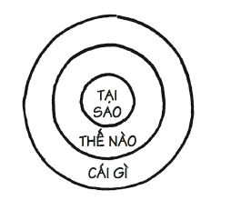

!!! abstract "Giới thiệu"
	**Bắt đầu với câu hỏi tại sao** là tên một cuốn sách của tác giả Simon Sinek chia sẻ khám phá về sức mạnh của câu hỏi Tại sao giúp tác giả thay đổi hoàn toàn góc nhìn thế giới.
	Simon Sinek nổi tiếng với khái niệm Golden Circle và là một trong những diễn giả có lượt xem nhiều nhất qua TED.com. 

## Golden Circle - Vòng tròn vàng

> Tư duy từ trong ra ngoài theo thứ tự Tại sao (WHY) - Thế nào (HOW) - Cái gì (WHAT) giúp thay đổi góc nhìn truyền thống theo số đông.

- 