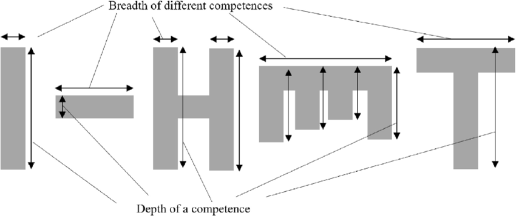

## Giới thiệu
!!! success "Chọn lựa & con đường"
	Trên con đường phát triển chuyên môn và định vị bản thân, mỗi người trong chúng ta đều trải qua những suy tư, nhận thức và định hình những hướng đi riêng biệt. Có thể bạn đã lựa chọn con đường một cách khoa học, với những bước đi đầy tính chiến lược; hoặc có khi bạn để bản năng dẫn dắt và tình cờ tìm thấy con đường phù hợp, dù chưa hề định trước.

Chắc chắn một điều rằng, dù bạn đã chọn con đường nào, hãy tự hào với những nỗ lực và thành quả mà bạn đã đạt được. Nhìn lại hành trình của mình, có những giai đoạn tôi được dẫn dắt bởi bản năng và may mắn có những giai đoạn hiểu mình hơn để có được định hướng một cách có hệ thống. Chính từ những trải nghiệm đó, tôi tin rằng việc hiểu rõ các mô hình phát triển sự nghiệp từ sớm sẽ giúp bạn hình dung rõ ràng hơn về con đường mà mình có thể đi, với sự tính toán và chiến lược phù hợp.

Nội dung bài viết này được đúc kết từ nội dung nghiên cứu khoa học lẫn báo cáo chiến lược, mang đến cho chúng ta một góc nhìn tổng quát và giúp bạn hiểu rõ hơn về lộ trình phát triển của chính mình. Ở phần cuối bài, tôi sẽ chia sẻ về hành trình phát triển của bản thân, hy vọng giúp bạn dễ dàng hình dung và liên hệ với chính mình trong những tình huống cụ thể.

## Các mô hình phát triển chuyên môn

<figure markdown>

  <figcaption>Các mô hình phát triển chuyên môn & sự nghiệp theo nghiên cứu. Nguồn: ResearchGate</figcaption>
</figure>

Hình minh hoạ trên đây cho bạn cái nhìn tổng quan về các mô hình phát triển chuyên môn, trong đó:

- Chiều cao của chữ cái thể hiện cho độ sâu về kiến thức chuyên môn
- Bề rộng của chữ cái thể hiện cho sự đa dạng trong lĩnh vực chuyên môn của bạn.

### 1. I-shaped Professionals (Chuyên môn hóa sâu)

**Mô hình I-shaped** đại diện cho những cá nhân có kiến thức sâu trong một lĩnh vực cụ thể. Những người này thường trải qua quá trình đào tạo chuyên sâu và hẹp, trở thành các chuyên gia trong lĩnh vực của mình. Tuy nhiên, họ có xu hướng bị hạn chế trong việc mở rộng sang các lĩnh vực khác, dẫn đến khó khăn khi phải hợp tác hoặc giải quyết các vấn đề đa ngành.

**Ưu điểm:**

- **Chuyên môn sâu:** Giúp bạn trở thành một chuyên gia thực thụ trong lĩnh vực mình chọn, với khả năng giải quyết các vấn đề phức tạp trong lĩnh vực đó.
- **Cập nhật kiến thức mới:** Do phạm vi kiến thức chuyên môn hẹp, việc cập nhật kiến thức mới và duy trì vị thế dẫn đầu trong lĩnh vực của mình trở nên dễ dàng hơn.

**Nhược điểm:**

- **Giới hạn trong phạm vi:** Kiến thức hẹp khiến bạn gặp khó khăn khi phải làm việc trong các dự án đa ngành hoặc cần sự linh hoạt.
- **Khó mở rộng:** Khả năng mở rộng kiến thức sang các lĩnh vực khác bị hạn chế, làm giảm khả năng thích ứng với những thay đổi nhanh chóng của thị trường.

### 2. Dash-shaped Professionals (Tổng quát hóa)

**Mô hình Dash-shaped** mô tả những cá nhân có kiến thức rộng nhưng không chuyên sâu vào một lĩnh vực cụ thể nào. Họ có khả năng hợp tác tốt và biết một chút về nhiều thứ, nhưng không có sự phát triển chuyên môn hóa đủ sâu để thực sự đóng góp lớn trong một lĩnh vực cụ thể.

**Ưu điểm:**

- **Khả năng hợp tác tốt:** Với kiến thức tổng quát, bạn dễ dàng hợp tác và hiểu biết về các lĩnh vực khác nhau.
- **Linh hoạt:** Khả năng thích ứng nhanh với các thay đổi và yêu cầu mới trong công việc do có phạm vi kiến thức rộng.

**Nhược điểm:**

- **Thiếu chiều sâu:** Kiến thức không đủ sâu trong một lĩnh vực cụ thể khiến bạn có thể bị đánh giá là “jack of all trades, master of none” – biết nhiều nhưng không giỏi hẳn một lĩnh vực nào.
- **Giá trị đóng góp thấp:** Do thiếu sự chuyên môn hóa, bạn có thể gặp khó khăn trong việc đóng góp ý kiến giá trị hoặc giải quyết các vấn đề phức tạp.

### 3. H-shaped Professionals (Chuyên môn kép)

**Mô hình H-shaped**, còn được gọi là **Pi-shaped professionals**, mô tả những người có chuyên môn sâu trong hai lĩnh vực khác nhau. Họ có khả năng kết hợp và tổng hợp hai lĩnh vực này để tạo ra những giải pháp sáng tạo.

**Ưu điểm:**

- **Chuyên môn đa lĩnh vực:** Sự kết hợp giữa hai lĩnh vực chuyên môn giúp bạn có thể cung cấp những góc nhìn đa chiều và giải pháp sáng tạo.
- **Năng lực hợp tác:** Khả năng “bilingual” trong hai lĩnh vực giúp bạn dễ dàng làm việc và truyền đạt kiến thức cho đồng nghiệp ở các ngành khác nhau.

**Nhược điểm:**

- **Khả năng mở rộng hạn chế:** Giới hạn bởi hai lĩnh vực phát triển chuyên môn, bạn có thể gặp khó khăn khi phải học thêm hoặc thích ứng với các lĩnh vực mới.
- **Cần cân bằng:** Việc duy trì sự chuyên môn hóa sâu trong hai lĩnh vực có thể dẫn đến áp lực và yêu cầu cao về thời gian và năng lượng.

### 4. Comb-shaped Professionals (Chuyên môn đa dạng)

**Mô hình Comb-shaped** hay **M-shaped professionals** mô tả những người có kiến thức và kỹ năng ở nhiều lĩnh vực khác nhau, nhưng không nhất thiết phải đạt đến mức độ chuyên môn sâu ở tất cả các lĩnh vực này.

**Ưu điểm:**

- **Đa năng:** Bạn có khả năng làm việc và đóng góp ở nhiều lĩnh vực khác nhau, giúp tăng cường sự linh hoạt và khả năng thích ứng.
- **Tính kết nối:** Có thể liên kết các lĩnh vực khác nhau để đưa ra những giải pháp toàn diện và đa chiều.

**Nhược điểm:**

- **Chiều sâu hạn chế:** Dù có kiến thức rộng, nhưng sự hiểu biết trong từng lĩnh vực có thể không đủ sâu để giải quyết những vấn đề chuyên môn phức tạp.
- **Khó định hướng:** Sự đa dạng trong kiến thức và kỹ năng có thể khiến bạn gặp khó khăn trong việc định hướng rõ ràng cho sự nghiệp của mình.

### 5. T-shaped Professionals (Chuyên môn và tổng quát hóa)

**Mô hình T-shaped** là sự kết hợp giữa phát triển chuyên môn sâu (chữ I) và kiến thức rộng (chữ Dash). Những người thuộc mô hình này không chỉ là chuyên gia trong một lĩnh vực mà còn có khả năng làm việc và hiểu biết về nhiều lĩnh vực khác.  

<figure markdown>
  
  <figcaption>Mô hình phát triển chuyên môn theo chữ T (T-shaped). Nguồn: McKinsey & Company</figcaption>
</figure>

**Ưu điểm:**

- **Chuyên môn sâu:** Bạn vẫn giữ được sự chuyên môn hóa trong một lĩnh vực cụ thể, giúp giải quyết các vấn đề phức tạp trong lĩnh vực đó.
- **Khả năng liên ngành:** Sự hiểu biết rộng ở nhiều lĩnh vực khác nhau giúp bạn dễ dàng hợp tác, giải quyết các vấn đề đa ngành, và tạo ra các giá trị mới.

**Nhược điểm:**

- **Cần cân bằng:** Việc duy trì cả chiều sâu và chiều rộng trong kiến thức và kỹ năng đòi hỏi bạn phải cân bằng tốt giữa hai yếu tố này, điều này có thể gây áp lực lớn.
- **Yêu cầu học hỏi liên tục:** Để duy trì và phát triển mô hình này, bạn cần có tinh thần học hỏi không ngừng và sẵn sàng mở rộng kiến thức.

## Hành trình 10 năm phát triển bản thân của tôi

Khi nhìn lại hành trình 10 năm phát triển sự nghiệp, tôi nhận thấy mình đã trải qua nhiều mô hình phát triển chuyên môn khác nhau, mỗi giai đoạn lại mang đến những bài học và kinh nghiệm quý giá. Điều thú vị là, mỗi mô hình mà tôi từng áp dụng đều phản ánh một phần quan trọng trong tên gọi của mình: T-H-I-M-H. Thật bất ngờ phải không?

- **Mô hình Dash-shaped – Giai đoạn khám phá bản thân**: Khi mới ra trường, như nhiều bạn trẻ khác, tôi không ngừng tìm kiếm bản thân mình trong một thế giới đầy những cơ hội và thách thức. Tôi đã thử sức ở nhiều công việc khác nhau, không phải để tìm kiếm sự ổn định ngay lập tức, mà để hiểu rõ hơn về khả năng của mình, công việc nào thực sự khiến tôi đam mê và đâu là lĩnh vực mà xã hội đang cần. Đây là giai đoạn tôi học cách lắng nghe bản thân, nhận ra điểm mạnh và yếu của mình, và tìm kiếm sự cân bằng giữa điều tôi muốn và điều thế giới cần. Đó là hành trình tìm kiếm IKIGAI, nơi niềm đam mê và mục đích sống của tôi giao thoa với nhu cầu xã hội.
- **Mô hình chữ T – Giai đoạn định hình chuyên môn:** Sau khi trải qua nhiều trải nghiệm, tôi dần nhận ra rằng để tạo dựng một sự nghiệp vững chắc, không chỉ dừng lại ở việc hiểu biết nhiều lĩnh vực mà còn cần phải xây dựng một chuyên môn sâu. Đây là lúc tôi quyết định tập trung vào việc phát triển một kỹ năng mà tôi cảm thấy tự tin nhất, nơi tôi có thể cạnh tranh và tạo ra sự khác biệt. Tôi hiểu rằng, trong thế giới đầy cạnh tranh này, chỉ khi bạn xuất sắc trong một lĩnh vực cụ thể, bạn mới thực sự có cơ hội để vượt lên và giành chiến thắng. Điều này đã dẫn dắt tôi vào giai đoạn phát triển chuyên môn sâu, nơi tôi không ngừng học hỏi và hoàn thiện kỹ năng của mình.
- **Mô hình chữ H – Giai đoạn cầu nối chuyên môn:** Khi làm việc trong lĩnh vực Digital Marketing, tôi nhanh chóng nhận ra rằng để thực sự tỏa sáng trong công việc, tôi cần biết nhiều hơn là chỉ một chuyên môn cụ thể. Công việc Digital Marketing của tôi không chỉ đòi hỏi sự am hiểu sâu cách thức tiếp thị, mà còn yêu cầu khả năng tận dụng tối đa thông tin từ tập dữ liệu lớn và am hiểu về công nghệ. Khi quan sát các đồng nghiệp trong ngành, tôi nhận thấy những người chỉ mạnh về marketing sẽ gặp khó khăn khi cần phân tích và xử lý dữ liệu, trong khi những chuyên gia về dữ liệu lại thường thiếu hiểu biết sâu về cách thức kinh doanh vận hành. Đây là lúc tôi quyết định phát triển thêm một chuyên môn nữa để tạo ra sự kết hợp hài hòa, đáp ứng nhu cầu ngày càng cao của công việc. Tôi bắt đầu tự học và nghiên cứu kỹ năng làm việc với dữ liệu, không chỉ mở rộng phạm vi chuyên môn mà còn giúp tôi định hình một hướng đi độc đáo, mang lại lợi thế cạnh tranh cho riêng mình. Nhìn lại năm 2023 đến hiện tại, AI đang ngày càng được tích hợp sâu vào công việc và cuộc sống, việc bạn nắm vững và kết hợp các lĩnh vực chuyên môn của mình càng trở nên cực kỳ quan trọng, đặc biệt khi xu hướng làm việc độc lập và cắt giảm nhân sự vẫn chưa dừng lại.
- **Mô hình chữ M – Giai đoạn đa dạng hoá chuyên môn**: Mô hình này dần xuất hiện một cách tự nhiên khi tôi tích lũy được kinh nghiệm và kiến thức đa dạng qua nhiều lĩnh vực khác nhau. Trong 5 năm vừa qua, các vị trí công việc của tôi luôn đòi hỏi sự đa dạng và linh hoạt – vừa phải hiểu biết về Digital Marketing, vừa cần kỹ năng làm việc với dữ liệu, công nghệ để có thể giao tiếp hiệu quả với các bạn đồng nghiệp thuộc các bộ phận khác nhau. Một ví dụ rõ ràng khác là khi tôi một mình thực hiện [dự án Vnstock](https://thinhvu.com/2022/09/22/vnstock-api-tai-du-lieu-chung-khoan-python/) – từ viết code, phát triển website, tạo nội dung và video, cho đến xây dựng cộng đồng. Tất cả những công việc này đều được gói gọn trong một người, và điều này thực sự phổ biến trong các dự án startup. Khi dự án còn sơ khai, người sáng lập không chỉ đóng vai “chỉ tay năm ngón” mà còn phải đảm nhiệm nhiều vai trò khác nhau – từ người giao hàng, sale, marketing, cho đến cả lập trình viên, vv. Đây chính là sức mạnh của mô hình chữ M – khả năng kết hợp nhiều kỹ năng và kiến thức để tạo ra sự linh hoạt và đáp ứng nhu cầu riêng biệt cho công việc và dự án cần thực hiện.

## Tổng kết quan trọng

Trước khi khép lại bài viết, tôi xin chia sẻ những bài học quan trọng từ hành trình phát triển sự nghiệp của mình và việc vận dụng các mô hình phát triển chuyên môn kể trên:

1. **Hiểu rõ bản thân và tích luỹ trải nghiệm đa dạng**: Đừng ngại thử sức ở nhiều lĩnh vực khác nhau trong những năm đầu sự nghiệp. Quá trình này sẽ giúp bạn khám phá đam mê thực sự và xác định con đường phù hợp nhất với mình. Tuổi trẻ là khi bạn phù hợp nhất để nếm trải cuộc sống, dù vấp ngã cũng còn có cơ hội đứng lên mạnh mẽ. Đừng để đến lúc cuộc sống ép buộc bạn phải thay đổi và mạo hiểm, bởi sau bạn sẽ có thể vợ/chồng, các con và ba mẹ lớn tuổi trông cậy vào bạn.
2. **Chuyên môn sâu là nền tảng, nhưng không đủ**: Trong một thế giới đầy cạnh tranh, xuất sắc trong một lĩnh vực là cần thiết, nhưng để tạo ra sự khác biệt, bạn cần mở rộng kiến thức và kỹ năng sang các lĩnh vực liên quan.
3. **Kết hợp nhiều lĩnh vực để tạo lợi thế cạnh tranh**: Người thành công nhất không chỉ là chuyên gia trong một lĩnh vực. Họ biết cách kết hợp kiến thức từ nhiều lĩnh vực để tạo ra giải pháp toàn diện và sáng tạo.
4. **Linh hoạt và đa năng để thích ứng với sự thay đổi**: Thị trường luôn thay đổi, và khả năng đảm nhiệm nhiều vai trò khác nhau sẽ giúp bạn đứng vững và phát triển sự nghiệp. Sự linh hoạt và sẵn sàng học hỏi sẽ mở ra cho bạn nhiều cơ hội phía trước.
5. **Sẵn sàng học hỏi và áp dụng công nghệ**: Trong thời đại số hóa, công nghệ, đặc biệt là AI, đóng vai trò quan trọng. Hãy tận dụng công nghệ để nâng cao hiệu suất làm việc và giá trị bản thân.

Hy vọng những chia sẻ này sẽ là nguồn cảm hứng và hướng dẫn cho bạn trên con đường phát triển sự nghiệp. Hãy luôn tự tin, sáng tạo và không ngừng hoàn thiện bản thân để tiến xa hơn!

## Tài liệu tham khảo

**1. Ninan, J., Hertogh, M., & Liu, Y. (2022).** Educating engineers of the future: T-shaped professionals for managing infrastructure projects. _ResearchGate_. [https://www.](https://www.researchgate.net/publication/365140670_Educating_engineers_of_the_future_T-shaped_professionals_for_managing_infrastructure_projects)[researchgate](https://www.researchgate.net/publication/365140670_Educating_engineers_of_the_future_T-shaped_professionals_for_managing_infrastructure_projects)[.net/publication/365140670_Educating_engineers_of_the_future_T-shaped_professionals_for_managing_infrastructure_projects](https://www.researchgate.net/publication/365140670_Educating_engineers_of_the_future_T-shaped_professionals_for_managing_infrastructure_projects)

**2. McKinsey & Company. (n.d.).** Ops 4.0—The human factor: A class size of 1. _McKinsey Insights_. [https://www.mckinsey.com/capabilities/operations/our-insights/operations-blog/ops-40-the-human-factor-a-class-size-of-1](https://www.mckinsey.com/capabilities/operations/our-insights/operations-blog/ops-40-the-human-factor-a-class-size-of-1)

