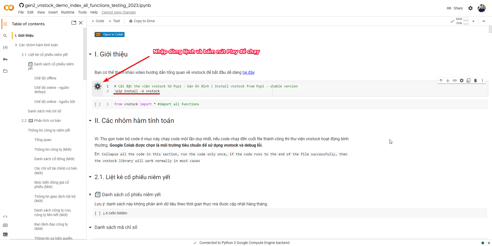
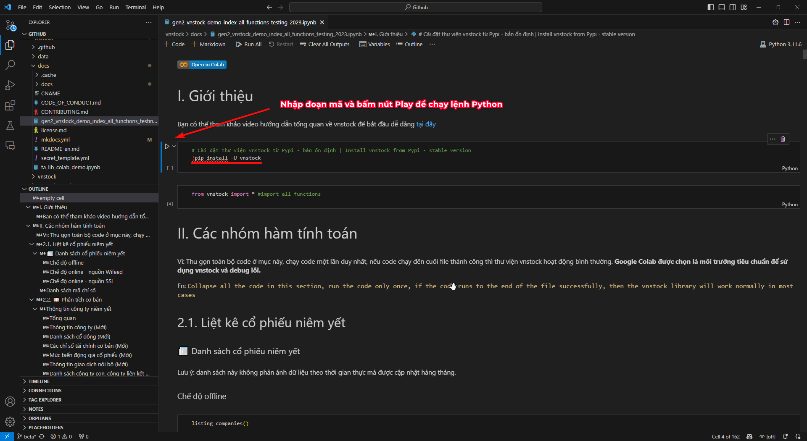
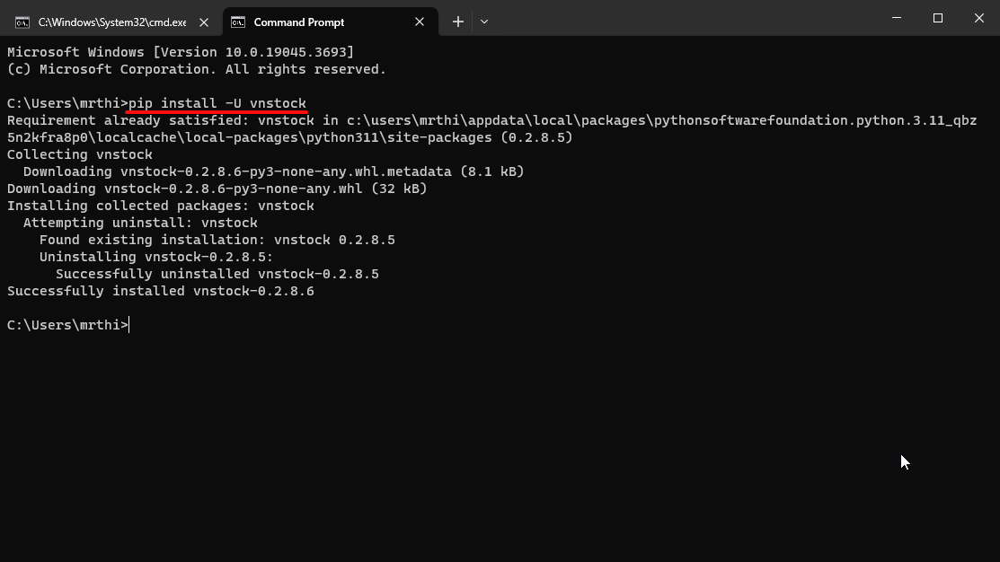

# Cài đặt các gói thư viện Python cần thiết

!!! abstract "Cài đặt thư viện Python với pip"
	Bản chất của một thư viện Python là đoạn mã python giúp tạo nên các hàm/phương thức giúp bạn thao tác với chương trình Python dễ dàng mà không cần phải viết lại các đoạn mã lặp đi lặp lại.

Để cài đặt một gói thư viện Python, bạn sử dụng công cụ quản lý gói `pip` thông qua dòng lệnh trong ứng dụng Terminal (macOS hay Command Prompt trên Windows) hoặc một ô chứa mã Python trên Google Colab/Jupyter Notebook.
## Sử dụng Jupyter Notebook

> Nếu bạn học phân tích dữ liệu với Python, hầu hết trường hợp bạn sẽ làm việc với Jupyter Notebook (Jupyter Lab hay Google Colab). Đây là cách đơn giản nhất bạn nên sử dụng trong mọi trường hợp.

=== "Cài đặt thư viện Python với Pip trong Google Colab"
	
=== "Cài đặt thư viện Python với Pip trong Visual Studio Code"
	
## Sử dụng Terminal / Command Prompt

> Nếu bạn sử dụng macbook, chỉ cần mở ứng dụng dòng lệnh Terminal và chạy dòng lệnh, còn nếu sử dụng Windows thì có thể rắc rối hơn 1 chút. Bạn sử dụng Terminal/Command Prompt để cài đặt thư viện nếu cài bản Python thuần, còn với bản Python Anaconda sẽ cần dùng ứng Anaconda Prompt (cũng là giao diện dòng lệnh tương tự nhưng thiết lập cho Anaconda) để cài đặt.

<figure markdown>
  
  <figcaption>Cài đặt thư viện vnstock cho Python với Pip</figcaption>
</figure>