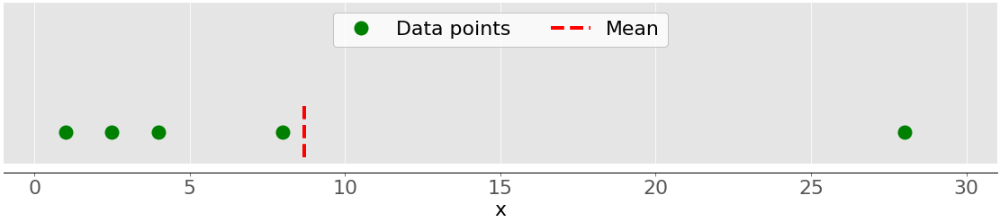
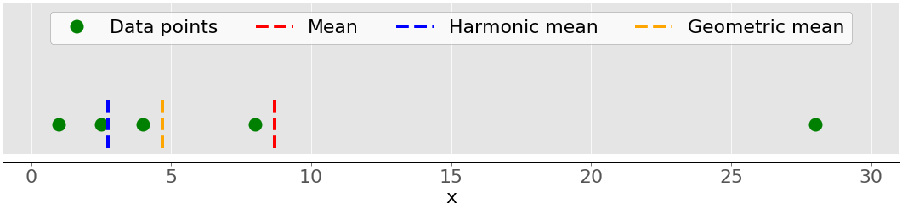
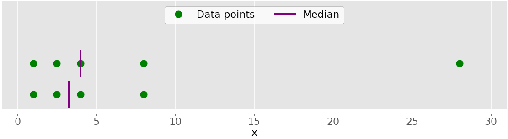
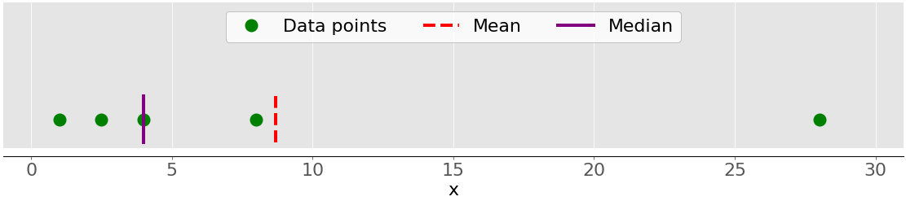
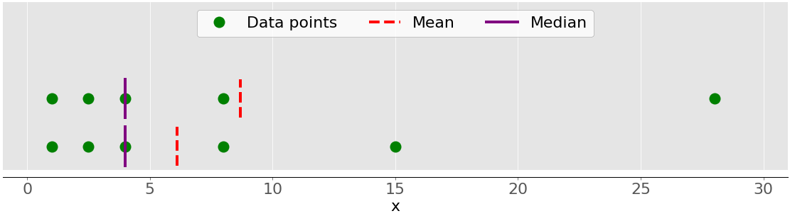
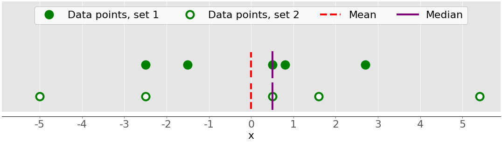
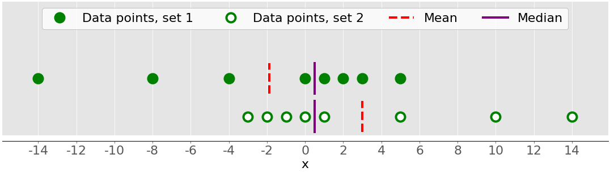

Trong thời đại của dữ liệu lớn và trí tuệ nhân tạo, khoa học dữ liệu và học máy đã trở nên thiết yếu trong nhiều lĩnh vực khoa học và công nghệ. Một khía cạnh cần thiết khi làm việc với dữ liệu là khả năng mô tả, tóm tắt và biểu diễn dữ liệu một cách trực quan. Các thư viện thống kê của Python là những công cụ toàn diện, phổ biến và được sử dụng rộng rãi sẽ hỗ trợ bạn làm việc với dữ liệu.

Bài viết này sẽ giới thiệu tới bạn:

- Bạn có thể sử dụng đại lượng nào để mô tả và tóm tắt bộ dữ liệu của mình
- Cách tính số liệu thống kê mô tả bằng Python thuần.
  - Cách tính số liệu thống kê mô tả với các thư viện Python có sẵn

## Hiểu thống kê mô tả

Thống kê mô tả nói về mô tả và tóm tắt dữ liệu. Có hai cách tiếp cận chính:

- Cách tiếp cận định lượng: mô tả và tóm tắt dữ liệu bằng các con số.
- Cách tiếp cận trực quan: minh họa dữ liệu bằng các loại biểu đồ, đồ thị, và các dạng tương tự.

Bạn có thể áp dụng thống kê mô tả cho một, nhiều bộ dữ liệu hoặc biến. Khi bạn mô tả và tóm tắt một biến, bạn đang thực hiện phân tích đơn biến (univariate analysis). Khi bạn tìm kiếm các mối quan hệ thống kê giữa một cặp biến, bạn đang thực hiện phân tích hai biến số (bivariate analysis). Tương tự, phân tích đa biến (multivariate analysis) liên quan đến phân tích nhiều biến cùng một lúc.

### Các loại đo lường

Trong hướng dẫn này, bạn sẽ tìm hiểu về các loại đo lường sau trong thống kê mô tả:

- **Xu hướng tập trung (central tendency)** cho bạn biết về các trung tâm của dữ liệu. Các chỉ số đo lường được sử dụng gồm Giá trị trung bình (mean), trung vị (median) và yếu vị (mode).
- **Mức độ biến thiên (Variability)** cho bạn biết về sự phân tán của dữ liệu. Các chỉ số đo lường được sử dụng gồm phương sai và độ lệch chuẩn.
- **Mối tương quan (Correlation) hoặc độ biến thiên chung (joint variability):** cho bạn biết về mối quan hệ giữa một cặp biến trong tập dữ liệu. Các chỉ số đo lường được sử dụng bao gồm hiệp phương sai (covariance) và hệ số tương quan (correlation coefficient).

Bạn sẽ học cách hiểu và tính toán các chỉ số đo lường này trong Python.

### Tổng thể và mẫu

Trong thống kê, tổng thể là tập hợp tất cả các yếu tố mà bạn quan tâm. Tổng thể thường rất lớn, khiến chúng không phù hợp để thu thập dữ liệu và phân tích. Đó là lý do khiến các chuyên gia thống kê thường cố gắng đưa ra một số kết luận về tổng thể bằng cách chọn và kiểm tra một tập hợp con đại diện của tổng thể đó.

Tập hợp con này của tổng thể được gọi là một mẫu. Lý tưởng nhất là mẫu nên bảo tồn các đặc điểm thống kê thiết yếu của tổng thể ở mức độ thỏa đáng. Bằng cách đó, bạn sẽ có thể sử dụng mẫu để thu thập kết luận về tổng thể.

### Giá trị ngoại lai (outlier)

Giá trị ngoại lai là một điểm dữ liệu khác biệt đáng kể so với phần lớn dữ liệu được lấy từ một mẫu hoặc tổng thể. 
Có nhiều nguyên nhân có thể tạo ra giá trị ngoại lai, nhưng sau đây là một số nguyên nhân cơ bản:

- Sự thay đổi tự nhiên của dữ liệu
- Thay đổi trong hành vi của hệ thống được quan sát
- Sai sót trong thu thập dữ liệu

Lỗi thu thập dữ liệu là một nguyên nhân đặc biệt nổi bật của các ngoại lai. Ví dụ, những hạn chế của các công cụ hoặc quy trình đo lường dẫn đến việc không thể thu được dữ liệu chính xác. Các lỗi khác có thể do tính toán sai, dữ liệu bị nhiễu, lỗi của con người, v.v.

Không có định nghĩa toán học chính xác về các giá trị ngoại lai. Bạn phải dựa vào kinh nghiệm, kiến thức về chủ đề quan tâm và suy luận để xác định xem một điểm dữ liệu có phải là ngoại lai hay không và cách xử lý nó.

## Chọn thư viện thống kê trong Python

Có rất nhiều thư viện thống kê Python để bạn sử dụng, trong hướng dẫn này, bạn sẽ tìm hiểu về một số thư viện phổ biến và được sử dụng rộng rãi nhất:

- `statistics` là thư viện thống kê tích hợp trong python cho thống kê mô tả. Bạn có thể sử dụng khi  bộ dữ liệu của bạn không quá lớn hoặc nếu bạn không thể cài đặt và nạp các thư viện khác vào hệ thống để sử dụng.
- `NumPy` là thư viện của bên thứ ba dành cho tính toán số học, được tối ưu hóa để làm việc với các mảng (array) đơn và đa chiều. Kiểu dữ liệu chính của nó là kiểu mảng, được gọi là `ndarray`. Thư viện này chứa nhiều phương thức để phân tích thống kê.
- `SciPy` là thư viện của bên thứ ba dành cho tính toán khoa học dựa trên NumPy. Nó cung cấp các chức năng bổ sung so với NumPy, bao gồm scipy.stats để phân tích thống kê.
- `pandas` là thư viện của bên thứ ba để tính toán số học dựa trên NumPy. Nó vượt trội trong việc xử lý dữ liệu một chiều (1D) được gắn nhãn (labeled one-dimensional data) với các đối tượng `Series` và dữ liệu hai chiều (2D) với các đối tượng `DataFrame`.
- `Matplotlib` là thư viện của bên thứ ba để trực quan hóa dữ liệu. Nó hoạt động tốt khi kết hợp với `NumPy`, `SciPy` và `pandas`.

Lưu ý rằng, trong nhiều trường hợp, `Series` và `DataFrame` có thể được sử dụng thay cho các NumPy array. Thông thường, bạn có thể truyền dữ liệu vào hàm thống kê NumPy hoặc SciPy. Ngoài ra, bạn có thể lấy dữ liệu chưa được gắn nhãn (unlabeled data) từ `Series` hoặc `DataFrame` dưới dạng đối tượng `np.ndarray` bằng cách gọi `.values` hoặc `.to_numpy()`.

## Làm quen với thư viện thống kê Python

Thư viện thống kê Python tích hợp cung cấp một số ít các hàm thống kê quan trọng nhất. Tài liệu chính thức được cung cấp là nguồn thông tin quý giá để bạn tìm hiểu thêm. Nếu bạn bị giới hạn sử dụng chỉ với Python thuần, thì thư viện thống kê Python là lựa chọn sử dụng phù hợp.

Để bắt đầu tìm hiểu về NumPy thì Hướng dẫn sử dụng chính thức (official User Guide) là một lựa chọn quan trọng, đặc biệt là phần khởi động nhanh ([quickstart](../../assets/images/https://numpy.org/doc/stable/user/quickstart.html)) bao gồm mục thông tin cơ bản (The Basics). Tài liệu hướng dẫn chính thức có thể giúp bạn cập nhật lại các khái niệm NumPy cụ thể. Trong khi đọc hướng dẫn này, bạn có thể muốn xem phần thống kê và tài liệu tham khảo scipy.stats chính thức.

Nếu bạn muốn tìm hiểu về pandas, thì trang Bắt đầu chính thức ([Getting Started](../../assets/images/https://pandas.pydata.org/docs/getting_started/index.html)) là một nơi tuyệt vời để bắt đầu. Phần giới thiệu về cấu trúc dữ liệu có thể giúp bạn tìm hiểu về các loại dữ liệu cơ bản, Series và DataFrame. Tương tự, hướng dẫn giới thiệu chính thức cung cấp cho bạn đầy đủ thông tin để có thể bắt đầu sử dụng pandas một cách hiệu quả trong thực tế.

matplotlib cung cấp Hướng dẫn sử dụng chính thức một cách toàn diện mà bạn có thể sử dụng để tìm hiểu chi tiết về cách sử dụng thư viện. [Anatomy of Matplotlib](../../assets/images/https://github.com/matplotlib/AnatomyOfMatplotlib) là một tài nguyên tuyệt vời cho những người mới muốn bắt đầu làm việc với matplotlib và các thư viện liên quan.

## Tính toán thống kê mô tả

### Xác định xu hướng tập trung

Các số liệu đo lường của xu hướng tập trung biểu thị các giá trị trung tâm hoặc trung bình của bộ dữ liệu. Có nhiều định nghĩa về giá trị được coi là trung tâm của bộ dữ liệu. Trong bài viết này, bạn sẽ học cách xác định và tính toán chỉ số về xu hướng tập trung của dữ liệu.

- Mean: Trung bình hay trung bình cộng
- Weighted mean: Trung bình trọng số
- Geometric mean: Trung bình nhân
- Harmonic mean: Trung bình điều hòa
- Median: Trung vị
- Mode: Mốt, Mo hay còn gọi là Yếu vị

#### Mean

Giá trị trung bình mẫu, còn được gọi là giá trị trung bình số học hoặc trung bình cộng (Average), là giá trị trung bình số học của tất cả các giá trị xuất hiện trong tập dữ liệu. Nói một cách đơn giản, giá trị này được tính bằng cách lấy tổng của tất cả các phần tử trong tập dữ liệu chia cho số phần tử trong tập dữ liệu đó.

Hình này minh họa giá trị trung bình của một mẫu có năm điểm dữ liệu:

Các chấm màu xanh lục biểu thị các điểm dữ liệu 1, 2,5, 4, 8 và 28. Đường đứt nét màu đỏ là giá trị trung bình của chúng hoặc (1 + 2,5 + 4 + 8 + 28)/5 = 8,7.

#### Weighted Mean

Giá trị trung bình có trọng số là dạng tổng quát của giá trị trung bình số học cho phép bạn xác định mức đóng góp tương đối của từng điểm dữ liệu vào kết quả.

Bạn xác định một trọng số 𝑤ᵢ cho mỗi điểm dữ liệu 𝑥ᵢ của tập dữ liệu 𝑥, trong đó 𝑖 = 1, 2, …, 𝑛 và 𝑛 là số mục trong 𝑥. Sau đó, bạn nhân từng điểm dữ liệu với trọng số tương ứng, tính tổng tất cả các tích và chia tổng thu được cho tổng trọng số: Σᵢ(𝑤ᵢ𝑥ᵢ) / Σᵢ𝑤ᵢ.

Giá trị trung bình trọng số rất hữu ích khi bạn cần giá trị trung bình của tập dữ liệu chứa các mục xuất hiện với tần suất tương đối nhất định. Ví dụ: giả sử bạn có một tập hợp trong đó 20% tổng số mục bằng 2, 50% số mục bằng 4 và 30% mục còn lại bằng 8. Bạn có thể tính giá trị trung bình của một bộ như sau:

```python
>>> 0.2 * 2 + 0.5 * 4 + 0.3 * 8
4.8
```

Ở đây, bạn tính đến các tần số xuất hiện của mỗi điểm dữ liệu với các trọng số (%). Với phương pháp này, bạn không cần biết tổng số điểm dữ liệu của mẫu để tính toán.

#### Harmonic Mean

Trung bình điều hòa là nghịch đảo của trung bình nghịch đảo của tất cả các mục trong tập dữ liệu: 𝑛 / Σᵢ(1/𝑥ᵢ), trong đó 𝑖 = 1, 2, …, 𝑛 và 𝑛 là số mục trong tập dữ liệu 𝑥. Một biến thể của việc sử dụng trung bình điều hòa với Python thuần là:

```python
>>> hmean = len(x) / sum(1 / item for item in x)
>>> hmean
2.7613412228796843
```

Nó hoàn toàn khác với giá trị của trung bình cộng cho cùng một dữ liệu x mà bạn đã tính là 8,7.

#### Geometric Mean

Giá trị trung bình nhân hay trung bình hình học là căn thứ 𝑛 của tích của tất cả 𝑛 phần tử 𝑥ᵢ trong tập dữ liệu 𝑥: ⁿ√(Πᵢ𝑥ᵢ), trong đó 𝑖 = 1, 2, …, 𝑛. Hình dưới đây minh họa các giá trị trung bình, trung bình điều hòa, trung bình nhân của cùng một tập dữ liệu:

Một lần nữa, các chấm màu xanh lá cây đại diện cho các điểm dữ liệu 1, 2.5, 4, 8 và 28. Đường đứt nét màu đỏ là giá trị trung bình. Đường đứt nét màu xanh là giá trị trung bình điều hòa và đường đứt nét màu vàng là giá trị trung bình hình học.

#### Median

Trung vị là phần tử ở giữa của tập dữ liệu được sắp xếp. Tập dữ liệu có thể được sắp xếp theo thứ tự tăng dần hoặc giảm dần. Nếu số phần tử 𝑛 của tập dữ liệu là số lẻ thì trung vị là giá trị ở vị trí chính giữa: 0,5(𝑛 + 1). Nếu 𝑛 chẵn thì trung vị là trung bình cộng của hai giá trị ở giữa, nghĩa là các phần tử ở vị trí 0,5𝑛 và 0,5𝑛 + 1.

Ví dụ: nếu bạn có các điểm dữ liệu 2, 4, 1, 8 và 9 thì giá trị trung bình là 4, nằm ở giữa tập dữ liệu đã sắp xếp (1, 2, 4, 8, 9). Nếu các điểm dữ liệu là 2, 4, 1 và 8 thì trung vị là 3, là trung bình cộng của hai phần tử ở giữa của dãy đã sắp xếp (2 và 4). Hình dưới đây minh họa điều này:


Các điểm dữ liệu là các chấm màu xanh lá cây và các đường màu tím hiển thị giá trị trung vị cho từng tập dữ liệu. Giá trị trung vị cho tập dữ liệu phía trên (1, 2.5, 4, 8 và 28) là 4. Nếu bạn loại bỏ giá trị ngoại lai 28 khỏi tập dữ liệu phía dưới, thì trung vị sẽ trở thành trung bình số học giữa 2.5 và 4, tức là 3.25.

Hình dưới đây cho thấy cả giá trị trung bình và giá trị trung vị của các điểm dữ liệu 1, 2.5, 4, 8 và 28:

Một lần nữa, giá trị trung bình là đường đứt nét màu đỏ, trong khi trung vị là đường màu tím.

Sự khác biệt chính giữa giá trị trung bình và trung vị có liên quan đến các giá trị ngoại lai của tập dữ liệu (ở đây  là 28). Giá trị trung bình bị ảnh hưởng nặng nề bởi các giá trị ngoại lai, nhưng giá trị trung vị chỉ bị ảnh hưởng bởi các giá trị ngoại lai một chút hoặc hoàn toàn không. Xét hình sau:



Tập dữ liệu phía trên lại có các mục 1, 2.5, 4, 8 và 28. Giá trị trung bình của nó là 8.7 và trung vị là 5. Tập dữ liệu bên dưới hiển thị những gì diễn ra khi bạn di chuyển điểm ngoài cùng bên phải có giá trị 28:

Nếu bạn tăng giá trị này (di chuyển nó sang phải), thì giá trị trung bình sẽ tăng, nhưng giá trị trung vị sẽ không bao giờ thay đổi.
Nếu bạn giảm giá trị của nó (di chuyển nó sang trái), thì giá trị trung bình sẽ giảm, nhưng giá trị trung vị sẽ giữ nguyên cho đến khi giá trị của điểm di chuyển lớn hơn hoặc bằng 4.
Bạn có thể so sánh giá trị trung bình và giá trị trung vị như một cách để phát hiện các giá trị ngoại lai và tính bất đối xứng trong dữ liệu của mình. Giá trị trung bình hay giá trị trung vị hữu ích hơn cho bạn tùy thuộc vào ngữ cảnh của vấn đề cụ thể của bạn.

#### Mode

Mode (Mốt hoặc Mo) là giá trị xuất hiện thường xuyên nhất trong tập dữ liệu. Nếu không có một giá trị nào như vậy, thì tập hợp đó được xem là đa mode vì nó có nhiều giá trị mode. Ví dụ: trong tập hợp chứa các điểm 2, 3, 2, 8 và 12, số 2 là mode vì nó xảy ra hai lần, không giống như các mục khác chỉ xảy ra một lần.

### Tính toán mức độ phân tán của dữ liệu

Xác định xu hướng tập trung đơn thuần không đủ để mô tả đặc tính của dữ liệu. Bạn cần xác định mức độ phân tán để định lượng sự phân bố của của các điểm dữ liệu. Trong phần này, bạn sẽ tìm hiểu cách xác định và tính toán giá trị xác định mức độ phân tán của dữ liệu như sau:

Varian: Phương sai
Standard deviation: Độ lệch chuẩn
Skewness: Độ lệch
Percentiles: bách phân vị
Ranges: khoảng biến thiên

#### Variance

Giá trị phương sai định lượng mức độ phân tán của dữ liệu. Nó biểu thị bằng số học các điểm dữ liệu cách giá trị trung bình bao xa. Bạn có thể biểu thị phương sai mẫu của tập dữ liệu 𝑥 với 𝑛 phần tử dưới dạng toán học là 𝑠² = Σᵢ(𝑥ᵢ − mean(𝑥))² / (𝑛 − 1), trong đó 𝑖 = 1, 2, …, 𝑛 và mean(𝑥) là trung bình mẫu của 𝑥. Nếu bạn muốn hiểu sâu hơn tại sao bạn chia tổng cho 𝑛 − 1 thay vì 𝑛, thì bạn có thể tìm hiểu sâu hơn về [hiệu chỉnh của Bessel](../../assets/images/https://en.wikipedia.org/wiki/Bessel%27s_correction).

Hình dưới đây cho bạn thấy lý do tại sao việc xem xét phương sai lại quan trọng khi mô tả bộ dữ liệu:



Có hai bộ dữ liệu trong hình này:

Dấu chấm màu xanh: Tập dữ liệu này có phương sai nhỏ hơn hoặc chênh lệch trung bình nhỏ hơn so với giá trị trung bình. Nó cũng có khoảng biến thiên nhỏ hơn hoặc chênh lệch nhỏ hơn giữa mục lớn nhất và mục nhỏ nhất.
Chấm trắng: Tập dữ liệu này có phương sai lớn hơn hoặc chênh lệch trung bình lớn hơn so với giá trị trung bình. Nó cũng có khoảng biến thiên lớn hơn hoặc chênh lệch lớn hơn giữa mục lớn nhất và mục nhỏ nhất.

Lưu ý rằng hai bộ dữ liệu này có cùng giá trị trung bình và trung vị, mặc dù chúng có vẻ khác nhau đáng kể. Cả giá trị trung bình và trung vị đều không thể mô tả sự khác biệt này. Đó là lý do tại sao bạn cần đo lường độ phân tán của dữ liệu.

#### Standard Deviation

Độ lệch chuẩn của mẫu là một cách định lượng khác về mức độ phân tán của dữ liệu. Nó được kết hợp với phương sai mẫu (sample variance), vì độ lệch chuẩn, 𝑠, là căn bậc hai dương của phương sai mẫu. Độ lệch chuẩn thường thuận tiện hơn phương sai vì nó có cùng đơn vị với các điểm dữ liệu. Khi bạn nhận được phương sai, bạn có thể tính độ lệch chuẩn bằng Python thuần:

```python
>>> std_ = var_ ** 0.5
>>> std_
11.099549540409285
```

#### Skewness

Độ lệch của mẫu đo lường sự bất đối xứng của một mẫu dữ liệu.

Có nhiều định nghĩa toán học về độ lệch. Một biểu thức phổ biến để tính toán độ lệch của tập dữ liệu 𝑥 với 𝑛 phần tử là (𝑛² / ((𝑛 − 1)(𝑛 − 2))) (Σᵢ(𝑥ᵢ − mean(𝑥))³ / (𝑛𝑠³)). Một biểu thức đơn giản hơn là Σᵢ(𝑥ᵢ − mean(𝑥))³ 𝑛 / ((𝑛 − 1)(𝑛 − 2)𝑠³), trong đó 𝑖 = 1, 2, …, 𝑛 và mean(𝑥) là trung bình mẫu của 𝑥. Độ lệch được xác định bằng cách này được gọi là hệ số mômen tiêu chuẩn Fisher-Pearson đã điều chỉnh (Fisher-Pearson standardized moment coefficient).

Hình trước cho thấy hai bộ dữ liệu khá đối xứng. Nói cách khác, các điểm có khoảng cách tương đồng so với giá trị trung bình. Ngược lại, hình sau đây minh họa hai bộ dữ liệu bất đối xứng:



Bộ dữ liệu đầu tiên được biểu thị bằng các chấm màu xanh lá cây và bộ thứ hai có các chấm màu trắng. Thông thường, các giá trị độ lệch âm cho biết rằng có một phần đuôi dài ở phía bên trái mà bạn có thể nhìn thấy với tập hợp đầu tiên. Các giá trị độ lệch dương tương ứng với phần đuôi dài hơn hoặc mập hơn ở phía bên phải mà bạn có thể thấy trong tập hợp thứ hai. Nếu độ lệch gần bằng 0 (ví dụ: từ -0,5 đến 0,5), thì tập dữ liệu được coi là khá đối xứng.

Đối tượng pandas Series cung cấp phương thức `.skew()` cho phép tính toán độ lệch của tập dữ liệu một cách đơn giản.

```python
>>> z, z_with_nan = pd.Series(x), pd.Series(x_with_nan)
>>> z.skew()
1.9470432273905924
>>> z_with_nan.skew()
1.9470432273905924
```

Giống như các phương pháp khác trong pandas, `.skew()` bỏ qua các giá trị `nan` theo mặc định, bởi vì giá trị mặc định của tham số `skipna` cho phép làm điều đó.

#### Percentiles

Phân vị mẫu 𝑝 là phần tử trong tập dữ liệu sao cho 𝑝% phần tử trong tập dữ liệu nhỏ hơn hoặc bằng giá trị đó. Ngoài ra, (100 − 𝑝)% phần tử lớn hơn hoặc bằng giá trị đó. Nếu có hai phần tử như vậy trong tập dữ liệu thì phân vị mẫu 𝑝 là trung bình số học của chúng. Mỗi tập dữ liệu có ba  phân vị, là giá trị phần trăm chia tập dữ liệu thành bốn phần:

- Tứ phân vị đầu tiên là phân vị thứ 25 của mẫu. Nó chia khoảng 25% các mục nhỏ nhất khỏi phần còn lại của tập dữ liệu.
- Tứ phân vị thứ hai là phân vị thứ 50 của mẫu hoặc trung vị. Khoảng 25% các mục nằm giữa tứ phân vị thứ nhất và thứ hai và 25% khác nằm giữa tứ phân vị thứ hai và thứ ba.
- Tứ phân vị thứ ba là phân vị thứ 75 của mẫu. Nó chia khoảng 25% các mục lớn nhất khỏi phần còn lại của tập dữ liệu.
  Mỗi phần có số lượng phần tử xấp xỉ như nhau. Nếu bạn muốn chia dữ liệu của mình thành nhiều khoảng, thì bạn có thể sử dụng `stats.quantiles()`:

```python
# Import
>>> import statistics
>>> import numpy as np
# Demo
>>> x = [-5.0, -1.1, 0.1, 2.0, 8.0, 12.8, 21.0, 25.8, 41.0]
>>> statistics.quantiles(x, n=2)
[8.0]
>>> statistics.quantiles(x, n=4, method='inclusive')
[0.1, 8.0, 21.0]
```

Trong ví dụ này, 8,0 là trung vị của x, trong khi 0,1 và 21,0 lần lượt là phần trăm thứ 25 và 75 của mẫu. Tham số n xác định số phần trăm có xác suất bằng nhau thu được và phương pháp xác định cách tính chúng.

#### Ranges

Khoảng biến thiên là sự khác biệt giữa giá trị tối đa và tối thiểu của phần tử trong tập dữ liệu. Để tính khoảng biến thiên, có thể sử dụng hàm có sẵn trong Python max() - min() hoặc tính hiệu số của .max() và .min() của series trong pandas. Lưu ý, pandas loại bỏ các giá trị NaN trước khi tính toán.

---
Còn nữa..

Nguồn: [Python Statistics Fundamentals: How to Describe Your Data](https://realpython.com/python-statistics/)