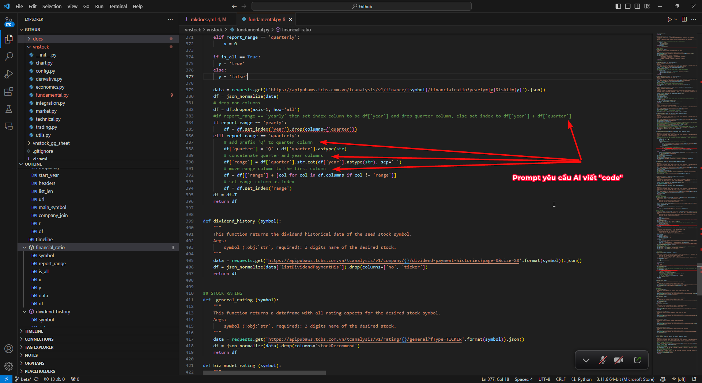
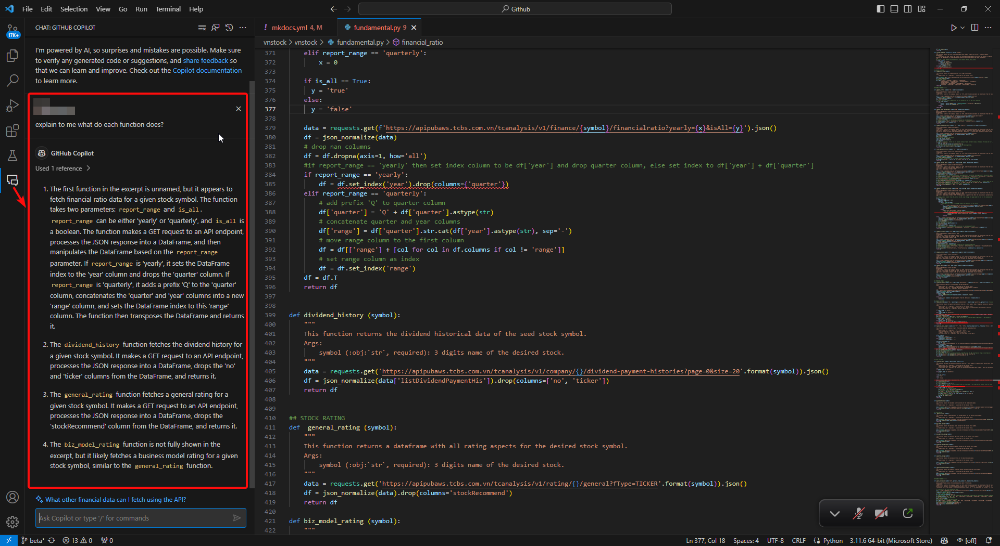

# Lập trình Python với AI cho mọi người

!!! abstract
	Với sự ra đời của các mô hình AI hiện nay, ai cũng có thể tạo ra những đoạn mã Python, thậm chí là cả chương trình hoàn chỉnh thông quan sự hỗ trợ của AI với độ chính xác cao. Hãy thử sử dụng ChatGPT, Github Copilot, Google Bard để thấy sự kì diệu của kỷ nguyên AI. 

Mô hình AI hoạt động dựa trên nguyên lý xác suất, xác định từ ngữ sẽ xuất hiện tiếp theo khi tạo ra văn bản trong khi Python được xem là ngôn ngữ phổ biến nhất hiện nay do đó sẵn có nguồn dữ liệu dồi dào để đào tạo AI thông minh và chính xác. Chính bởi điều này, hầu hết các công cụ AI hiện nay đều có thể tạo mã Python rất tốt.

## Lập trình Python với ChatGPT

Bạn hoàn toàn có thể tận dụng [ChatGPT3.5](https://chat.openai.com/) miễn phí để lập trình Python không giới hạn. ChatGPT có thể tạo ra những đoạn mã Python với độ chính xác cao để có thể copy/paste và chạy ngay lập tức trong Google Colab và các môi trường Python.

<iframe width="900" height="506" src="https://www.youtube.com/embed/wTMSDbAli0s?si=GtgyOI_c7zUksqDT" title="YouTube video player" frameborder="0" allow="accelerometer; autoplay; clipboard-write; encrypted-media; gyroscope; picture-in-picture; web-share" allowfullscreen></iframe>

## Lập trình Python với Github Copilot

Github Copilot là một công cụ AI cung cấp khả năng lập trình mạnh mẽ với tốc độ suy nghĩ và "code" của bạn thông qua các prompt ngay trên dự án lập trình của bạn. Bạn có thể cài tiện ích mở rộng này để sử dụng trên các IDE (môi trường lập trình) phổ biến như Visual Studio Code, Visual Studio, Vim, JetBrains IDE, vv 

<iframe width="900" height="506" src="https://www.youtube.com/embed/9s7WEgC7aqo?si=Zs36XvlPXrd4Qg8m" title="YouTube video player" frameborder="0" allow="accelerometer; autoplay; clipboard-write; encrypted-media; gyroscope; picture-in-picture; web-share" allowfullscreen></iframe>

Hiện nay bạn có thể sử dụng Github Copilot dưới 2 dạng:
- Gõ prompt vào file mã nguồn Python (Python script `.py` hoặc Jupyter Notebook `.ipynb`) để nhận gợi ý lệnh hoặc tự động hoàn thiện lệnh.
- Sử dụng Copilot qua cửa sổ Chat.

=== "Prompt trong mã nguồn"
	
=== "Chat với Copilot"
	
## Lập trình Python với Google Bard

Google Bard có thể tạo ra những đoạn mã Python có chất lượng tốt, dù khi so với ChatGPT sẽ có nhiều yếu tố thua thiệt hơn. Tuy nhiên Bard có khả năng tích hợp rất tốt với bộ công cụ văn phòng Google Suite, cho phép xuất code ra Google Colab, Replit. Thêm nữa, Bard có khả năng nhận diện hình ảnh với Google Lens và hoàn toàn miễn phí.

<iframe width="900" height="506" src="https://www.youtube.com/embed/D3QekSAJU2s?si=koGtPEs3pE9EPQUO" title="YouTube video player" frameborder="0" allow="accelerometer; autoplay; clipboard-write; encrypted-media; gyroscope; picture-in-picture; web-share" allowfullscreen></iframe>
