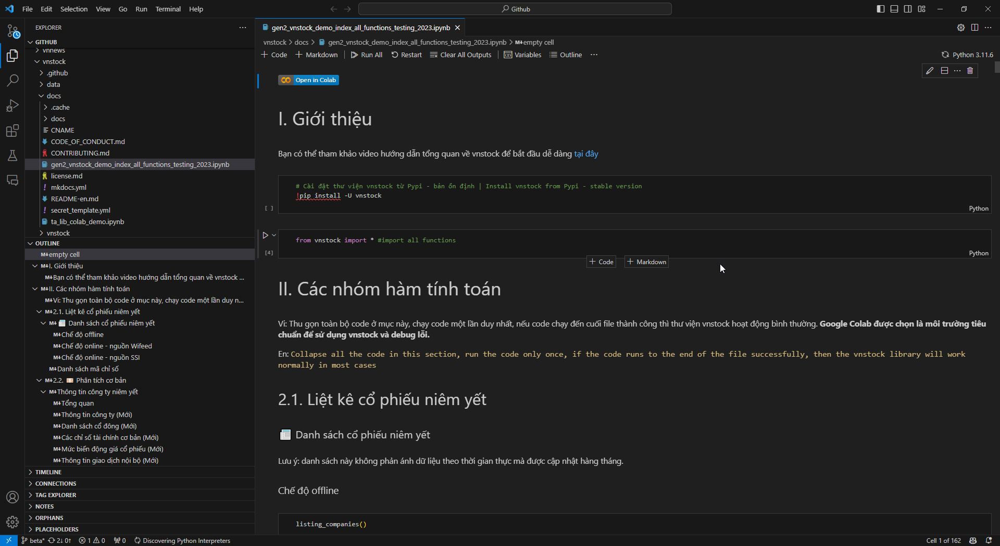

# Khởi động môi trường Python

# Thiết lập môi trường Python

!!! abstract "Môi trường Python"
	Môi trường Python là nơi bạn cấu hình các thành phần chính của hệ thống để có thể soạn thảo lệnh, thực thi hay triển khai ứng dụng Python trong quá trình sử dụng. Bạn có thể sử dụng các dịch vụ đám mây một cách tiện lợi, luôn sẵn sàng để dùng ngay hoặc dành thêm chút thời gian để cài đặt đầy đủ bộ công cụ trên môi trường máy tính cục bộ của mình, sử dụng cấu hình phần cứng sẵn có mà không phải trả thêm phí dịch vụ không cần thiết.

<iframe width="914" height="514"src="https://www.youtube.com/embed/uqxHCHDLqRE?si=bIQ_w4LiEKeNA012" title="YouTube video player" frameborder="0" allow="accelerometer; autoplay; clipboard-write; encrypted-media; gyroscope; picture-in-picture; web-share" allowfullscreen></iframe>

## Python trên cloud

!!! abstract "Chọn môi trường Python phù hợp"
	Bạn có thể sử dụng các dịch vụ trên môi trường đám mây (cloud) để thực thi lệnh/ứng dụng Python mà không cần trải qua các bước cài đặt phức tạp. Dưới đây là các dịch vụ đám mây cho phép chạy Python ngay lập tức.

Để sử dụng dịch vụ cho phép chạy Python trên đám mây, bạn cần đăng ký dịch vụ. Với tài khoản Github và Google, bạn có thể chọn đăng nhập các dịch vụ này ngay lập tức mà không phải trải qua các bước tạo tài khoản mất thời gian. Trong khuôn khổ các hướng dẫn về Python tại LEarn Anything sẽ sử dụng cách tiếp cận của người học Python cho mục đích xử lý dữ liệu thay vì lập trình viên chuyên nghiệp. Do đó bạn sẽ tiếp cận Python thông qua các biến thể Jupyter Notebook thay vì IDE và giao diện dòng lệnh.

### Jupyter Notebook

> [Jupyter](https://jupyter.org/) Notebook/Jupyter Lab và các sản phẩm biến thể từ Jupyter như Google Colab hay Kaggle đều cung cấp trải nghiệm lập trình trên Jupyter Notebook tương tự. Jupyter Notebook thích hợp cho những người mới lập trình, làm quen từng bước một với dòng lệnh với giao diện trực quan. Khi đã quen thuộc với Python, bạn có thể tự lựa chọn bộ công cụ phù hợp nhu cầu của mình, còn bây giờ hãy làm quen với Jupyter Notebook.

#### Google Colab

> [Colaboratory](https://colab.research.google.com/) (hay Colab) là dịch vụ miễn phí của Google cho phép bạn soạn thảo và thực thi Python ngay trên trình duyệt web với nhiều tính năng ưu việt.

- Miễn phí, không giới hạn.

- Không cần cấu hình rườm rà, truy cập và chạy Python ngay lập tức.

- Tận dụng sức mạnh GPU trên dịch vụ đám mây của Google cho các dự án liên quan đến học máy, AI.

- Dễ dàng chia sẻ và cộng tác với nhóm và đồng nghiệp. 

[Mở Colab Notebook :material-download:](https://colab.research.google.com/){ .md-button }

Dù là sinh viên, nhà khoa học dữ liệu hay người làm về AI thì Colab đều giúp công việc của bạn dễ dàng và thuận lợi hơn rất nhiều.

<figure markdown>
  
  <figcaption>Giao diện làm việc của Google Colab</figcaption>
</figure>

#### Kaggle

> [Kaggle](https://www.kaggle.com/) là một cộng đồng khoa học dữ liệu và máy học được vận hành bởi Google. Bạn có thể tham gia Kaggle để thi đấu thông qua các dự án được treo giải thưởng hoặc sử dụng các dataset (tập dữ liệu) thực tế để thực hành. Ngoài ra, bạn cũng có thể sử dụng Jupyter Notebook cung cấp bởi Kaggle để phân tích dữ liệu với Python hoàn toàn miễn phí, và phục vụ cho các dự án về máy học và AI bên cạnh Google Colab.

[Tạo Kaggle Notebook :material-download:](https://www.kaggle.com/){ .md-button }

Chọn `Create` sau đó là `New Notebook` khi truy cập & đăng nhập Kaggle thành công.

### IDE hoàn chỉnh

> IDE hay Môi trường phát triển tích hợp (integrated development environment) cung cấp đầy đủ bộ công cụ cho phát triển phần mềm thay vì chỉ trình soạn mã như Jupyter Notebook (chuyên dùng cho Python và R). Với các môi trường này, bạn vẫn sử dụng Jupyter Notebook để lập trình nhưng kết hợp sử dụng Terminal, các tính năng thêm như port forwarding cho phép chạy localhost server, vv

#### Github Codespace 

> [Github Codespace](https://github.com/features/codespaces) là dịch vụ do Github cung cấp - dịch vụ lưu trữ mã nguồn phần mềm trên web. Github Codespace cung cấp môi trường lập trình hoàn chỉnh bao gồm cả Terminal, port forwarding, vv như bạn đang làm việc với máy tính cá nhân cùng Visual Studio Code.

Codespace tiên tiến hơn so với việc sử dụng Google Colab và Kaggle khi bạn cần làm việc với Github và dịch vụ kèm theo như Github Copilot để tận dụng sức mạnh của AI trong lập trình. Lợi ích quan trọng nữa là bạn có thể sử dụng Codespace trên tablet khi di chuyển nhưng vẫn có sức mạnh đầy đủ của một môi trường lập trình hoàn chỉnh.

[Thử Codepsace :material-download:](https://github.com/features/codespaces){ .md-button }

=== "1. Chọn Jupyter Notebook để bắt đầu"
	
=== "2. Sẵn sàng sử dụng Python"
	

Bạn được sử dụng miễn phí 60 giờ/tháng cho dịch vụ miễn phí với cấu hình máy ảo với sức mạnh 2 nhân CPU (thấp nhất). [Nâng cấp](https://github.com/pricing/calculator) với giá $0.18/giờ với mức cấu hình này.

Tuy Github Codespace và Gitpod cung cấp môi trường Python và khả năng tương tự nhau nhưng trải nghiệm sử dụng Github Copilot đơn giản hơn khi cho phép người dùng chọn template môi trường lập trình (ví dụ Jupyter Notebook) và môi trường đã được cài đặt sẵn chỉ việc sử dụng. Đồng thời bạn không cần phải bắt đầu dự án với việc nạp một Github repo để sử dụng như Gitpod.
#### Gitpod

> [Gitpod](https://www.gitpod.io/) cung cấp môi trường lập trình Online hoàn chỉnh thông qua dịch vụ đám mây tương tự Github Copilot. Bạn có thể sử dụng miễn phí 50h mỗi tháng cho dịch vụ, [nâng cấp](https://www.gitpod.io/pricing) thêm với giá $0.36/giờ.

Để làm việc với Gitpod bạn cần có tài khoản Github để đăng nhập và lưu trữ mã nguồn dự án.

Khi sử dụng Gitpod, không có tính năng môi trường mẫu được thiết lập sẵn, do đó để chạy được Python bạn phải cài extension (tự động nhận diện) sau đó phải cài thêm các gói thư viện cơ bản kể cả pandas mà dự án bạn cần dùng. Như vậy bạn phải mất thời gian thiết lập môi trường thay vì sử dụng ngay lập tức như Github Codespace.

[Thử Gitpod :material-download:](https://www.gitpod.io/){ .md-button }

=== "1. Tạo môi trường làm việc mới"
	
=== "2. Cài đặt các extension cho Python"
	
=== "3. Cài đặt thư viện cần thiết & sử dụng"
	

#### Replit

> [Replit](https://replit.com/) cung cấp môi trường lập trình trực tuyến cho phép người dùng biến ý tưởng lập trình thành dự án thực tế thông qua bộ công cụ tích hợp của dịch vụ thông qua trình duyệt web hoặc app trên máy tính. Mặc định bạn có thể tạo và lưu trữ các dự án Python qua Replit một cách công khai và miễn phí. Bạn cần trả phí để có thể bảo mật mã nguồn dự án của mình với phí $120/năm hoặc $20/tháng.

Điểm thú vị của Replit là nó cung cấp công cụ AI ngay trong môi trường lập trình giúp bạn code "nhàn" hơn và tiết kiệm.

[Thử Replit :material-download:](https://replit.com/){ .md-button }

<figure markdown>
  
  <figcaption>Giao diện làm việc của Replit</figcaption>
</figure>

## Python trên máy tính cục bộ

### Bộ cài đặt Python

!!! abstract "Giới thiệu"
	Để sử dụng được Python trên máy tính cá nhân, môi trường cục bộ (local) thì bạn cần 3 thành phần gồm: Python, IDE (trình soạn mã), Python package (các gói thư viện python cần thiết). Trong bước này bạn sẽ được hướng dẫn lựa chọn bộ cài đặt Python phù hợp.

Lưu ý: Bạn chỉ cần cài đặt 1 trong 2 lựa chọn là Python hoặc Anaconda. Đối với mục đích phân tích dữ liệu và tính toán khoa học thì Anaconda được khuyên dùng vì có đầy đủ các thư viện phổ biến để sử dụng ngay và đảm bảo tính tương thích tốt tuy nhiên dung lượng cài đặt lớn hơn lựa chọn còn lại.

#### Python thuần

> [Python](https://www.python.org/downloads/) "thuần" tức chỉ cài đặt gói phần mềm Python và cài đặt riêng lẻ các thư viện kèm theo khi cần thiết (bao gồm cả Jupyter Lab/Notebook cho phân tích dữ liệu). Điều này khác với việc cài gói Anaconda bao gồm hầu hết các thư viện python (package) dù bạn có sử dụng tới hay không. Cách tiếp cận này giúp bạn tiết kiệm dung lượng bộ nhớ máy khi máy tính có cấu hình phần cứng không mạnh mẽ vượt trội.

[Tải Python :material-download:](https://www.python.org/downloads/){ .md-button }

Trong nhiều trường hợp, bản Python mới nhất sẽ không tương thích với một số thư viện, do đó bạn có thể cân nhắc tải bản cũ hơn và phổ biến để tránh rắc rối.

Đối với các bạn người dùng phổ thông mới tìm hiểu Python sẽ có chút bối rối bởi chưa rõ Python có hình thù như thế nào khi chạy từ máy tính. Câu trả lời là nó có chút gì đó vô hình bởi không như các phần mềm có giao diện đồ họa (GUI) thì Python có thể được chạy từ ứng dụng dòng lệnh như Terminal (macOS/Linux) hoặc Command Prompt (Windows). Giao tiếp với Python thông qua cửa sổ dòng lệnh như dưới đây, gọi chương trình Python bằng lệnh `python` sau đó nhập các câu lệnh để thực thi. Python thân thiện hơn khi các bạn sử dụng Jupyter Notebook/Lab bởi khi đó không gian làm việc của bạn giống một chương trình soạn thảo văn bản hơn là một cửa sổ lệnh hoàn toàn.

<figure markdown>
  
  <figcaption>Chạy Python trên Windows</figcaption>
</figure>

#### Python với Anaconda

> [Anaconda](https://www.anaconda.com/download) là một gói phần mềm cho ngôn ngữ lập trình Python và R dành cho mục đích tính toán khoa học. Gói cài đặt Anaconda chứa hầu hết các thư viện Python phổ biến bạn cần dùng cho dự án của mình. Do đó cài Anaconda bạn có thể bỏ qua bước cài đặt các thư viện phụ thuộc. Đối với các bạn sử dụng Python cho phân tích dữ liệu thì chọn cách tiếp cận này giúp bạn có được môi trường sử dụng Python đầy đủ và nhanh chóng.

[Tải Anaconda :material-download:](https://www.anaconda.com/download){ .md-button }

### Trình soạn thảo lệnh

> Code Editor hay trình soạn thảo lệnh cung cấp cho bạn công cụ chỉnh sửa dòng lệnh (dạng văn bản như bạn dùng Notepad trên Windows) kèm những tính năng chuyên biệt để lập trình, trong đó có thể kể đến như code higlighting (tô màu lệnh để dễ phân biệt). Có nhiều Code Editor cho bạn lựa chọn tùy vào mục đích và nhu cầu. Trong hướng dẫn này, bạn sẽ làm quen với Visual Studio Code là Code Editor đa dụng, mã nguồn mở được sử dụng rộng rãi để lập trình nhiều ngôn ngữ khác nhau.

#### Visual Studio Code

!!! abstract "Giới thiệu"
	Để lập trình Python trên [Visual Studio Code](https://code.visualstudio.com/download) (VSC), bạn cần cài đặt các extension (phần mở rộng) cần thiết, trong đó có Python. VSC được sử dụng rộng rãi cả ở môi trường cục bộ lẫn đám mây. Lựa chọn VSC để sử dụng giúp bạn làm quen 1 công cụ đã năng và tiết kiệm thời gian học công cụ mới khi chuyển đổi môi trường. Bạn sẽ bắt gặp VSC trên Github Copilot, Gitpod như mình giới thiệu ở phần trên. VSc có mặt trên tất cả hệ điều hành, và kể cả trên trình duyệt web tại địa chỉ [vscode.dev](https://vscode.dev/).

[Tải Visual Studio Code :material-download:](https://code.visualstudio.com/download){ .md-button }

Khi sử dụng Visual Studio Code, các bạn có thể lập trình Python với Jupyter Notebook với định dạng file `.ipynb` hoặc chương trình Python với file văn bản có định dạng `.py`.

<figure markdown>
  
  <figcaption>Giao diện Visual Studio Code</figcaption>
</figure>