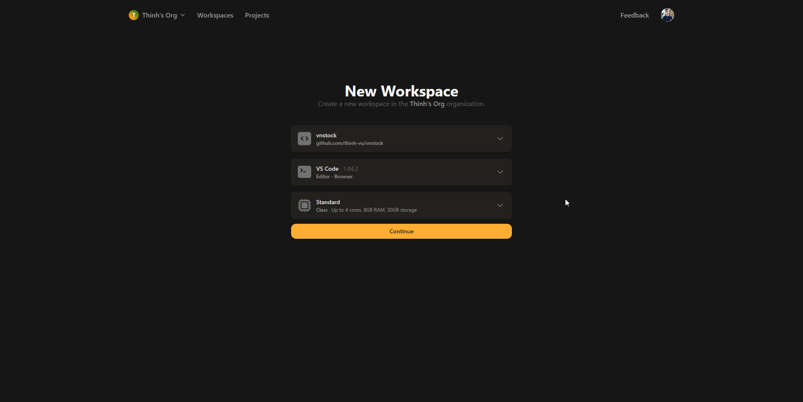
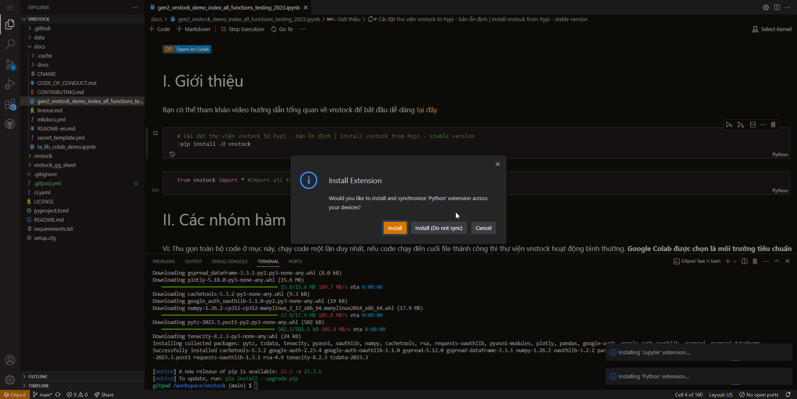
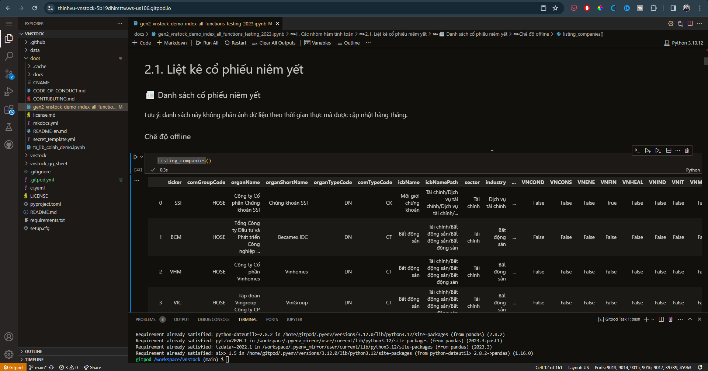

# Thiết lập môi trường Python

## Python trên cloud

!!! abstract 
	Bạn có thể sử dụng các chương trình python để thực thi trên môi trường đám mây mà không cần trải qua các bước cài đặt phức tạp. Dưới đây là các dịch vụ đám mây cho phép chạy Python ngay lập tức.

### Google Colab

> [Colaboratory](https://colab.research.google.com/) (hay Colab) là dịch vụ miễn phí của Google cho phép bạn soạn thảo và thực thi Python ngay trên trình duyệt web với nhiều tính năng ưu việt.

- Miễn phí, không giới hạn.
- Không cần cấu hình rườm rà, truy cập và chạy Python ngay lập tức.
- Tận dụng sức mạnh GPU trên dịch vụ đám mây của Google cho các dự án liên quan đến học máy, AI.
- Dễ dàng chia sẻ và cộng tác với nhóm và đồng nghiệp.

Dù là sinh viên, nhà khoa học dữ liệu hay người làm về AI thì Colab đều giúp công việc của bạn dễ dàng và thuận lợi hơn rất nhiều.

### Kaggle

> [Kaggle](https://www.kaggle.com/) là một cộng đồng khoa học dữ liệu và máy học được vận hành bởi Google. Bạn có thể tham gia Kaggle để thi đấu thông qua các dự án được treo giải thưởng hoặc sử dụng các dataset (tập dữ liệu) thực tế để thực hành. Ngoài ra, bạn cũng có thể sử dụng môi trường Python trên Kaggle hoàn toàn miễn phí, phục vụ cho các dự án về máy học và AI bên cạnh Google Colab.

### Github Codespace

> [Github Codespace](https://github.com/features/codespaces) là dịch vụ do Github cung cấp  - dịch vụ lưu trữ mã nguồn phần mềm trên web. Github Codespace cung cấp môi trường lập trình hoàn chỉnh bao gồm cả Terminal, port forwarding, vv như bạn đang làm việc với máy tính cá nhân cùng Visual Studio Code.  

Codespace tiên tiến hơn so với việc sử dụng Google Colab và Kaggle khi bạn cần làm việc với Github và dịch vụ kèm theo như Github Copilot để tận dụng sức mạnh của AI trong lập trình. Lợi ích quan trọng nữa là bạn có thể sử dụng Codespace trên tablet khi di chuyển nhưng vẫn có sức mạnh đầy đủ của một môi trường lập trình hoàn chỉnh.

=== "1. Chọn Jupyter Notebook để bắt đầu"
	
=== "2. Sẵn sàng sử dụng Python"
	
Bạn được sử dụng miễn phí 60 giờ/tháng cho dịch vụ miễn phí với cấu hình máy ảo với sức mạnh 2 nhân CPU (thấp nhất). [Nâng cấp](https://github.com/pricing/calculator) với giá $0.18/giờ với mức cấu hình này.

Tuy Github Codespace và Gitpod cung cấp môi trường Python và khả năng tương tự nhau nhưng trải nghiệm sử dụng Github Copilot đơn giản hơn khi cho phép người dùng chọn template môi trường lập trình (ví dụ Jupyter Notebook) và môi trường đã được cài đặt sẵn chỉ việc sử dụng. Đồng thời bạn không cần phải bắt đầu dự án với việc nạp một Github repo để sử dụng như Gitpod.
### Gitpod
> [Gitpod](https://www.gitpod.io/) cung cấp môi trường lập trình Online hoàn chỉnh thông qua dịch vụ đám mây tương tự Github Copilot. Bạn có thể sử dụng miễn phí 50h mỗi tháng cho dịch vụ, [nâng cấp](https://www.gitpod.io/pricing) thêm với giá $0.36/giờ.

=== "1. Tạo môi trường làm việc mới"
	
=== "2. Cài đặt các extension cho Python"
	
=== "3. Cài đặt thư viện cần thiết & sử dụng"
	

Để làm việc với Gitpod bạn cần có tài khoản Github để đăng nhập và lưu trữ mã nguồn dự án.

Khi sử dụng Gitpod, không có tính năng môi trường mẫu được thiết lập sẵn, do đó để chạy được Python bạn phải cài extension (tự động nhận diện) sau đó phải cài thêm các gói thư viện cơ bản kể cả pandas mà dự án bạn cần dùng. Như vậy bạn phải mất thời gian thiết lập môi trường thay vì sử dụng ngay lập tức như Github Codespace.
## Python trên máy tính cục bộ

### Python tối giản

### Python với Anaconda

